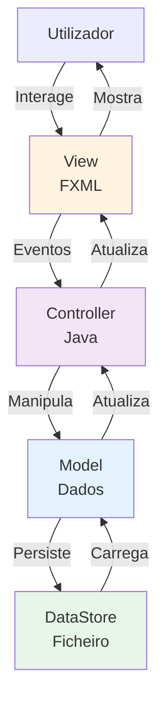
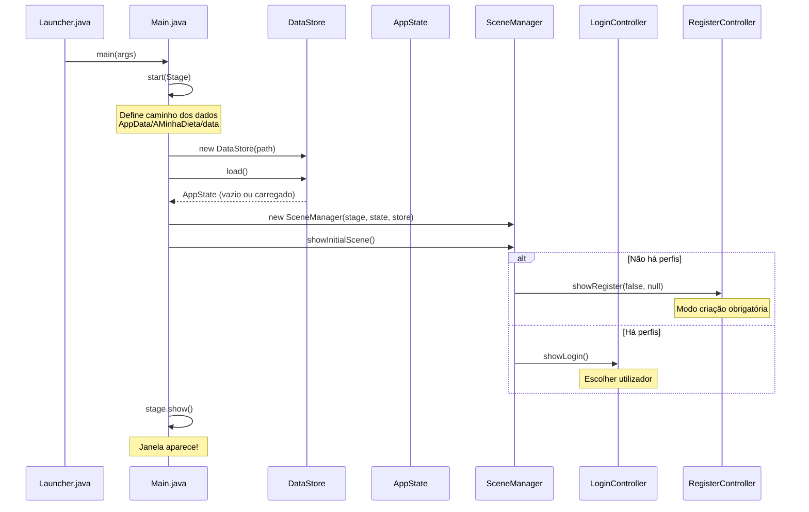
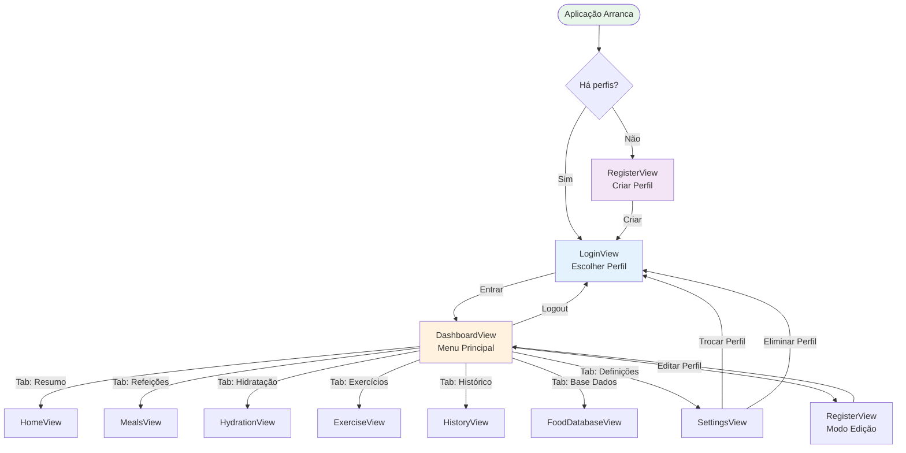
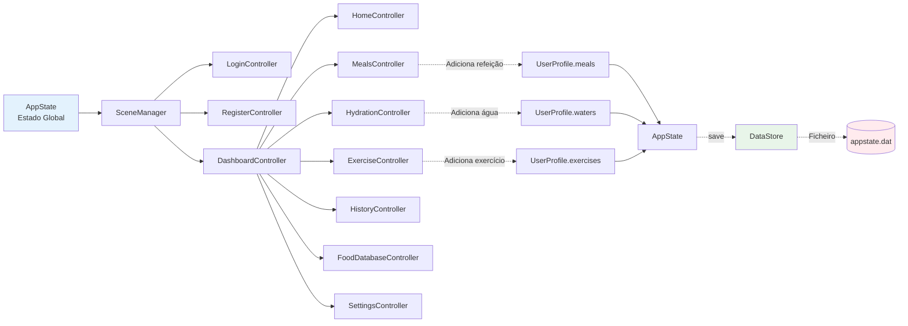
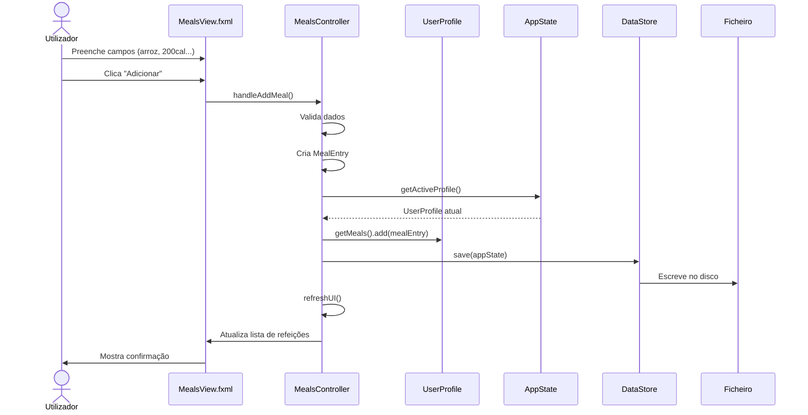
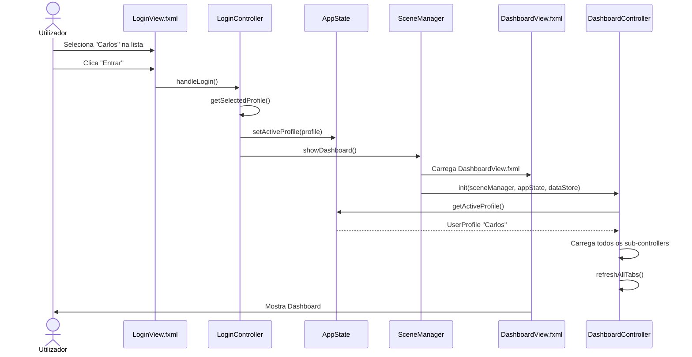
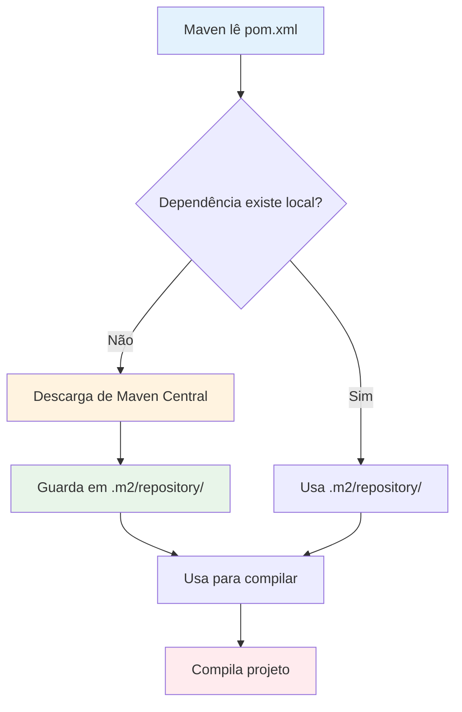
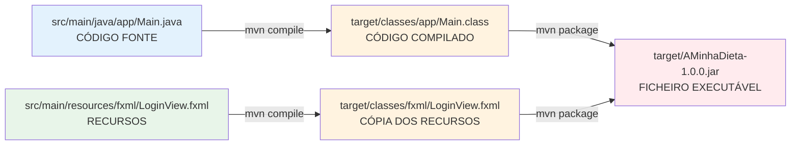
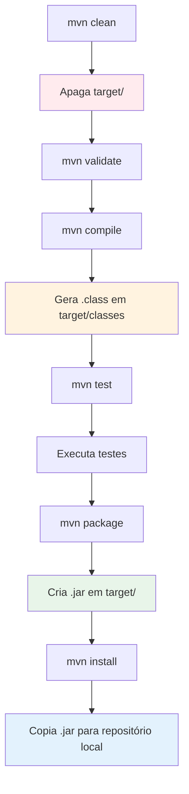
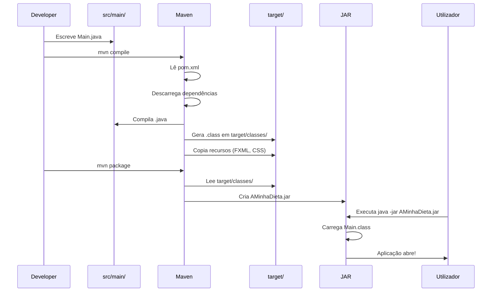

# 📘 Guia Completo: "A Minha Dieta" - Como Tudo se Liga

> **Documento Único e Completo** explicando toda a arquitetura, ligações entre ficheiros, fluxo de dados e navegação do projeto "A Minha Dieta"

---

## 📑 Índice

1. [Visão Geral do Projeto](#visão-geral-do-projeto)
2. [Arquitetura Completa](#arquitetura-completa)
3. [Fluxo de Arranque da Aplicação](#fluxo-de-arranque-da-aplicação)
4. [Mapa Completo de Ficheiros](#mapa-completo-de-ficheiros)
5. [Sistema de Navegação Entre Ecrãs](#sistema-de-navegação-entre-ecrãs)
6. [Fluxo de Dados na Aplicação](#fluxo-de-dados-na-aplicação)
7. [Casos de Uso Completos](#casos-de-uso-completos)
8. [Como os Controllers Comunicam](#como-os-controllers-comunicam)
9. [Sistema de Persistência](#sistema-de-persistência)
10. [Ligações FXML ↔ Controller ↔ Model](#ligações-fxml--controller--model)

---

## 🎯 Visão Geral do Projeto

**"A Minha Dieta"** é uma aplicação desktop JavaFX para gestão de dieta, exercício e hidratação.

### Tecnologias Usadas
- **Java 21** - Linguagem de programação
- **JavaFX 21** - Framework de interface gráfica
- **Maven** - Gestão de dependências
- **Serialização Java** - Persistência de dados

### Padrão Arquitetural: MVC



---

## 🏗️ Arquitetura Completa

### Estrutura de Diretórios

```
AminhaDieta/
├── src/main/
│   ├── java/app/
│   │   ├── Launcher.java           ← Ponto de entrada (wrapper)
│   │   ├── Main.java               ← Classe principal JavaFX
│   │   │
│   │   ├── model/                  ← CAMADA DE DADOS
│   │   │   ├── AppState.java       ← Estado global (todos os perfis)
│   │   │   ├── UserProfile.java    ← Perfil do utilizador
│   │   │   ├── MealEntry.java      ← Registo de refeição
│   │   │   ├── WaterEntry.java     ← Registo de água
│   │   │   ├── ExerciseEntry.java  ← Registo de exercício
│   │   │   ├── WeightEntry.java    ← Registo de peso
│   │   │   └── Food.java           ← Alimento (base de dados)
│   │   │
│   │   ├── persistence/            ← CAMADA DE PERSISTÊNCIA
│   │   │   └── DataStore.java      ← Guardar/Carregar ficheiro
│   │   │
│   │   └── ui/                     ← CAMADA DE INTERFACE
│   │       ├── SceneManager.java   ← Gestor de navegação
│   │       └── controller/         ← Controllers dos ecrãs
│   │           ├── LoginController.java
│   │           ├── RegisterController.java
│   │           ├── DashboardController.java
│   │           ├── HomeController.java
│   │           ├── MealsController.java
│   │           ├── HydrationController.java
│   │           ├── ExerciseController.java
│   │           ├── HistoryController.java
│   │           ├── FoodDatabaseController.java
│   │           └── SettingsController.java
│   │
│   └── resources/
│       ├── fxml/                   ← DESENHO DOS ECRÃS
│       │   ├── LoginView.fxml      ← Ecrã de login
│       │   ├── RegisterView.fxml   ← Ecrã de registo/edição
│       │   ├── DashboardView.fxml  ← Dashboard principal (container)
│       │   ├── HomeView.fxml       ← Tab: Resumo
│       │   ├── MealsView.fxml      ← Tab: Refeições
│       │   ├── HydrationView.fxml  ← Tab: Hidratação
│       │   ├── ExerciseView.fxml   ← Tab: Exercícios
│       │   ├── HistoryView.fxml    ← Tab: Histórico
│       │   ├── FoodDatabaseView.fxml ← Tab: Base de Dados
│       │   └── SettingsView.fxml   ← Tab: Definições
│       │
│       ├── css/
│       │   └── styles.css          ← Estilos globais
│       │
│       └── images/
│           └── icon.png            ← Ícone da aplicação
│
└── pom.xml                         ← Configuração Maven
```

---

## 🚀 Fluxo de Arranque da Aplicação

### Sequência Completa de Inicialização



### Código Explicado

**1. Launcher.java** - O Wrapper
```java
public class Launcher {
    public static void main(String[] args) {
        Main.main(args);  // Chama o Main "verdadeiro"
    }
}
```
**Por que existe?** Resolve problemas de módulos do Java. É só um intermediário.

---

**2. Main.java** - O Coração

```java
public class Main extends Application {
    
    @Override
    public void start(Stage stage) {
        // 1️⃣ DEFINIR CAMINHO DOS DADOS
        String appData = System.getenv("APPDATA");
        if (appData == null) {
            appData = System.getProperty("user.home");
        }
        Path dataPath = Path.of(appData, "AMinhaDieta", "data", "appstate.dat");
        
        // 2️⃣ CARREGAR DADOS
        DataStore store = new DataStore(dataPath);
        AppState state = store.load();  // Carrega ou cria novo
        
        // 3️⃣ CRIAR GESTOR DE NAVEGAÇÃO
        SceneManager sceneManager = new SceneManager(stage, state, store);
        
        // 4️⃣ MOSTRAR PRIMEIRO ECRÃ
        sceneManager.showInitialScene();
        
        // 5️⃣ CONFIGURAR JANELA
        stage.setTitle("A Minha Dieta");
        stage.getIcons().add(new Image(getClass().getResourceAsStream("/images/icon.png")));
        stage.show();
    }
    
    public static void main(String[] args) {
        launch(args);  // Arranca JavaFX
    }
}
```

**Fluxo:**
1. Sistema chama `main()` → chama `launch()`
2. JavaFX chama `start(Stage stage)` automaticamente
3. Carregamos dados do ficheiro
4. Criamos gestor de navegação
5. Decidimos que ecrã mostrar
6. Mostramos a janela

---

## 🗺️ Mapa Completo de Ficheiros

### Camada Model (Dados)

#### AppState.java - O Estado Global

```java
public class AppState implements Serializable {
    private List<UserProfile> profiles = new ArrayList<>();
    private UserProfile activeProfile;
    
    // Métodos principais
    public void addProfile(UserProfile profile)
    public UserProfile getActiveProfile()
    public void setActiveProfile(UserProfile profile)
    public List<UserProfile> getProfiles()
}
```

**O que guarda:**
- Lista de TODOS os utilizadores da aplicação
- Referência ao utilizador ativo neste momento

**Ligações:**
- `Main.java` → Carrega de `DataStore`
- `SceneManager` → Passa para todos os Controllers
- Todos os Controllers → Leem/modificam

---

#### UserProfile.java - O Perfil do Utilizador

```java
public class UserProfile implements Serializable {
    // DADOS PESSOAIS
    private String nome;
    private int idade;
    private double pesoKg;
    private double alturaCm;
    private Gender gender;
    private PhysicalActivityLevel physicalActivityLevel;
    private double targetWeightKg;
    private WeighInFrequency weighInFrequency;
    
    // LISTAS DE REGISTOS
    private List<MealEntry> meals = new ArrayList<>();
    private List<WaterEntry> waters = new ArrayList<>();
    private List<ExerciseEntry> exercises = new ArrayList<>();
    private List<WeightEntry> weights = new ArrayList<>();
    private List<Food> foods = new ArrayList<>();
    
    // MÉTODOS DE CÁLCULO
    public double getBMI()
    public int getDailyCalorieGoal()
    public double getDailyWaterGoalMl()
    public int getCaloriesConsumedToday()
    public double getWaterConsumedToday()
    // ... etc
}
```

**Ligações:**
- `AppState` → Guarda vários perfis
- `RegisterController` → Cria/edita perfil
- `HomeController` → Mostra estatísticas
- `MealsController` → Adiciona refeições
- Todos os Controllers → Acedem ao perfil ativo

---

#### Entries - Os Registos

Todas as classes de registo seguem o mesmo padrão:

```java
// MealEntry.java
public class MealEntry implements Serializable {
    private String description;
    private int calories;
    private double protein, carbs, fat;
    private LocalDateTime timestamp;
}

// WaterEntry.java
public class WaterEntry implements Serializable {
    private double amountMl;
    private LocalDateTime timestamp;
}

// ExerciseEntry.java
public class ExerciseEntry implements Serializable {
    private String type;
    private int duration;
    private double caloriesBurned;
    private LocalDateTime timestamp;
}

// WeightEntry.java
public class WeightEntry implements Serializable {
    private double weightKg;
    private LocalDate date;
}
```

**Ligação:** `UserProfile.meals/waters/exercises/weights` → Guardam listas destes

---

### Camada Persistence (Guardar Dados)

#### DataStore.java - O Gestor de Ficheiros

```java
public class DataStore {
    private Path filePath;
    
    public void save(AppState state) {
        // Cria diretórios se não existirem
        Files.createDirectories(filePath.getParent());
        
        // Escreve objeto serializado
        ObjectOutputStream out = new ObjectOutputStream(
            new FileOutputStream(filePath.toFile())
        );
        out.writeObject(state);
    }
    
    public AppState load() {
        if (!Files.exists(filePath)) {
            return new AppState();  // Novo
        }
        
        // Lê objeto do ficheiro
        ObjectInputStream in = new ObjectInputStream(
            new FileInputStream(filePath.toFile())
        );
        return (AppState) in.readObject();
    }
}
```

**Quando é usado:**
- `Main.java` → Carrega ao arranque
- Todos os Controllers → Chamam `store.save(state)` após alterações

**Localização do ficheiro:**
- Windows: `C:\Users\[Nome]\AppData\Roaming\AMinhaDieta\data\appstate.dat`

---

### Camada UI (Interface)

#### SceneManager.java - O Gestor de Navegação

**Este é o CORAÇÃO da navegação!**

```java
public class SceneManager {
    private final Stage stage;       // A janela
    private final AppState state;    // Dados globais
    private final DataStore store;   // Gestor de ficheiros
    
    // MÉTODO PRINCIPAL: Decide que ecrã mostrar no início
    public void showInitialScene() {
        if (state.getProfiles().isEmpty()) {
            showRegister(false, null);  // Sem perfis → criar obrigatoriamente
        } else {
            showLogin();                // Há perfis → escolher
        }
    }
    
    // MOSTRAR ECRÃ DE REGISTO/EDIÇÃO
    public void showRegister(boolean canCancel, UserProfile profileToEdit) {
        FXMLLoader loader = new FXMLLoader(
            getClass().getResource("/fxml/RegisterView.fxml")
        );
        Scene scene = new Scene(loader.load(), 1280, 800);
        scene.getStylesheets().add(
            getClass().getResource("/css/styles.css").toExternalForm()
        );
        
        RegisterController controller = loader.getController();
        controller.init(this, state, store, canCancel, profileToEdit);
        
        stage.setScene(scene);
    }
    
    // MOSTRAR ECRÃ DE LOGIN
    public void showLogin() {
        FXMLLoader loader = new FXMLLoader(
            getClass().getResource("/fxml/LoginView.fxml")
        );
        Scene scene = new Scene(loader.load(), 1280, 800);
        scene.getStylesheets().add(
            getClass().getResource("/css/styles.css").toExternalForm()
        );
        
        LoginController controller = loader.getController();
        controller.init(this, state, store);
        
        stage.setScene(scene);
    }
    
    // MOSTRAR DASHBOARD PRINCIPAL
    public void showDashboard() {
        if (state.getActiveProfile() == null) {
            showLogin();  // Sem utilizador ativo? Volta ao login
            return;
        }
        
        FXMLLoader loader = new FXMLLoader(
            getClass().getResource("/fxml/DashboardView.fxml")
        );
        Scene scene = new Scene(loader.load(), 1280, 800);
        scene.getStylesheets().add(
            getClass().getResource("/css/styles.css").toExternalForm()
        );
        
        DashboardController controller = loader.getController();
        controller.init(this, state, store);
        
        stage.setScene(scene);
    }
}
```

**Padrão que se repete em todos os métodos `show*()`:**

1. **Carregar FXML** → `FXMLLoader` lê o ficheiro `.fxml`
2. **Criar Scene** → Coloca o conteúdo numa cena de 1280×800
3. **Adicionar CSS** → Aplica estilos
4. **Obter Controller** → Pega o controller ligado ao FXML
5. **Inicializar Controller** → Passa `SceneManager`, `AppState`, `DataStore`
6. **Mudar Scene** → `stage.setScene(scene)` muda o ecrã

---

## 🔄 Sistema de Navegação Entre Ecrãs

### Mapa de Navegação



### Tipos de Navegação

#### 1. Navegação por Janela Completa (Scene Manager)

Usado para mudanças grandes (Login → Dashboard):

```java
// No Controller atual
sceneManager.showDashboard();  // Muda para Dashboard
sceneManager.showLogin();      // Volta ao Login
sceneManager.showRegister(true, profile);  // Editar perfil
```

#### 2. Navegação por Tabs (Dentro do Dashboard)

O `DashboardView.fxml` tem um `TabPane`:

```xml
<TabPane>
    <Tab text="Resumo">
        <fx:include source="HomeView.fxml" />
    </Tab>
    <Tab text="Refeições">
        <fx:include source="MealsView.fxml" />
    </Tab>
    <!-- ... outras tabs -->
</TabPane>
```

**Como funciona:**
- `<fx:include>` carrega outro ficheiro FXML dentro
- Cada tab tem o seu próprio Controller
- Todos partilham o mesmo `AppState` e `DataStore`

---

## 📊 Fluxo de Dados na Aplicação

### Como os Dados Circulam



### Cadeia de Responsabilidade

1. **Main** carrega `AppState` do ficheiro
2. **SceneManager** recebe `AppState` e passa para cada Controller
3. **Controller** manipula `AppState` (adiciona, remove, modifica)
4. **Controller** chama `dataStore.save(state)` para persistir
5. **DataStore** escreve no ficheiro

---

## 💡 Casos de Uso Completos

### Caso 1: Adicionar uma Refeição

**Passo a passo completo:**



**Código real do MealsController:**

```java
@FXML
private TextField descriptionField;
@FXML
private TextField caloriesField;
@FXML
private TextField proteinField;
@FXML
private TextField carbsField;
@FXML
private TextField fatField;
@FXML
private TableView<MealEntry> mealsTable;

@FXML
private void handleAddMeal() {
    // 1️⃣ VALIDAR
    if (descriptionField.getText().isEmpty()) {
        showError("Descrição obrigatória!");
        return;
    }
    
    try {
        // 2️⃣ RECOLHER DADOS
        String description = descriptionField.getText();
        int calories = Integer.parseInt(caloriesField.getText());
        double protein = Double.parseDouble(proteinField.getText());
        double carbs = Double.parseDouble(carbsField.getText());
        double fat = Double.parseDouble(fatField.getText());
        
        // 3️⃣ CRIAR OBJETO
        MealEntry meal = new MealEntry(description, calories, protein, carbs, fat);
        
        // 4️⃣ ADICIONAR AO PERFIL
        UserProfile profile = appState.getActiveProfile();
        profile.getMeals().add(meal);
        
        // 5️⃣ GUARDAR
        dataStore.save(appState);
        
        // 6️⃣ ATUALIZAR UI
        refreshMealsTable();
        clearFields();
        showSuccess("Refeição adicionada!");
        
    } catch (NumberFormatException e) {
        showError("Valores numéricos inválidos!");
    }
}

private void refreshMealsTable() {
    UserProfile profile = appState.getActiveProfile();
    LocalDate today = LocalDate.now();
    
    List<MealEntry> todayMeals = profile.getMeals().stream()
        .filter(m -> m.getTimestamp().toLocalDate().equals(today))
        .collect(Collectors.toList());
    
    mealsTable.getItems().setAll(todayMeals);
}
```

---

### Caso 2: Login e Navegação para Dashboard



**Código do LoginController:**

```java
@FXML
private ListView<String> profilesListView;

public void init(SceneManager sm, AppState state, DataStore store) {
    this.sceneManager = sm;
    this.appState = state;
    this.dataStore = store;
    
    // Preencher lista com nomes dos perfis
    profilesListView.getItems().clear();
    for (UserProfile profile : state.getProfiles()) {
        profilesListView.getItems().add(profile.getNome());
    }
}

@FXML
private void handleLogin() {
    String selectedName = profilesListView.getSelectionModel().getSelectedItem();
    
    if (selectedName == null) {
        showError("Selecione um perfil!");
        return;
    }
    
    // Encontrar o perfil pelo nome
    UserProfile profile = appState.getProfiles().stream()
        .filter(p -> p.getNome().equals(selectedName))
        .findFirst()
        .orElse(null);
    
    if (profile != null) {
        // Definir como ativo
        appState.setActiveProfile(profile);
        
        // Navegar para Dashboard
        sceneManager.showDashboard();
    }
}
```

---

### Caso 3: Dashboard Coordena Todos os Tabs

**DashboardController.java** é especial porque:
- Carrega múltiplos sub-controllers (um por cada tab)
- Passa dados para todos eles
- Coordena atualizações entre tabs

```java
public class DashboardController {
    
    // REFERÊNCIAS AOS SUB-CONTROLLERS
    @FXML private HomeController homeViewController;
    @FXML private MealsController mealsViewController;
    @FXML private HydrationController hydrationViewController;
    @FXML private ExerciseController exerciseViewController;
    @FXML private HistoryController historyViewController;
    @FXML private FoodDatabaseController foodDatabaseViewController;
    @FXML private SettingsController settingsViewController;
    
    private SceneManager sceneManager;
    private AppState appState;
    private DataStore dataStore;
    
    public void init(SceneManager sm, AppState state, DataStore store) {
        this.sceneManager = sm;
        this.appState = state;
        this.dataStore = store;
        
        // INICIALIZAR TODOS OS SUB-CONTROLLERS
        homeViewController.init(this, state, store);
        mealsViewController.init(this, state, store);
        hydrationViewController.init(this, state, store);
        exerciseViewController.init(this, state, store);
        historyViewController.init(this, state, store);
        foodDatabaseViewController.init(this, state, store);
        settingsViewController.init(this, state, store);
        
        // ATUALIZAR TODOS
        refreshAll();
    }
    
    // MÉTODO CHAMADO PELOS SUB-CONTROLLERS
    public void refreshAll() {
        homeViewController.refresh();
        // Outros podem implementar refresh() se necessário
    }
    
    // MÉTODOS DE NAVEGAÇÃO
    public void logout() {
        appState.setActiveProfile(null);
        sceneManager.showLogin();
    }
    
    public void editProfile() {
        UserProfile current = appState.getActiveProfile();
        sceneManager.showRegister(true, current);
    }
}
```

**Como os sub-controllers comunicam:**

```java
// MealsController adiciona refeição
public void handleAddMeal() {
    // ... adiciona refeição ...
    
    // Notifica Dashboard para atualizar Home (estatísticas)
    dashboardController.refreshAll();
}
```

---

## 🔗 Ligações FXML ↔ Controller ↔ Model

### Anatomia Completa de uma Conexão

#### 1. FXML Define a Interface

**MealsView.fxml:**
```xml
<?xml version="1.0" encoding="UTF-8"?>
<?import javafx.scene.control.*?>
<?import javafx.scene.layout.*?>

<VBox xmlns:fx="http://javafx.com/fxml"
      fx:controller="app.ui.controller.MealsController"
      spacing="20" padding="30">
    
    <!-- CAMPO DE DESCRIÇÃO -->
    <HBox spacing="10">
        <Label text="Descrição:" />
        <TextField fx:id="descriptionField" prefWidth="300" />
    </HBox>
    
    <!-- CAMPO DE CALORIAS -->
    <HBox spacing="10">
        <Label text="Calorias:" />
        <TextField fx:id="caloriesField" prefWidth="100" />
    </HBox>
    
    <!-- BOTÃO ADICIONAR -->
    <Button text="Adicionar Refeição" 
            onAction="#handleAddMeal" 
            styleClass="primary-button" />
    
    <!-- TABELA DE REFEIÇÕES -->
    <TableView fx:id="mealsTable" prefHeight="400">
        <columns>
            <TableColumn text="Descrição" 
                         fx:id="descriptionColumn" 
                         prefWidth="200" />
            <TableColumn text="Calorias" 
                         fx:id="caloriesColumn" 
                         prefWidth="100" />
        </columns>
    </TableView>
    
</VBox>
```

**Pontos de Ligação:**
- `fx:controller="app.ui.controller.MealsController"` → Diz qual classe controla
- `fx:id="descriptionField"` → ID para ligar ao Java
- `onAction="#handleAddMeal"` → Método chamado ao clicar

---

#### 2. Controller Liga ao FXML

**MealsController.java:**
```java
package app.ui.controller;

import javafx.fxml.FXML;
import javafx.scene.control.*;

public class MealsController {
    
    // LIGAÇÃO AOS ELEMENTOS FXML
    // Nome TEM de coincidir com fx:id=""
    @FXML private TextField descriptionField;
    @FXML private TextField caloriesField;
    @FXML private TableView<MealEntry> mealsTable;
    @FXML private TableColumn<MealEntry, String> descriptionColumn;
    @FXML private TableColumn<MealEntry, Integer> caloriesColumn;
    
    // DADOS RECEBIDOS DO DASHBOARD
    private DashboardController dashboardController;
    private AppState appState;
    private DataStore dataStore;
    
    // INICIALIZAÇÃO
    public void init(DashboardController dc, AppState state, DataStore store) {
        this.dashboardController = dc;
        this.appState = state;
        this.dataStore = store;
        
        // Configurar colunas da tabela
        descriptionColumn.setCellValueFactory(
            cellData -> new SimpleStringProperty(cellData.getValue().getDescription())
        );
        caloriesColumn.setCellValueFactory(
            cellData -> new SimpleIntegerProperty(cellData.getValue().getCalories()).asObject()
        );
        
        // Carregar dados
        refresh();
    }
    
    // EVENTO DO BOTÃO (ligado via onAction="#handleAddMeal")
    @FXML
    private void handleAddMeal() {
        // Código aqui
    }
    
    // ATUALIZAR DADOS
    public void refresh() {
        UserProfile profile = appState.getActiveProfile();
        if (profile == null) return;
        
        // Filtrar refeições de hoje
        LocalDate today = LocalDate.now();
        List<MealEntry> todayMeals = profile.getMeals().stream()
            .filter(m -> m.getTimestamp().toLocalDate().equals(today))
            .collect(Collectors.toList());
        
        // Atualizar tabela
        mealsTable.getItems().setAll(todayMeals);
    }
}
```

---

#### 3. Model Fornece os Dados

**UserProfile.java** (já explicado antes):
```java
public class UserProfile {
    private List<MealEntry> meals = new ArrayList<>();
    
    public List<MealEntry> getMeals() {
        return meals;
    }
}
```

**MealEntry.java:**
```java
public class MealEntry implements Serializable {
    private String description;
    private int calories;
    private double protein, carbs, fat;
    private LocalDateTime timestamp;
    
    public MealEntry(String desc, int cal, double prot, double carbs, double fat) {
        this.description = desc;
        this.calories = cal;
        this.protein = prot;
        this.carbs = carbs;
        this.fat = fat;
        this.timestamp = LocalDateTime.now();
    }
    
    // Getters
    public String getDescription() { return description; }
    public int getCalories() { return calories; }
    // ...
}
```

---

### Resumo da Ligação Completa

```mermaid
graph TD
    FXML[MealsView.fxml<br/>fx:id='descriptionField'<br/>onAction='#handleAddMeal'] 
    
    CTRL[MealsController.java<br/>@FXML private TextField descriptionField<br/>@FXML void handleAddMeal]
    
    MODEL[UserProfile<br/>List&lt;MealEntry&gt; meals]
    
    ENTRY[MealEntry<br/>description, calories, ...]
    
    FXML -->|@FXML liga| CTRL
    CTRL -->|getMeals.add| MODEL
    MODEL -->|contém| ENTRY
    
    style FXML fill:#fff3e0
    style CTRL fill:#f3e5f5
    style MODEL fill:#e3f2fd
    style ENTRY fill:#e8f5e9
```

---

## 🎨 Sistema de Estilos (CSS)

**styles.css** é aplicado a TODOS os ecrãs:

```css
/* Cores principais */
:root {
    -fx-primary-color: #667eea;
    -fx-secondary-color: #764ba2;
}

/* Botões */
.button {
    -fx-background-color: linear-gradient(to right, #667eea, #764ba2);
    -fx-text-fill: white;
    -fx-font-size: 14px;
    -fx-padding: 10px 20px;
    -fx-background-radius: 8px;
}

.button:hover {
    -fx-opacity: 0.9;
    -fx-cursor: hand;
}

/* Campos de texto */
.text-field {
    -fx-padding: 10px;
    -fx-font-size: 14px;
    -fx-border-color: #ddd;
    -fx-border-radius: 5px;
}

.text-field:focused {
    -fx-border-color: #667eea;
}
```

**Como é aplicado:**

```java
// No SceneManager
scene.getStylesheets().add(
    getClass().getResource("/css/styles.css").toExternalForm()
);
```

---

## 🔧 Maven e o Processo de Compilação

### O que é Maven?

**Maven** é uma ferramenta de automação e gestão de projetos Java. Pensa nela como um "assistente" que:
- **Descarrega bibliotecas** automaticamente (JavaFX, OpenPDF, etc.)
- **Compila** o código Java
- **Empacota** a aplicação num ficheiro executável
- **Gere dependências** entre bibliotecas

### O Ficheiro pom.xml - A Receita do Projeto

**Localização:** `AminhaDieta/pom.xml`

Este ficheiro XML diz ao Maven **tudo** sobre o projeto:

```xml
<project>
  <!-- IDENTIFICAÇÃO -->
  <groupId>ubi</groupId>
  <artifactId>AMinhaDieta</artifactId>
  <version>1.0.0</version>
  <name>A Minha Dieta</name>
  
  <!-- VERSÃO DO JAVA -->
  <properties>
    <maven.compiler.source>21</maven.compiler.source>
    <maven.compiler.target>21</maven.compiler.target>
    <javafx.version>21.0.4</javafx.version>
  </properties>
  
  <!-- BIBLIOTECAS NECESSÁRIAS -->
  <dependencies>
    <dependency>
      <groupId>org.openjfx</groupId>
      <artifactId>javafx-controls</artifactId>
      <version>21.0.4</version>
    </dependency>
    
    <dependency>
      <groupId>org.openjfx</groupId>
      <artifactId>javafx-fxml</artifactId>
      <version>21.0.4</version>
    </dependency>
    
    <dependency>
      <groupId>com.github.librepdf</groupId>
      <artifactId>openpdf</artifactId>
      <version>1.3.30</version>
    </dependency>
  </dependencies>
  
  <!-- PLUGINS (FERRAMENTAS) -->
  <build>
    <plugins>
      <!-- Plugin para executar JavaFX -->
      <plugin>
        <groupId>org.openjfx</groupId>
        <artifactId>javafx-maven-plugin</artifactId>
        <version>0.0.8</version>
        <configuration>
          <mainClass>app.Launcher</mainClass>
        </configuration>
      </plugin>
      
      <!-- Plugin para criar JAR executável -->
      <plugin>
        <groupId>org.apache.maven.plugins</groupId>
        <artifactId>maven-shade-plugin</artifactId>
        <version>3.5.1</version>
      </plugin>
    </plugins>
  </build>
</project>
```

**Explicação das Secções:**

| Secção | O que Define |
|--------|--------------|
| `groupId` | Organização (como domínio invertido) |
| `artifactId` | Nome do projeto |
| `version` | Versão atual |
| `properties` | Configurações (versão Java, etc.) |
| `dependencies` | Bibliotecas externas necessárias |
| `build/plugins` | Ferramentas para compilar/executar |

---

### Os Dois Ficheiros POM: Qual é Qual?

No projeto existem **2 ficheiros POM**. Vamos perceber a diferença:

#### 1. **pom.xml** - O FUNDAMENTAL ✅

**Localização:** `AminhaDieta/pom.xml`

**O que é?** Este é o ficheiro **PRINCIPAL** e **ESSENCIAL** do projeto Maven.

**Para que serve:**
- Define **TODAS** as dependências do projeto
- Configura plugins e build
- É o que **TU EDITAS** quando precisas mudar algo
- **SEM ESTE FICHEIRO, O PROJETO NÃO FUNCIONA!**

**Quando editar:**
- Adicionar nova biblioteca
- Mudar versão do Java
- Configurar novo plugin
- Alterar versão do projeto

**Exemplo de edição comum:**
```xml
<!-- Adicionar nova dependência -->
<dependencies>
  <dependency>
    <groupId>com.google.code.gson</groupId>
    <artifactId>gson</artifactId>
    <version>2.10.1</version>
  </dependency>
</dependencies>
```

---

#### 2. **dependency-reduced-pom.xml** - O GERADO ⚙️

**Localização:** `AminhaDieta/dependency-reduced-pom.xml`

**O que é?** Ficheiro **GERADO AUTOMATICAMENTE** pelo plugin `maven-shade-plugin`.

**Para que serve:**
- É criado quando fazes `mvn package`
- Usado pelo shade plugin para criar JAR "gordo" (com todas as dependências incluídas)
- Mostra só as dependências que realmente vão para o JAR final

**Quando editar:**
- **NUNCA!** ❌ É regenerado sempre que compilas

**Diferença visual:**

```
pom.xml (ORIGINAL - 86 linhas)
├── TODAS as dependências listadas
├── Configuração completa
└── TU EDITAS ISTO ✅

dependency-reduced-pom.xml (GERADO - menos linhas)
├── Dependências REDUZIDAS (algumas podem estar "inline" no JAR)
├── Gerado pelo shade plugin
└── NÃO MEXER! ❌
```

---

### Por Que o `dependency-reduced-pom.xml` Existe?

Quando o **maven-shade-plugin** cria o JAR final:

1. **Pega todas as bibliotecas** (JavaFX, OpenPDF, etc.)
2. **Inclui-as DENTRO do JAR** (por isso é "gordo" / "shaded")
3. **Cria este ficheiro** para documentar o que ficou de fora

**Analogia:** Imagina que estás a fazer uma mala para viajar:
- `pom.xml` → Lista COMPLETA do que queres levar
- `maven-shade` → Empacota tudo numa mala só
- `dependency-reduced-pom.xml` → Lista do que já está empacotado vs. o que ficou separado

---

### Comparação Lado a Lado

| Aspeto | pom.xml | dependency-reduced-pom.xml |
|--------|---------|---------------------------|
| **Criado por** | Tu (developer) | Maven shade plugin |
| **Quando** | Início do projeto | Ao fazer `mvn package` |
| **Modificar?** | ✅ SIM, sempre que necessário | ❌ NÃO, é regenerado |
| **Essencial?** | ✅ SIM, sem isto o projeto não funciona | ⚠️ Não, é só auxiliar |
| **Git commit?** | ✅ SIM, sempre | ⚠️ Opcional, muitos ignoram |
| **Conteúdo** | Configuração COMPLETA | Versão REDUZIDA após shade |

---

### São Fundamentais para o Projeto?

**pom.xml** → **SIM! 100% FUNDAMENTAL** ⭐⭐⭐⭐⭐

Sem este ficheiro:
- ❌ Maven não sabe que bibliotecas descarregar
- ❌ Não compila o projeto
- ❌ Não sabe a versão de Java
- ❌ Não consegue criar o executável

**É COMO A CERTIDÃO DE NASCIMENTO DO PROJETO!**

---

**dependency-reduced-pom.xml** → **Não é fundamental** ⭐

Sem este ficheiro:
- ✅ Projeto compila na mesma
- ✅ Maven funciona normalmente
- ✅ JAR é criado
- ⚠️ Só é usado internamente pelo shade plugin

**É COMO UM RECIBO AUTOMÁTICO - útil mas não essencial**

---

### O Que Acontece Se Apagar?

**Se apagares `pom.xml`:**
```bash
$ mvn compile
[ERROR] The goal you specified requires a project to execute 
but there is no POM in this directory
```
💥 **PROJETO PÁRA DE FUNCIONAR!**

---

**Se apagares `dependency-reduced-pom.xml`:**
```bash
$ mvn package
[INFO] Building jar: target/AMinhaDieta-1.0.0.jar
[INFO] BUILD SUCCESS
```
✅ **Funciona normalmente! É recriado automaticamente.**

---

### Estrutura Detalhada do pom.xml

```xml
<?xml version="1.0" encoding="UTF-8"?>
<project>
  <!-- 1️⃣ IDENTIFICAÇÃO DO PROJETO -->
  <modelVersion>4.0.0</modelVersion>
  <groupId>ubi</groupId>              <!-- Organização -->
  <artifactId>AMinhaDieta</artifactId> <!-- Nome -->
  <version>1.0.0</version>             <!-- Versão -->
  
  <!-- 2️⃣ METADATA -->
  <name>A Minha Dieta</name>
  <description>Aplicação desktop para gestão de dieta...</description>
  <developers>
    <developer>
      <name>Equipa Técnica</name>
    </developer>
  </developers>
  
  <!-- 3️⃣ PROPRIEDADES GLOBAIS -->
  <properties>
    <!-- Versão Java que o código usa -->
    <maven.compiler.source>21</maven.compiler.source>
    <maven.compiler.target>21</maven.compiler.target>
    
    <!-- Versão JavaFX -->
    <javafx.version>21.0.4</javafx.version>
  </properties>
  
  <!-- 4️⃣ DEPENDÊNCIAS (BIBLIOTECAS) -->
  <dependencies>
    <!-- JavaFX Controls (botões, labels, etc.) -->
    <dependency>
      <groupId>org.openjfx</groupId>
      <artifactId>javafx-controls</artifactId>
      <version>${javafx.version}</version>
    </dependency>
    
    <!-- JavaFX FXML (carregar ficheiros .fxml) -->
    <dependency>
      <groupId>org.openjfx</groupId>
      <artifactId>javafx-fxml</artifactId>
      <version>${javafx.version}</version>
    </dependency>
    
    <!-- JavaFX Swing (integração com Swing) -->
    <dependency>
      <groupId>org.openjfx</groupId>
      <artifactId>javafx-swing</artifactId>
      <version>${javafx.version}</version>
    </dependency>
    
    <!-- OpenPDF (exportar PDFs) -->
    <dependency>
      <groupId>com.github.librepdf</groupId>
      <artifactId>openpdf</artifactId>
      <version>1.3.30</version>
    </dependency>
  </dependencies>
  
  <!-- 5️⃣ BUILD (COMO COMPILAR) -->
  <build>
    <plugins>
      <!-- Plugin para executar JavaFX -->
      <plugin>
        <groupId>org.openjfx</groupId>
        <artifactId>javafx-maven-plugin</artifactId>
        <version>0.0.8</version>
        <configuration>
          <!-- Classe principal (ponto de entrada) -->
          <mainClass>app.Launcher</mainClass>
        </configuration>
      </plugin>
      
      <!-- Plugin para criar JAR executável com dependências -->
      <plugin>
        <groupId>org.apache.maven.plugins</groupId>
        <artifactId>maven-shade-plugin</artifactId>
        <version>3.5.1</version>
        <executions>
          <execution>
            <phase>package</phase>
            <goals>
              <goal>shade</goal>
            </goals>
            <configuration>
              <transformers>
                <transformer>
                  <!-- Define qual classe tem o main() -->
                  <mainClass>app.Launcher</mainClass>
                </transformer>
              </transformers>
            </configuration>
          </execution>
        </executions>
      </plugin>
    </plugins>
  </build>
</project>
```

---

### Por Que Estas Dependências Específicas?

| Dependência | Por Que Precisamos |
|-------------|--------------------|
| **javafx-controls** | Botões, Labels, TextFields - toda a UI básica |
| **javafx-fxml** | Carregar ficheiros `.fxml` (interface desenhada em XML) |
| **javafx-swing** | Gráficos e integração (PieChart, LineChart) |
| **openpdf** | Exportar histórico para PDF (HistoryController) |

**Se removeres qualquer uma:**
```
Error: Class not found: javafx.scene.control.Button
```

---

### Como Maven Resolve Dependências?



**Primeira vez:**
```
Downloading from central: https://repo.maven.apache.org/.../javafx-controls-21.0.4.jar
Downloaded: 2.8 MB
```

**Próximas vezes:**
```
Using cached: C:\Users\Carlos\.m2\repository\...\javafx-controls-21.0.4.jar
```
⚡ **Muito mais rápido!**

---

### Resumo: O Essencial sobre POM

✅ **FUNDAMENTAL:**
- `pom.xml` → Ficheiro PRINCIPAL, editas TU
- Define TUDO sobre o projeto
- SEM ele, NADA funciona
- Faz commit no Git sempre

⚙️ **AUXILIAR:**
- `dependency-reduced-pom.xml` → Gerado automaticamente
- Criado pelo shade plugin
- NUNCA edites
- Pode ser ignorado no Git (.gitignore)

🎯 **Para o Nosso Projeto:**
- `pom.xml` é **ESSENCIAL** ⭐⭐⭐⭐⭐
- Sem as dependências do JavaFX → Interface não funciona
- Sem OpenPDF → Exportação PDF não funciona
- Sem shade plugin → JAR executável não é criado

---

### A Pasta `target` - Onde Vai o Código Compilado

**Localização:** `AminhaDieta/target/`

**O que é?** É onde Maven coloca tudo o que **gera** a partir do teu código fonte.

```
target/
├── classes/                    ← Ficheiros .class compilados
│   ├── app/
│   │   ├── Launcher.class
│   │   ├── Main.class
│   │   ├── model/
│   │   │   ├── AppState.class
│   │   │   ├── UserProfile.class
│   │   │   └── ...
│   │   └── ui/
│   │       ├── SceneManager.class
│   │       └── controller/
│   │           ├── LoginController.class
│   │           └── ...
│   ├── css/
│   │   └── styles.css
│   ├── fxml/
│   │   ├── LoginView.fxml
│   │   └── ...
│   └── images/
│       └── icon.png
│
├── generated-sources/          ← Código gerado automaticamente
├── maven-status/               ← Estado da compilação
├── AMinhaDieta-1.0.0.jar      ← JAR executável final
└── original-AMinhaDieta-1.0.0.jar  ← JAR antes do shade

```

**Importante:** Esta pasta é **GERADA** automaticamente. Nunca edites nada aqui!

---

### Relação entre `src/main` e `target`



**Processo:**

1. **src/main/java/** (código .java) → **mvn compile** → **target/classes/** (ficheiros .class)
2. **src/main/resources/** (FXML, CSS, imagens) → **copiados** → **target/classes/**
3. **target/classes/** + **bibliotecas** → **mvn package** → **target/*.jar** (executável)

---

### Comandos Maven Essenciais

#### 1. `mvn clean` - Limpar

```bash
mvn clean
```

**O que faz:**
- Apaga completamente a pasta `target/`
- Remove todos os ficheiros compilados
- "Reset" ao projeto

**Quando usar:** Quando há problemas estranhos ou queres começar do zero.

---

#### 2. `mvn compile` - Compilar

```bash
mvn compile
```

**O que faz:**
1. Descarrega dependências (se não estiverem já)
2. Compila todos os ficheiros `.java` → `.class`
3. Copia recursos (FXML, CSS) para `target/classes/`

**Resultado:** Pasta `target/classes/` preenchida

**Erros comuns:**
- `cannot find symbol` → Erro de código (variável não existe, import errado)
- `package does not exist` → Falta dependência no `pom.xml`

---

#### 3. `mvn package` - Empacotar

```bash
mvn package
```

**O que faz:**
1. Faz `mvn compile` primeiro
2. Cria ficheiro **JAR** em `target/AMinhaDieta-1.0.0.jar`
3. Inclui todas as dependências (shade plugin)

**Resultado:** Ficheiro executável `.jar`

---

#### 4. `mvn javafx:run` - Executar

```bash
mvn javafx:run
```

**O que faz:**
1. Compila se necessário
2. **Executa** a aplicação
3. Chama a classe definida em `<mainClass>` (Launcher)

**Resultado:** Aplicação abre!

---

#### 5. `mvn clean install` - Tudo

```bash
mvn clean install
```

**O que faz:**
1. Limpa (`clean`)
2. Compila (`compile`)
3. Testa (se houver testes)
4. Empacota (`package`)
5. Instala no repositório local Maven

---

### Ciclo de Vida Maven



---

### Onde Maven Guarda as Bibliotecas?

**Repositório Local:** `C:\Users\[TeuNome]\.m2\repository\`

Exemplo:
```
.m2/repository/
├── org/openjfx/
│   ├── javafx-controls/21.0.4/
│   │   └── javafx-controls-21.0.4.jar
│   └── javafx-fxml/21.0.4/
│       └── javafx-fxml-21.0.4.jar
└── com/github/librepdf/
    └── openpdf/1.3.30/
        └── openpdf-1.3.30.jar
```

**Primeira vez:** Maven descarrega da internet
**Depois:** Usa cópias locais (muito mais rápido!)

---

### Estrutura Completa do Projeto

```
AminhaDieta/  (pasta raiz do git)
│
├── .git/                       ← Controlo de versão Git
├── .gitignore                  ← Ficheiros a ignorar no Git
│
├── AminhaDieta/               ← PASTA DO PROJETO MAVEN
│   │
│   ├── pom.xml                ← Configuração Maven
│   │
│   ├── src/                   ← CÓDIGO FONTE
│   │   ├── main/
│   │   │   ├── java/          ← Código Java
│   │   │   └── resources/     ← FXML, CSS, imagens
│   │   └── test/              ← Testes (se houver)
│   │
│   ├── target/                ← GERADO PELO MAVEN
│   │   ├── classes/           ← .class compilados + recursos
│   │   └── *.jar              ← Executáveis
│   │
│   ├── build_with_portable_maven.ps1  ← Script build
│   ├── setup.iss              ← Configuração instalador
│   └── AMinhaDieta_Setup.exe  ← Instalador Windows
│
├── README.md                  ← Documentação
├── GIT_MANUAL.md             ← Manual Git
├── Project_Report.md          ← Relatório
└── guia-estudo/              ← Esta documentação!
    └── GUIA_COMPLETO_DO_PROJETO.md
```

---

### Ficheiros que (Quase) Nunca Deves Editar

❌ **Não mexer:**
- Qualquer coisa em `target/` - é regenerado sempre
- `.m2/repository/` - é o repositório Maven
- `dependency-reduced-pom.xml` - gerado pelo shade plugin

✅ **Editas normalmente:**
- `src/main/java/` - o teu código
- `src/main/resources/` - FXML, CSS, imagens
- `pom.xml` - quando adicionas dependências

---

### FAQ Maven e Target

**P: Posso apagar a pasta `target`?**  
R: Sim! É recriada com `mvn compile`. Equivale a `mvn clean`.

**P: Por que `target` está tão grande?**  
R: Contém todas as bibliotecas (JavaFX é grande). Normal ter 50-100MB.

**P: Devo fazer commit de `target` no Git?**  
R: **NÃO!** O `.gitignore` já a exclui. É gerada, não é código fonte.

**P: O que é o ficheiro `.class`?**  
R: Código Java compilado (bytecode). A JVM (Java Virtual Machine) executa isto, não o `.java`.

**P: Por que há 2 JARs (original e normal)?**  
R: O `shade` plugin cria o JAR "gordo" (com dependências) e guarda o original sem elas.

**P: Como adiciono uma biblioteca nova?**  
R: Adiciona `<dependency>` no `pom.xml` e faz `mvn compile`.

Exemplo:
```xml
<dependency>
    <groupId>com.google.code.gson</groupId>
    <artifactId>gson</artifactId>
    <version>2.10.1</version>
</dependency>
```

---

### Fluxo Completo: Do Código ao Executável



---

## 📝 Resumo Final: Como Tudo Funciona Junto

### Fluxo Completo da Aplicação

```
1. ARRANQUE
   Launcher → Main → DataStore.load() → AppState

2. NAVEGAÇÃO INICIAL
   Main → SceneManager.showInitialScene()
   ↓
   Se há perfis: LoginView
   Se não há: RegisterView

3. LOGIN
   LoginView → LoginController → seleciona perfil
   → appState.setActiveProfile()
   → sceneManager.showDashboard()

4. DASHBOARD
   DashboardView (TabPane) carrega:
   - HomeView → HomeController
   - MealsView → MealsController
   - HydrationView → HydrationController
   - ... (7 tabs no total)

5. INTERAÇÃO
   Utilizador clica botão em MealsView
   → MealsController.handleAddMeal()
   → Cria MealEntry
   → profile.getMeals().add(meal)
   → dataStore.save(appState)
   → Atualiza UI
   → dashboardController.refreshAll()

6. PERSISTÊNCIA
   Qualquer alteração → dataStore.save()
   → Serializa AppState
   → Escreve em appstate.dat

7. PRÓXIMO ARRANQUE
   Main.start() → DataStore.load()
   → Deserializa appstate.dat
   → AppState restaurado com todos os dados!
```

---

## ✅ Checklist de Compreensão

Marca quando compreenderes cada tópico:

### Arranque
- [ ] Entendo o papel do Launcher vs Main
- [ ] Sei como o DataStore carrega dados
- [ ] Compreendo showInitialScene()

### Navegação
- [ ] Sei como SceneManager muda entre ecrãs
- [ ] Entendo a diferença entre navegação de janela e tabs
- [ ] Compreendo o papel do DashboardController

### Fluxo de Dados
- [ ] Sei como AppState é passado para controllers
- [ ] Entendo como UserProfile guarda registos
- [ ] Compreendo quando dataStore.save() é chamado

### Ligações
- [ ] Entendo fx:id e @FXML
- [ ] Sei como onAction liga a métodos
- [ ] Compreendo como TableView é populada

### Casos Práticos
- [ ] Consigo seguir o fluxo de adicionar refeição
- [ ] Entendo o processo de login completo
- [ ] Sei como tabs comunicam entre si

---

**Agora compreendes como TUDO se liga no projeto "A Minha Dieta"! 🎉**

*Este é o mapa completo da aplicação. Usa-o como referência sempre que precisares!*
