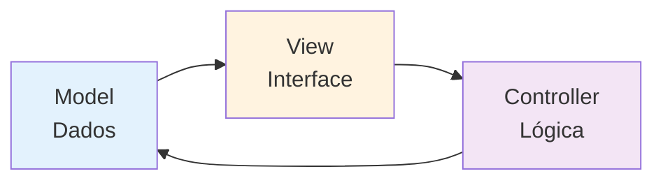
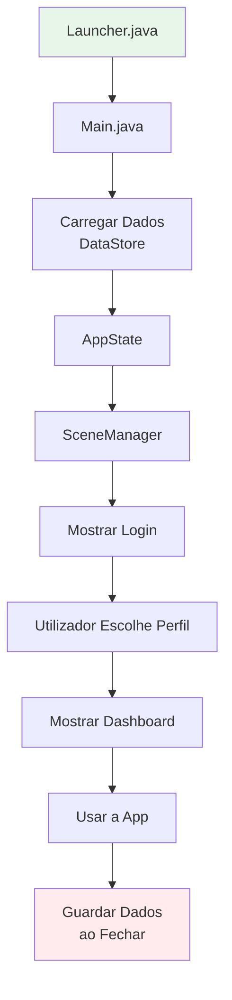
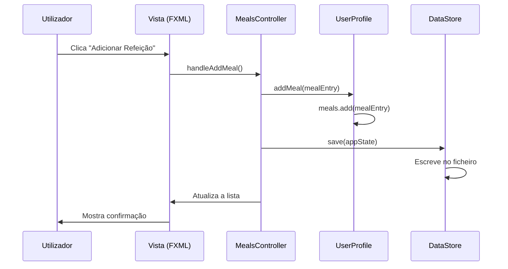

# 🎓 Guia de Estudo: A Minha Dieta - Java para Iniciantes

> **Bem-vindo!** Este guia foi criado para te ajudar a compreender tudo sobre o nosso projeto "A Minha Dieta" como se fosse a primeira vez que vês código Java. Vamos explicar cada conceito de forma simples e clara!

---

## 📚 Índice

1. [O que é este Projeto?](#o-que-é-este-projeto)
2. [Conceitos Básicos de Java](#conceitos-básicos-de-java)
3. [Entendendo a Estrutura do Projeto](#entendendo-a-estrutura-do-projeto)
4. [As Classes do Nosso Projeto](#as-classes-do-nosso-projeto)
5. [Como Funciona a Interface Gráfica](#como-funciona-a-interface-gráfica)
6. [Vocabulário Técnico](#vocabulário-técnico)

---

## 🎯 O que é este Projeto?

**"A Minha Dieta"** é uma aplicação de computador que ajuda pessoas a controlar:
- 🍎 O que comem (refeições)
- 💧 Quanta água bebem
- 🏃 Que exercícios fazem
- ⚖️ O seu peso

**Tipo de Aplicação:** Desktop (corre no teu computador, não é site)
**Linguagem:** Java (uma linguagem de programação muito popular)
**Interface:** JavaFX (uma ferramenta para criar janelas e botões bonitos)

---

## 🔤 Conceitos Básicos de Java

### O que é uma Classe?

Imagina uma **classe** como um molde para fazer biscoitos. O molde define a forma, mas não é o biscoito em si.

```java
public class Carro {
    // Características (atributos)
    String cor;
    int numeroDePortas;
    
    // Ações (métodos)
    void ligar() {
        System.out.println("Carro ligado!");
    }
}
```

**Explicação:**
- `public class Carro` → Define o molde "Carro"
- `String cor` → Característica: o carro tem uma cor (texto)
- `int numeroDePortas` → Característica: número de portas (número inteiro)
- `void ligar()` → Ação: o carro pode ligar-se

### O que é um Objeto?

Se a **classe** é o molde, o **objeto** é o biscoito feito com esse molde!

```java
Carro meuCarro = new Carro();  // Criamos um carro novo!
meuCarro.cor = "Vermelho";     // Pintamos de vermelho
meuCarro.numeroDePortas = 4;   // Tem 4 portas
meuCarro.ligar();              // Ligamos o carro
```

### Tipos de Dados Mais Comuns

| Tipo | O que guarda | Exemplo |
|------|--------------|---------|
| `int` | Números inteiros | `idade = 25` |
| `double` | Números com vírgula | `peso = 70.5` |
| `String` | Texto | `nome = "Carlos"` |
| `boolean` | Verdadeiro ou Falso | `estaChovendo = true` |
| `LocalDate` | Data | `hoje = 2026-01-07` |

### Palavras-chave Importantes

- **`public`** → Todos podem ver/usar
- **`private`** → Só a própria classe pode ver
- **`static`** → Pertence à classe, não a um objeto específico
- **`void`** → O método não devolve nada
- **`return`** → Devolve um valor
- **`new`** → Cria um objeto novo
- **`this`** → Refere-se ao objeto atual

---

## 📁 Entendendo a Estrutura do Projeto

### Como está Organizado?

```
AminhaDieta/
├── src/main/java/app/          ← Código Java
│   ├── model/                  ← Os "moldes" dos dados
│   ├── persistence/            ← Guardar e carregar dados
│   ├── ui/                     ← Interface gráfica
│   │   └── controller/         ← Controla o que acontece nos ecrãs
│   ├── Main.java               ← Ponto de partida
│   └── Launcher.java           ← Arranca a aplicação
├── src/main/resources/
│   ├── css/                    ← Estilos (cores, tamanhos)
│   ├── fxml/                   ← Desenho dos ecrãs
│   └── images/                 ← Imagens e ícones
└── pom.xml                     ← Configuração do projeto
```

### O Modelo MVC

O projeto usa um padrão chamado **MVC** (Model-View-Controller):



**Explicação simples:**
- **Model** (Modelo) → Guarda os dados (ex: informação do utilizador)
- **View** (Vista) → O que vês no ecrã (botões, caixas de texto)
- **Controller** (Controlador) → Faz a ligação entre os dois (quando clicas, o que acontece)

---

## 🧩 As Classes do Nosso Projeto

### 1️⃣ Classe Main.java (O Início de Tudo)

**Localização:** `app/Main.java`

**O que faz?** É a primeira classe que corre quando abres o programa.

```java
public class Main extends Application {
    
    @Override
    public void start(Stage stage) {
        // Aqui começa a aplicação!
    }
    
    public static void main(String[] args) {
        launch(args);  // Arranca o JavaFX
    }
}
```

**Vocabulário:**
- `extends Application` → Herda poderes da classe Application do JavaFX
- `@Override` → Estamos a substituir um método que já existia
- `Stage` → A "janela" principal da aplicação
- `main` → O ponto de entrada (como ligar o computador)

---

### 2️⃣ Classes do Model (Os Dados)

#### UserProfile.java - Perfil do Utilizador

**O que guarda?**
- Nome, idade, peso, altura
- Sexo (masculino/feminino)
- Nível de atividade física
- Historial de refeições, água, exercícios

**Exemplo simplificado:**

```java
public class UserProfile {
    // Atributos (características)
    private String name;          // Nome
    private int age;              // Idade
    private double weight;        // Peso em kg
    private double height;        // Altura em cm
    private String gender;        // Sexo
    
    // Listas de registos
    private List<MealEntry> meals;          // Refeições
    private List<WaterEntry> waterEntries;  // Água
    private List<ExerciseEntry> exercises;  // Exercícios
    
    // Método para calcular calorias necessárias
    public double calculateDailyCalories() {
        // Fórmula matemática aqui
    }
}
```

**Conceitos novos:**
- `private` → Ninguém de fora pode mexer diretamente
- `List<MealEntry>` → Uma lista que guarda várias refeições
- `calculateDailyCalories()` → Método que faz um cálculo

#### MealEntry.java - Registo de Refeição

```java
public class MealEntry {
    private String description;    // Ex: "Arroz com frango"
    private double calories;       // Calorias
    private double protein;        // Proteína (g)
    private double carbs;          // Hidratos (g)
    private double fat;            // Gordura (g)
    private LocalDate date;        // Quando foi comido
}
```

**Por que existe?** Cada vez que registas uma refeição, cria-se um objeto `MealEntry`!

#### WaterEntry.java - Registo de Água

```java
public class WaterEntry {
    private double amount;         // Quantidade em ml
    private LocalDate date;        // Quando bebeste
}
```

#### ExerciseEntry.java - Registo de Exercício

```java
public class ExerciseEntry {
    private String type;           // Ex: "Corrida"
    private int duration;          // Duração em minutos
    private double caloriesBurned; // Calorias queimadas
    private LocalDate date;        // Quando fizeste
}
```

#### Food.java - Alimento da Base de Dados

```java
public class Food {
    private String name;           // Nome do alimento
    private double caloriesPer100g;// Calorias por 100g
    private double proteinPer100g; // Proteína por 100g
    private double carbsPer100g;   // Hidratos por 100g
    private double fatPer100g;     // Gordura por 100g
}
```

#### AppState.java - Estado Global da Aplicação

```java
public class AppState {
    private List<UserProfile> profiles;  // Todos os utilizadores
    private UserProfile currentProfile;  // Utilizador ativo
    
    public void addProfile(UserProfile profile) {
        profiles.add(profile);
    }
}
```

**O que faz?** Guarda todos os utilizadores e sabe quem está a usar a app agora.

---

### 3️⃣ Classe de Persistência

#### DataStore.java - Guardar e Carregar Dados

**O que faz?** Guarda os dados num ficheiro para quando fechas a app, não perdes tudo!

```java
public class DataStore {
    private Path filePath;
    
    // Guardar dados
    public void save(AppState state) {
        // Escreve no ficheiro
    }
    
    // Carregar dados
    public AppState load() {
        // Lê do ficheiro
        return state;
    }
}
```

**Onde ficam os dados?**
- Windows: `C:\Users\[TeuNome]\AppData\Roaming\AMinhaDieta\data\appstate.dat`

**Vocabulário:**
- `Path` → Caminho para um ficheiro
- Serialização → Transformar objetos em bytes para guardar

---

### 4️⃣ Classes de Interface (UI)

#### SceneManager.java - Gestor de Ecrãs

**O que faz?** Muda entre os diferentes ecrãs (login, dashboard, refeições, etc.)

```java
public class SceneManager {
    private Stage stage;
    private AppState appState;
    
    public void showLoginScene() {
        // Mostra o ecrã de login
    }
    
    public void showDashboard() {
        // Mostra o dashboard principal
    }
}
```

**Conceito:** É como mudar de canal na TV!

#### Controllers - Os Cérebros de Cada Ecrã

Cada ecrã tem um controlador que diz o que acontece quando clicas nos botões.

**LoginController.java** - Ecrã de Login
```java
public class LoginController {
    @FXML
    private ListView<String> profileListView;  // Lista de utilizadores
    
    @FXML
    private void handleLogin() {
        // O que acontece quando clicas "Entrar"
    }
}
```

**Vocabulário:**
- `@FXML` → Liga este código ao ficheiro FXML (o desenho do ecrã)
- `ListView` → Uma lista visual de itens

**HomeController.java** - Dashboard Principal
```java
public class HomeController {
    @FXML
    private Label caloriesConsumedLabel;  // Mostra calorias
    
    @FXML
    private ProgressBar caloriesProgressBar;  // Barra de progresso
    
    @FXML
    private PieChart macrosChart;  // Gráfico circular
    
    public void updateDashboard() {
        // Atualiza os números e gráficos
    }
}
```

**MealsController.java** - Registo de Refeições
```java
public class MealsController {
    @FXML
    private TextField descriptionField;  // Campo de texto
    
    @FXML
    private void handleAddMeal() {
        String description = descriptionField.getText();
        // Adiciona a refeição
    }
}
```

**HydrationController.java** - Registo de Água
```java
public class HydrationController {
    @FXML
    private void addGlass() {
        addWater(250);  // Adiciona 250ml
    }
    
    @FXML
    private void addBottle() {
        addWater(500);  // Adiciona 500ml
    }
}
```

**ExerciseController.java** - Registo de Exercícios
```java
public class ExerciseController {
    @FXML
    private ComboBox<String> exerciseTypeCombo;  // Menu dropdown
    
    @FXML
    private Spinner<Integer> durationSpinner;  // Seletor de números
    
    @FXML
    private void handleAddExercise() {
        // Adiciona exercício
    }
}
```

---

## 🖼️ Como Funciona a Interface Gráfica

### FXML - O Desenho do Ecrã

FXML é como HTML, mas para JavaFX. Define onde ficam os botões, textos, etc.

**Exemplo: login.fxml**
```xml
<VBox>
    <Label text="Bem-vindo!" />
    <ListView fx:id="profileListView" />
    <Button text="Entrar" onAction="#handleLogin" />
</VBox>
```

**Explicação:**
- `VBox` → Caixa vertical (elementos em coluna)
- `fx:id="profileListView"` → Nome para usar no código Java
- `onAction="#handleLogin"` → Quando clicas, chama o método `handleLogin()`

### CSS - O Estilo Visual

CSS define cores, tamanhos, fontes.

**Exemplo:**
```css
.button {
    -fx-background-color: linear-gradient(to right, #667eea, #764ba2);
    -fx-text-fill: white;
    -fx-font-size: 14px;
}
```

**Explicação:**
- `.button` → Aplica a todos os botões
- `-fx-background-color` → Cor de fundo (gradiente)
- `-fx-text-fill` → Cor do texto
- `-fx-font-size` → Tamanho da letra

---

## 📖 Vocabulário Técnico

### Termos de Java

| Termo | Significado | Analogia |
|-------|-------------|----------|
| **Classe** | Molde/blueprint para criar objetos | Receita de bolo |
| **Objeto** | Instância de uma classe | Bolo feito com a receita |
| **Atributo** | Característica de um objeto | Ingredientes do bolo |
| **Método** | Ação que um objeto pode fazer | Passos da receita |
| **Construtor** | Método especial que cria o objeto | Misturar os ingredientes |
| **Herança** | Uma classe herda de outra | Filho herda genes dos pais |
| **Encapsulamento** | Esconder detalhes internos | Motor do carro (não vês, mas funciona) |
| **Package** | Pasta que agrupa classes | Gaveta da cozinha |
| **Import** | Trazer classes de outros packages | Pedir utensílios de outra gaveta |

### Termos de JavaFX

| Termo | Significado |
|-------|-------------|
| **Stage** | A janela principal |
| **Scene** | O conteúdo dentro da janela |
| **Node** | Qualquer elemento visual (botão, texto, etc.) |
| **Layout** | Como os elementos estão organizados |
| **FXML** | Linguagem para desenhar interfaces |
| **Controller** | Classe que controla um ecrã FXML |
| **@FXML** | Anotação que liga código Java ao FXML |

### Componentes Visuais

| Componente | O que é |
|------------|---------|
| **Label** | Texto simples |
| **TextField** | Caixa onde escreves |
| **Button** | Botão clicável |
| **ListView** | Lista de itens |
| **ComboBox** | Menu dropdown |
| **Spinner** | Seletor de números |
| **ProgressBar** | Barra de progresso |
| **PieChart** | Gráfico circular |
| **LineChart** | Gráfico de linhas |
| **TableView** | Tabela de dados |

### Termos do Projeto

| Termo | Significado no Projeto |
|-------|------------------------|
| **Profile** | Utilizador da aplicação |
| **TMB** | Taxa Metabólica Basal (calorias que queimas a descansar) |
| **IMC** | Índice de Massa Corporal (peso/altura²) |
| **Macros** | Macronutrientes (proteínas, hidratos, gorduras) |
| **Entry** | Registo (de refeição, água, exercício) |
| **Persistence** | Guardar dados permanentemente |

---

## 🔄 Como Tudo se Liga?

### Fluxo da Aplicação



### Exemplo: Adicionar uma Refeição



**Passo a passo:**
1. Clicas no botão
2. O Controller recebe o evento
3. Cria um objeto `MealEntry`
4. Adiciona à lista do perfil
5. Guarda no ficheiro
6. Atualiza o ecrã

---

## 💡 Conceitos Importantes

### 1. Serialização

**O que é?** Transformar objetos em bytes para guardar num ficheiro.

```java
// Guardar
ObjectOutputStream out = new ObjectOutputStream(new FileOutputStream("dados.dat"));
out.writeObject(appState);

// Carregar
ObjectInputStream in = new ObjectInputStream(new FileInputStream("dados.dat"));
AppState state = (AppState) in.readObject();
```

**Por que precisamos?** Sem isto, quando fechas a app, perdes tudo!

### 2. Programação Orientada a Objetos (POO)

**4 Pilares:**

1. **Encapsulamento** → Proteger dados com `private`
2. **Herança** → Reutilizar código (`extends`)
3. **Polimorfismo** → Uma coisa com várias formas
4. **Abstração** → Simplificar complexidade

**Exemplo no projeto:**
```java
// Encapsulamento
private double weight;  // Não se mexe diretamente

public void setWeight(double weight) {
    if (weight > 0) {  // Validação
        this.weight = weight;
    }
}
```

### 3. Coleções (Listas)

**Como guardar vários itens?**

```java
List<MealEntry> meals = new ArrayList<>();
meals.add(meal1);
meals.add(meal2);

for (MealEntry meal : meals) {
    System.out.println(meal.getDescription());
}
```

**Tipos comuns:**
- `ArrayList` → Lista normal
- `LinkedList` → Lista ligada
- `HashMap` → Mapa chave-valor

### 4. Tratamento de Erros

**Try-Catch:**
```java
try {
    // Código que pode dar erro
    AppState state = dataStore.load();
} catch (IOException e) {
    // O que fazer se der erro
    System.out.println("Erro ao carregar!");
}
```

---

## 🎯 Exercícios para Praticar

### Nível 1: Básico

1. **Criar uma classe Animal**
   - Atributos: nome, idade, tipo
   - Métodos: fazer som, andar

2. **Criar objetos**
   - Cria 3 animais diferentes
   - Imprime as suas informações

### Nível 2: Intermédio

1. **Adicionar um novo tipo de registo**
   - Cria `SleepEntry.java` (registo de sono)
   - Adiciona à `UserProfile`
   - Cria um controlador simples

2. **Calcular totais**
   - Método para somar calorias do dia
   - Método para calcular água total

### Nível 3: Avançado

1. **Criar um novo ecrã**
   - Desenha em FXML
   - Cria o Controller
   - Liga ao SceneManager

2. **Adicionar gráfico**
   - Gráfico de evolução de peso
   - Usar `LineChart`

---

## 🚀 Próximos Passos

1. **Lê o código com calma** - Não te apresses!
2. **Experimenta pequenas mudanças** - Muda textos, cores
3. **Adiciona `System.out.println()`** - Para ver o que acontece
4. **Usa o debugger** - Para parar o código e ver variáveis
5. **Faz perguntas** - Não há perguntas estúpidas!

---

## 📚 Recursos Úteis

- [Documentação oficial Java](https://docs.oracle.com/en/java/)
- [JavaFX Tutorial](https://openjfx.io/)
- [W3Schools Java](https://www.w3schools.com/java/)

---

## ✅ Checklist de Compreensão

Marca quando compreenderes cada conceito:

- [ ] O que é uma classe e um objeto
- [ ] Diferença entre `public` e `private`
- [ ] O que são atributos e métodos
- [ ] Como funciona o MVC
- [ ] O que é FXML
- [ ] Como os Controllers funcionam
- [ ] O que é serialização
- [ ] Como adicionar uma refeição no código
- [ ] Como mudar de ecrã
- [ ] Como guardar dados

---

**Boa sorte nos teus estudos! 🎉**

*Se tiveres dúvidas, relê este guia ou pede ajuda ao teu professor/colega!*
