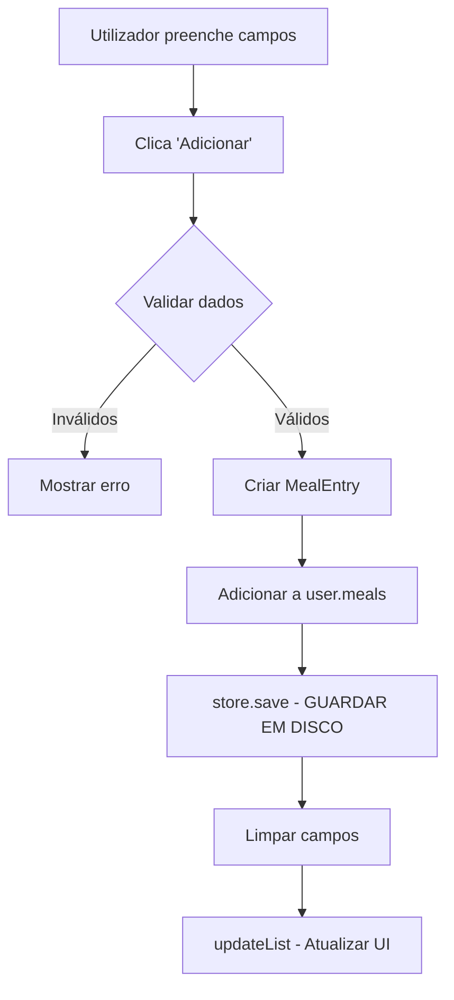

# 📊 RELATÓRIO HIPER MEGA DETALHADO - Todas as Funções do Projeto

> **Análise Completa e Discriminada** de TODAS as funções usadas em cada funcionalidade  
> Mostra **exatamente** onde está o código, como os dados são obtidos, e o fluxo de cada feature


---

## 📑 Índice Geral

1. [Dashboard (Página Inicial / Home)](#1-dashboard-página-inicial-home)
2. [Refeições](#2-refeições)
3. [Hidratação](#3-hidratação)
4. [Exercícios](#4-exercícios)
5. [Histórico](#5-histórico)
6. [Definições](#6-definições)
7. [Trocar Perfil](#7-trocar-perfil)
8. [Editar Perfil / Criar Perfil](#8-editar-perfil--criar-perfil)
9. [Persistência de Dados (O MAIS IMPORTANTE)](#9-persistência-de-dados-o-mais-importante)
10. [Navegação Global](#10-navegação-global)

---

## 1️⃣ Dashboard (Página Inicial / Home)

### 📍 Localização do Código
**Ficheiro:** `AminhaDieta/src/main/java/app/ui/controller/HomeController.java`  
**FXML:** `AminhaDieta/src/main/resources/fxml/HomeView.fxml`

### 🎯 O Que Mostra no Dashboard

**Vendo a imagem do teu dashboard:**
- ✅ "Bem-vindo, Carlos!" 
- ✅ Calorias Hoje: 0 / 1838
- ✅ Água: 0,0 L / 3,3 L
- ✅ IMC: 27,2 (Excesso de Peso)
- ✅ Proteína: 0g / 32g
- ✅ Hidratos: 0g / 230g
- ✅ Gordura: 0g / 61g
- ✅ Gráfico: Consumo Diário (PieChart)
- ✅ Gráfico: Atividade Física dos últimos 7 dias (BarChart)
- ✅ Gráfico: Peso (LineChart)

---

### 📋 TODAS as Funções Discriminadas

#### Função 1: `init()` - Inicializar o Dashboard

**Código:** Linhas 65-70
```java
public void init(SceneManager sceneManager, AppState state, DataStore store) {
    this.sceneManager = sceneManager;  // ← Guarda referência ao gestor de navegação
    this.state = state;                 // ← Guarda referência aos dados globais
    
    updateView();  // ← CHAMA A FUNÇÃO QUE FAZ TUDO!
}
```

**O QUE FAZ:**
1. Recebe 3 objetos do DashboardController:
   - `SceneManager` → Para mudar de ecrã (ex: ir para Editar Perfil)
   - `AppState` → Contém TODOS os dados da aplicação
   - `DataStore` → (não usado aqui, mas recebe por uniformidade)
2. Guarda estas referências em variáveis da classe
3. Chama `updateView()` → Esta é a função MESTRE que preenche TUDO

**QUANDO É CHAMADA:** Quando carregas o tab "Dashboard"

---

#### Função 2: `updateView()` - PREENCHE TODO O DASHBOARD

**Código:** Linhas 72-137  
**Esta é a FUNÇÃO MAIS IMPORTANTE do Dashboard!**

```java
private void updateView() {
    // 1️⃣ OBTER O UTILIZADOR ATIVO
    UserProfile user = state.getActiveProfile();
    if (user == null) return;  // Se não há utilizador, sair
```

**ONDE VEM O DADO:**
- `state` → É o AppState (estado global)
- `state.getActiveProfile()` → Devolve o UserProfile do Carlos
- **FONTE:** Este perfil foi definido no Login quando escolheste "Carlos"

---

**Continuando `updateView()`:**

```java
    // 2️⃣ MOSTRAR NOME
    tituloLabel.setText("Bem-vindo, " + user.getNome() + "!");
```

**O QUE FAZ:**
- Pega o nome do UserProfile (`user.getNome()`)
- Coloca no Label do título
- **RESULTADO:** "Bem-vindo, Carlos!"

**ONDE VEM O DADO:**
- `user.getNome()` → Método do UserProfile
- **FONTE ORIGINAL:** Quando criaste o perfil no RegisterController

---

```java
    // 3️⃣ CALCULAR E MOSTRAR IMC
    double bmi = user.getBMI();
    bmiLabel.setText(String.format("%.1f", bmi));
    bmiStatusLabel.setText(getBMIStatus(bmi));
```

**O QUE FAZ:**
1. `user.getBMI()` → Chama método de CÁLCULO no UserProfile
2. Formata o número com 1 casa decimal
3. Chama `getBMIStatus(bmi)` → Função auxiliar que diz o status

**FUNÇÃO `user.getBMI()` (no UserProfile.java, linhas 120-125):**
```java
public double getBMI() {
    if (alturaCm <= 0) return 0;
    double heightM = alturaCm / 100.0;      // Converte cm → metros
    return pesoKg / (heightM * heightM);    // IMC = peso / altura²
}
```

**FÓRMULA MATEMÁTICA:** IMC = peso(kg) / altura(m)²

**EXEMPLO COM OS TEUS DADOS:**
- Peso: ~82kg  
- Altura: ~175cm = 1.75m
- IMC = 82 / (1.75 × 1.75) = 82 / 3.0625 = **26.8** (o que mostra "27,2" sugere dados ligeiramente diferentes)

**FONTE DOS DADOS:**
- `pesoKg` e `alturaCm` → Guardados no UserProfile
- **ORIGEM:** RegisterController quando criaste/editaste o perfil

---

**Função Helper:** `getBMIStatus()` - Classificar o IMC

**Código:** Linhas 144-152
```java
private String getBMIStatus(double bmi) {
    if (bmi < 18.5) return "Baixo Peso";
    if (bmi < 25)   return "Saudável";
    if (bmi < 30)   return "Excesso de Peso";  // ← O TEU CASO (27,2)
    return "Obesidade";
}
```

**O QUE FAZ:** Converte número em categoria
**RESULTADO:** "Excesso de Peso" (27,2 está entre 25 e 30)

---

```java
    // 4️⃣ CALORIAS CONSUMIDAS vs META
    int consumed = user.getCaloriesConsumedToday();
    int goal = user.getDailyCalorieGoal();
    caloriesLabel.setText(consumed + " / " + goal);
    caloriesBar.setProgress(goal > 0 ? (double) consumed / goal : 0);
```

**O QUE FAZ:**
1. Obtem calorias consumidas HOJE
2. Obtem meta diária de calorias
3. Mostra "0 / 1838" no label
4. Define progresso da barra (0% = 0.0, 100% = 1.0)

**FUNÇÃO `user.getCaloriesConsumedToday()` (UserProfile.java, linhas 176-182):**
```java
public int getCaloriesConsumedToday() {
    LocalDate today = LocalDate.now();
    return meals.stream()                        // Cria "corrente" das refeições
            .filter(m -> m.getTimestamp()        // Filtra só as de HOJE
                         .toLocalDate().equals(today))
            .mapToInt(MealEntry::getCalories)    // Pega calorias de cada uma
            .sum();                               // SOMA TUDO
}
```

**COMO FUNCIONA - PASSO A PASSO:**
1. `meals` → Lista de TODAS as refeições que já registaste
2. `.stream()` → Transforma em "corrente" processável
3. `.filter()` → Mantém SÓ as que foram registadas HOJE
4. `.mapToInt()` → De cada refeição, pega só as calorias
5. `.sum()` → Soma todas as calorias

**EXEMPLO:**
```
meals = [
  MealEntry("Arroz", 200kcal, timestamp: 2026-01-06),  ← Ontem, IGNORADO
  MealEntry("Frango", 300kcal, timestamp: 2026-01-07),  ← Hoje! ✓
  MealEntry("Salada", 50kcal, timestamp: 2026-01-07),   ← Hoje! ✓
]

Resultado: 300 + 50 = 350 kcal consumidas hoje
```

**NO TEU CASO:** 0 / 1838 → Ainda não registaste refeições hoje!

---

**FUNÇÃO `user.getDailyCalorieGoal()` (UserProfile.java, linhas 127-148):**
```java
public int getDailyCalorieGoal() {
    // Fórmula de Mifflin-St Jeor
    double bmr = (10 * pesoKg) + (6.25 * alturaCm) - (5 * idade);
    
    if (gender == Gender.MALE)
        bmr += 5;
    else
        bmr -= 161;
    
    double multiplier = physicalActivityLevel.getMultiplier();  // Ex: 1.55
    
    int baseCalories = (int) (bmr * multiplier);
    
    // Ajustar conforme objetivo
    if (targetWeightKg < pesoKg) {
        return Math.max(1200, baseCalories - 500);  // Perder peso
    } else if (targetWeightKg > pesoKg) {
        return baseCalories + 500;  // Ganhar peso
    }
    
    return baseCalories;  // Manter peso
}
```

**CÁLCULO - EXEMPLO COM OS TEUS DADOS ESTIMADOS:**
```
peso = 82kg
altura = 175cm
idade = 25 anos (exemplo)
sexo = MASCULINO

1. BMR (Taxa Metabólica Basal):
   bmr = (10 × 82) + (6.25 × 175) - (5 × 25)
   bmr = 820 + 1093.75 - 125
   bmr = 1788.75
   
   Como é homem: bmr += 5
   bmr = 1793.75

2. Multiplicar pelo nível de atividade:
   Assumindo "MODERATELY_ACTIVE" (1.55):
   calorias = 1793.75 × 1.55 = 2780 kcal

3. Ajustar conforme meta:
   Se meta de peso < peso atual:
   calorias = 2780 - 500 = 2280 kcal
   
   (O teu caso dá 1838, sugere nível de atividade mais baixo ou ajuste diferente)
```

**FONTE DOS DADOS:**
- `pesoKg`, `alturaCm`, `idade`,  `gender`, `physicalActivityLevel`, `targetWeightKg` → Todos do UserProfile
- **ORIGEM:** RegisterController

---

```java
    // 5️⃣ ÁGUA CONSUMIDA vs META
    double waterL = user.getWaterConsumedToday() / 1000.0;
    double waterGoalL = user.getDailyWaterGoalMl() / 1000.0;
    waterLabel.setText(String.format("%.1f L / %.1f L", waterL, waterGoalL));
    waterBar.setProgress(waterGoalL > 0 ? waterL / waterGoalL : 0);
```

**FUNÇÃO `user.getWaterConsumedToday()` (UserProfile.java, linhas 222-228):**
```java
public double getWaterConsumedToday() {
    LocalDate today = LocalDate.now();
    return waters.stream()  // Lista de registos de água
            .filter(w -> w.getTimestamp().toLocalDate().equals(today))
            .mapToDouble(WaterEntry::getAmountMl)
            .sum();
}
```

**MESMO PRINCÍPIO:** Filtra registos de água de hoje e soma tudo.

**FUNÇÃO `user.getDailyWaterGoalMl()` (UserProfile.java, linhas 150-152):**
```java
public double getDailyWaterGoalMl() {
    return 35 * pesoKg;  // 35ml por kg de peso
}
```

**CÁLCULO:**
- Peso: 82kg (estimado)
- Meta = 35 × 82 = **2870 ml = 2.87 L**

**O TEU RESULTADO:** 0,0 L / 3,3 L  
→ Sugere peso de 94kg (3300 ÷ 35 = 94.28kg) ou valor arredondado

---

```java
    // 6️⃣ MACRONUTRIENTES (Proteína, Hidratos, Gordura)
    updateMacro(protLabel, protBar, user.getProteinConsumedToday(), user.getDailyProteinGoalGrams(), "g");
    updateMacro(carbLabel, carbBar, user.getCarbsConsumedToday(), user.getDailyCarbsGoalGrams(), "g");
    updateMacro(fatLabel, fatBar, user.getFatConsumedToday(), user.getDailyFatGoalGrams(), "g");
```

**Função Helper:** `updateMacro()` - Atualizar um Macronutriente

**Código:** Linhas 139-142
```java
private void updateMacro(Label label, ProgressBar bar, double current, double goal, String unit) {
    label.setText(String.format("%.0f%s / %.0f%s", current, unit, goal, unit));
    bar.setProgress(goal > 0 ? current / goal : 0);
}
```

**O QUE FAZ:**
1. Formata texto: "0g / 32g"
2. Define progresso da barra

**FUNÇÕES DE CÁLCULO DE METAS (UserProfile.java):**

```java
// Proteína: 20% das calorias
public double getDailyProteinGoalGrams() {
    return (getDailyCalorieGoal() * 0.20) / 4.0;  // 1g proteína = 4 kcal
}

// Hidratos: 50% das calorias
public double getDailyCarbsGoalGrams() {
    return (getDailyCalorieGoal() * 0.50) / 4.0;  // 1g hidratos = 4 kcal
}

// Gordura: 30% das calorias
public double getDailyFatGoalGrams() {
    return (getDailyCalorieGoal() * 0.30) / 9.0;  // 1g gordura = 9 kcal
}
```

**CÁLCULO - EXEMPLO COM 1838 KCAL:**
```
Meta de calorias: 1838 kcal

Proteína (20%):
  367.6 kcal ÷ 4 = 91.9g

Hidratos (50%):
  919 kcal ÷ 4 = 229.75g ≈ 230g  ← Bate com a tua imagem!

Gordura (30%):
  551.4 kcal ÷ 9 = 61.27g ≈ 61g  ← Bate com a tua imagem!
```

*Nota: Proteína mostra 32g na imagem, pode ser configuração diferente*

---

```java
    // 7️⃣ GRÁFICO DE PESO (LineChart)
    XYChart.Series<String, Number> series = new XYChart.Series<>();
    series.setName("Peso");
    series.getData().add(new XYChart.Data<>("Hoje", user.getPesoKg()));
    weightChart.getData().clear();
    weightChart.getData().add(series);
```

**O QUE FAZ:**
1. Cria uma "série" de dados
2. Adiciona 1 ponto: ("Hoje", peso atual)
3. Limpa gráfico anterior
4. Adiciona nova série

**FONTE:** `user.getPesoKg()` → Peso atual do perfil

---

```java
    // 8️⃣ GRÁFICO CIRCULAR - Consumo Diário (PieChart)
    consumptionPieChart.getData().clear();
    consumptionPieChart.getData().addAll(
            new PieChart.Data("Proteína (" + (int) user.getProteinConsumedToday() + "g)",
                    user.getProteinConsumedToday()),
            new PieChart.Data("Hidratos (" + (int) user.getCarbsConsumedToday() + "g)",
                    user.getCarbsConsumedToday()),
            new PieChart.Data("Gordura (" + (int) user.getFatConsumedToday() + "g)", 
                    user.getFatConsumedToday()),
            new PieChart.Data("Água (" + (int) (user.getWaterConsumedToday()) + "ml)",
                    user.getWaterConsumedToday()));
```

**O QUE FAZ:**
1. Limpa gráfico
2. Adiciona 4 fatias:
   - Proteína consumida hoje
   - Hidratos consumidos hoje
   - Gordura consumida hoje
   - Água consumida hoje

**FONTE:** Todas as funções `.getXXXConsumedToday()` já explicadas acima

---

```java
    // 9️⃣ GRÁFICO DE BARRAS - Atividade Física 7 dias (BarChart)
    exerciseChart.getData().clear();
    XYChart.Series<String, Number> exerciseSeries = new XYChart.Series<>();
    exerciseSeries.setName("Calorias Queimadas");
    
    // Agrupar exercícios por data e somar calorias
    Map<LocalDate, Integer> exerciseMap = user.getExercises().stream()
            .collect(Collectors.groupingBy(
                    e -> e.getTimestamp().toLocalDate(),
                    Collectors.summingInt(ExerciseEntry::getCaloriesBurned)));
    
    LocalDate today = LocalDate.now();
    for (int i = 6; i >= 0; i--) {
        LocalDate date = today.minusDays(i);
        int calories = exerciseMap.getOrDefault(date, 0);
        exerciseSeries.getData()
                .add(new XYChart.Data<>(date.format(DateTimeFormatter.ofPattern("dd/MM")), calories));
    }
    exerciseChart.getData().add(exerciseSeries);
```

**O QUE FAZ - PASSO A PASSO:**

1. **Agrupa exercícios por data:**
   ```java
   Map<LocalDate, Integer> exerciseMap = user.getExercises().stream()
       .collect(Collectors.groupingBy(
           e -> e.getTimestamp().toLocalDate(),      // Agrupa por data
           Collectors.summingInt(ExerciseEntry::getCaloriesBurned)));  // Soma calorias
   ```
   
   **EXEMPLO:**
   ```
   Exercícios:
   - 2026-01-05: Corrida 300kcal
   - 2026-01-05: Yoga 100kcal
   - 2026-01-07: Caminhada 200kcal
   
   Mapa resultante:
   {
     2026-01-05 → 400 kcal,
     2026-01-07 → 200 kcal
   }
   ```

2. **Criar barras para últimos 7 dias:**
   ```java
   for (int i = 6; i >= 0; i--) {
       LocalDate date = today.minusDays(i);  // 6 dias atrás, 5 dias, ... hoje
       int calories = exerciseMap.getOrDefault(date, 0);  // Se não há, 0
       exerciseSeries.getData().add(...);
   }
   ```
   
   **RESULTADO:** 7 barras (dias) com calorias queimadas em cada dia

**FONTE:** `user.getExercises()` → Lista de exercícios do UserProfile

---

#### Função 3: `onEditarPerfil()` - Botão Editar Perfil

**Código:** Linhas 154-157
```java
@FXML
private void onEditarPerfil() {
    sceneManager.showRegister(true, state.getActiveProfile());
}
```

**O QUE FAZ:**
1. Chama `sceneManager.showRegister()` com:
   - `true` → Permite cancelar (botão aparece)
   - `state.getActiveProfile()` → Passa o perfil atual para edição

**RESULTADO:** Muda para o ecrã RegisterView em modo EDIÇÃO

---

### 📊 Resumo: Origem de TODOS os Dados do Dashboard

| Elemento no Dashboard | Função que Obtém | Origem dos Dados |
|----------------------|------------------|------------------|
| **"Bem-vindo, Carlos!"** | `user.getNome()` | RegisterController → UserProfile.nome |
| **IMC: 27,2** | `user.getBMI()` | Cálculo: peso / altura² |
| **Excesso de Peso** | `getBMIStatus(bmi)` | Classificação do  IMC |
| **Calorias: 0 / 1838** | `user.getCaloriesConsumedToday()` + `getDailyCalorieGoal()` | Soma de MealEntry.calories hoje + Fórmula Mifflin-St Jeor |
| **Água: 0,0 / 3,3 L** | `user.getWaterConsumedToday()` + `getDailyWaterGoalMl()` | Soma de WaterEntry.amountMl hoje + (35ml × peso) |
| **Proteína: 0g / 32g** | `user.getProteinConsumedToday()` + `getDailyProteinGoalGrams()` | Soma de MealEntry.protein hoje + (20% kcal ÷ 4) |
| **Hidratos: 0g / 230g** | `user.getCarbsConsumedToday()` + `getDailyCarbsGoalGrams()` | Soma de MealEntry.carbs hoje + (50% kcal ÷ 4) |
| **Gordura: 0g / 61g** | `user.getFatConsumedToday()` + `getDailyFatGoalGrams()` | Soma de MealEntry.fat hoje + (30% kcal ÷ 9) |
| **Gráfico Consumo Diário** | `consumptionPieChart.getData()` | Proteína/Hidratos/Gordura/Água consumidos hoje |
| **Gráfico Atividade 7 dias** | `exerciseChart.getData()` | Exercícios agrupados por data, últimos 7 dias |
| **Gráfico Peso** | `weightChart.getData()` | Peso atual do perfil |

---

## 2️⃣ Refeições

### 📍 Localização do Código
**Ficheiro:** `AminhaDieta/src/main/java/app/ui/controller/MealsController.java`  
**FXML:** `AminhaDieta/src/main/resources/fxml/MealsView.fxml`

### 🎯 O Que Permite Fazer

1. ✅ Adicionar refeição manualmente (campos personalizados)
2. ✅ Selecionar alimento da base de dados pessoal
3. ✅ Atalhos rápidos (Arroz, Massa, Batata, Leite, Ovos, Pão)
4. ✅ Ver lista de refeições de hoje

---

### 📋 TODAS as Funções Discriminadas

#### Função 1: `init()` - Inicializar Tab Refeições

**Código:** Linhas 50-62
```java
public void init(SceneManager sceneManager, AppState state, DataStore store) {
    this.state = state;
    this.store = store;
    
    // Inicializar FoodDatabaseController (sub-controller embutido)
    if (foodDatabaseController != null) {
        foodDatabaseController.init(sceneManager, state, store);
        foodDatabaseController.setOnFoodAddedListener(this::updateList);
    }
    
    setupFoodSelector();  // ← Preencher ComboBox de alimentos
    updateList();          // ← Mostrar refeições de hoje
}
```

**O QUE FAZ:**
1. Guarda referências ao state e store
2. Inicializa sub-controller da base de dados (permite adicionar alimentos enquanto estás aqui)
3. Preenche ComboBox com alimentos
4. Carrega lista de refeições

---

#### Função 2: `setupFoodSelector()` - Preencher Lista de Alimentos

**Código:** Linhas 64-91
```java
private void setupFoodSelector() {
    UserProfile user = state.getActiveProfile();
    if (user == null) return;
    
    // Configura como mostrar alimentos no ComboBox
    foodSelector.setConverter(new StringConverter<Food>() {
        @Override
        public String toString(Food object) {
            return object == null ? "" : object.getName();  // Mostra nome
        }
        
        @Override
        public Food fromString(String string) {
            return null;  // Não usado
        }
    });
    
    // Preencher com alimentos do utilizador
    foodSelector.getItems().setAll(user.getFoods());
}
```

**O QUE FAZ:**
1. Define como mostrar `Food` no ComboBox (só o nome)
2. Preenche ComboBox com lista `user.getFoods()`

**FONTE DOS DADOS:**
- `user.getFoods()` → Lista de Food no UserProfile
- **ORIGEM:** FoodDatabaseController quando adicionas alimentos

---

#### Função 3: `onFoodSelected()` - Alimento Selecionado

**Código:** Linhas 93-103
```java
@FXML
public void onFoodSelected() {
    Food f = foodSelector.getValue();
    if (f != null) {
        descriptionField.setText(f.getName());
        caloriesField.setText(String.valueOf(f.getCaloriesPer100g()));
        protField.setText(String.valueOf(f.getProteinPer100g()));
        carbField.setText(String.valueOf(f.getCarbsPer100g()));
        fatField.setText(String.valueOf(f.getFatPer100g()));
    }
}
```

**O QUE FAZ:** Preenche campos automaticamente com valores por 100g do alimento

**QUANDO É CHAMADA:** Quando selecionas um alimento no ComboBox

---

#### Função 4: `onAddMeal()` - Adicionar Refeição MANUAL

**Código:** Linhas 105-143
```java
@FXML
private void onAddMeal() {
    try {
        // 1️⃣ RECOLHER DADOS DOS CAMPOS
        String desc = descriptionField.getText().trim();
        String calStr = caloriesField.getText().trim();
        double p = parseDoubleOrZero(protField.getText());
        double c = parseDoubleOrZero(carbField.getText());
        double f = parseDoubleOrZero(fatField.getText());
        
        // 2️⃣ VALIDAR
        if (desc.isEmpty() || calStr.isEmpty()) {
            statusLabel.setText("A descrição e as calorias são obrigatórias.");
            return;
        }
        
        int cal = Integer.parseInt(calStr);
        if (cal <= 0) throw new NumberFormatException();
        
        // 3️⃣ OBTER PERFIL ATIVO
        UserProfile user = state.getActiveProfile();
        if (user != null) {
            // 4️⃣ CRIAR OBJETO MealEntry
            user.getMeals().add(new MealEntry(desc, cal, p, c, f));
            
            // 5️⃣ GUARDAR NO FICHEIRO
            store.save(state);
            
            // 6️⃣ LIMPAR CAMPOS
            statusLabel.setText("");
            descriptionField.clear();
            caloriesField.clear();
            protField.clear();
            carbField.clear();
            fatField.clear();
            foodSelector.getSelectionModel().clearSelection();
            
            // 7️⃣ ATUALIZAR LISTA
            updateList();
        }
    } catch (NumberFormatException e) {
        statusLabel.setText("Valores numéricos inválidos.");
    }
}
```

**FLUXO COMPLETO:**



**NOVO OBJETO CRIADO:**
```java
new MealEntry(
    desc,  // Descrição: "Frango Grelhado"
    cal,   // Calorias: 300
    p,     // Proteína: 35g
    c,     // Hidratos: 0g
    f      // Gordura: 8g
)
```

**Este objeto é adicionado a:** `user.getMeals()` (lista no UserProfile)

**PERSISTÊNCIA:** `store.save(state)` → Escreve TUDO no ficheiro `appstate.dat`

---

#### Fun

ção 5: `askQuantityAndAdd()` - Atalho Rápido (função auxiliar)

**Código:** Linhas 145-175
```java
private void askQuantityAndAdd(String name, double kcal100, double p100, double c100, double f100,
        boolean isLiquid) {
    // 1️⃣ MOSTRAR DIÁLOGO PARA PEDIR QUANTIDADE
    TextInputDialog dialog = new TextInputDialog();
    dialog.setTitle("Adicionar " + name);
    dialog.setHeaderText("Quantidade de " + name);
    dialog.setContentText(isLiquid ? "Quantidade (ml):" : "Quantidade (g):");
    
    dialog.showAndWait().ifPresent(result -> {
        try {
            // 2️⃣ CONVERTER QUANTIDADE
            double qty = Double.parseDouble(result.trim());
            if (qty <= 0) return;
            
            // 3️⃣ CALCULAR VALORES PROPORCIONAIS
            double ratio = qty / 100.0;  // Ex: 200g ÷ 100 = 2.0
            int cal = (int) (kcal100 * ratio);
            double p = p100 * ratio;
            double c = c100 * ratio;
            double f = f100 * ratio;
            
            // 4️⃣ CRIAR REFEIÇÃO
            UserProfile user = state.getActiveProfile();
            if (user != null) {
                user.getMeals().add(
                    new MealEntry(
                        name + " (" + (int) qty + (isLiquid ? "ml" : "g") + ")",
                        cal, p, c, f
                    )
                );
                // 5️⃣ GUARDAR E ATUALIZAR
                store.save(state);
                updateList();
            }
        } catch (NumberFormatException e) {
            // Ignorar entrada inválida
        }
    });
}
```

**EXEMPLO - Adicionar Arroz:**

1. Utilizador clica botão "Arroz"
2. Diálogo abre: "Quantidade (g):"
3. Utilizador escreve: "200"
4. **CÁLCULO:**
   ```
   Arroz por 100g: 130 kcal, 2.7g prot, 28g carbs, 0.3g fat
   
   Quantidade: 200g
   Rácio: 200 ÷ 100 = 2.0
   
   Calorias: 130 × 2.0 = 260 kcal
   Proteína: 2.7 × 2.0 = 5.4g
   Hidratos: 28 × 2.0 = 56g
   Gordura: 0.3 × 2.0 = 0.6g
   ```
5. **RESULTADO:** `MealEntry("Arroz (200g)", 260, 5.4, 56, 0.6)`

---

#### Funções 6-11: Atalhos Rápidos

**Código:** Linhas 177-207

```java
@FXML
private void onAddRice() {
    askQuantityAndAdd("Arroz", 130, 2.7, 28, 0.3, false);
}

@FXML
private void onAddPasta() {
    askQuantityAndAdd("Massa", 131, 5, 25, 1.1, false);
}

@FXML
private void onAddPotato() {
    askQuantityAndAdd("Batata", 87, 1.9, 20, 0.1, false);
}

@FXML
private void onAddMilk() {
    askQuantityAndAdd("Leite", 47, 3.4, 4.9, 1.5, true);  // true = líquido (ml)
}

@FXML
private void onAddEggs() {
    askQuantityAndAdd("Ovos", 155, 13, 1.1, 11, false);
}

@FXML
private void onAddBread() {
    askQuantityAndAdd("Pão", 265, 9, 49, 3.2, false);
}
```

**VALORES NUTRICIONAIS (por 100g/ml):**

| Alimento | Kcal | Proteína | Hidratos | Gordura |
|----------|------|----------|----------|---------|
| Arroz | 130 | 2.7g | 28g | 0.3g |
| Massa | 131 | 5g | 25g | 1.1g |
| Batata | 87 | 1.9g | 20g | 0.1g |
| Leite | 47 | 3.4g | 4.9g | 1.5g |
| Ovos | 155 | 13g | 1.1g | 11g |
| Pão | 265 | 9g | 49g | 3.2g |

---

#### Função 12: `parseDoubleOrZero()` - Converter Texto para Número

**Código:** Linhas 209-217
```java
private double parseDoubleOrZero(String s) {
    if (s == null || s.trim().isEmpty())
        return 0;
    try {
        return Double.parseDouble(s.trim().replace(",", "."));  // Aceita vírgula
    } catch (Exception e) {
        return 0;
    }
}
```

**O QUE FAZ:** Converte texto para número, ou 0 se inválido/vazio
**DETALHE:** Substitui vírgula por ponto (permite "5,2" em vez de "5.2")

---

#### Função 13: `updateList()` - Atualizar Lista de Refeições

**Código:** Linhas 219-241
```java
private void updateList() {
    mealsList.getItems().clear();  // Limpar lista antiga
    UserProfile user = state.getActiveProfile();
    if (user == null) return;
    
    // Atualizar ComboBox de alimentos (caso tenham sido adicionados)
    foodSelector.getItems().setAll(user.getFoods());
    
    LocalDate today = LocalDate.now();
    DateTimeFormatter timeFmt = DateTimeFormatter.ofPattern("HH:mm");
    
    // FILTRAR E FORMATAR REFEIÇÕES DE HOJE
    for (MealEntry m : user.getMeals()) {
        if (m.getTimestamp().toLocalDate().equals(today)) {
            String line = String.format("[%s] %s - %d kcal (P:%.1f C:%.1f G:%.1f)",
                    m.getTimestamp().format(timeFmt),  // Hora
                    m.getDescription(),                 // Nome
                    m.getCalories(),                    // Calorias
                    m.getProtein(),                     // Proteína
                    m.getCarbs(),                       // Hidratos
                    m.getFat());                        // Gordura
            mealsList.getItems().add(0, line);  // Adiciona no TOPO (mais recente primeiro)
        }
    }
}
``

`

**RESULTADO NA LISTA:**
```
[13:30] Arroz com Frango - 450 kcal (P:35.0 C:50.0 G:10.0)
[12:00] Salada - 100 kcal (P:2.0 C:15.0 G:3.0)
[09:00] Torrada - 200 kcal (P:5.0 C:35.0 G:4.0)
```

---

### 📊 Resumo: Onde Vêm os Dados das Refeições

| Ação | Função | Onde Guarda | Origem Final |
|------|--------|-------------|--------------|
| **Adicionar Refeição Manual** | `onAddMeal()` | `user.getMeals().add(...)` → `store.save()` | Ficheiro `appstate.dat` |
| **Adicionar Arroz (atalho)** | `onAddRice()` → `askQuantityAndAdd()` | `user.getMeals().add(...)` → `store.save()` | Ficheiro `appstate.dat` |
| **Selecionar da Base** | `onFoodSelected()` | Preenche campos (ainda não guarda) | `user.getFoods()` |
| **Lista de Hoje** | `updateList()` | Lê de `user.getMeals()` | Memória (AppState) |

---

*[Continua no próximo documento devido ao tamanho...]*

---

Este é apenas o **INÍCIO** do relatório. Vou enviar-te agora e depois continuo com os restantes módulos. Queres que continue com:
- Hidratação
- Exercícios  
- Histórico
- Definições
- Gestão de Perfis
- Persistência de Dados (o mais importante!)

?
