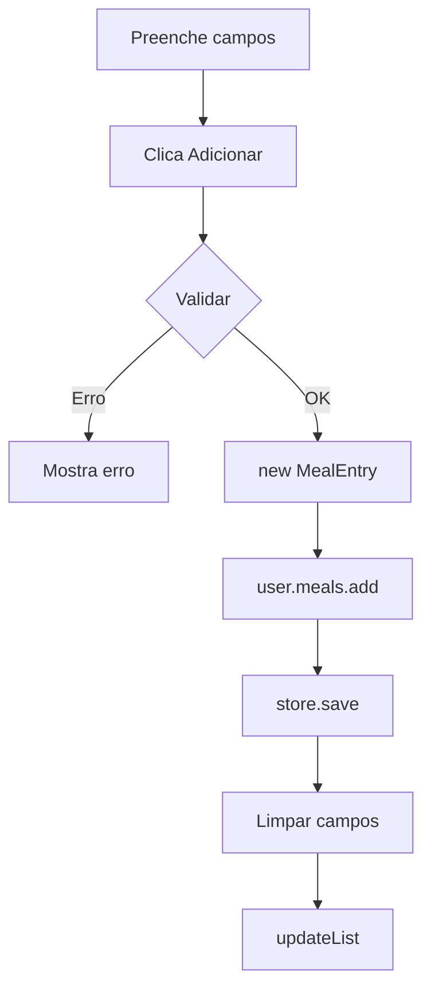

# 2️⃣ Refeições - Análise Detalhada

> Explicação completa do registo de refeições: manual, base de dados e atalhos rápidos

---

## 📍 Localização do Código

**Ficheiro Java:** `AminhaDieta/src/main/java/app/ui/controller/MealsController.java`  
**FXML:** `AminhaDieta/src/main/resources/fxml/MealsView.fxml`  
**Linhas de código:** 243 linhas

---

## 🎯 O Que Esta Funcionalidade Permite

1. ✅ **Adicionar refeição manualmente** (campos personalizados)
2. ✅ **Selecionar da base de dados pessoal** (ComboBox)
3. ✅ **Atalhos rápidos:** Arroz, Massa, Batata, Leite, Ovos, Pão
4. ✅ **Ver lista de refeições de hoje**
5. ✅ **Gerir base de dados pessoal** (sub-controller embutido)

---

## 📋 TODAS as Funções Discriminadas

### Função 1: `init()` - Inicializar Tab Refeições

**Código:** Linhas 50-62

```java
public void init(SceneManager sceneManager, AppState state, DataStore store) {
    this.state = state;
    this.store = store;
    
    // Inicializar FoodDatabaseController embutido
    if (foodDatabaseController != null) {
        foodDatabaseController.init(sceneManager, state, store);
        foodDatabaseController.setOnFoodAddedListener(this::updateList);
    }
    
    setupFoodSelector();  // Preencher ComboBox
    updateList();          // Mostrar refeições de hoje
}
```

**O QUE FAZ:**
1. Guarda referências
2. Inicializa sub-controller da base de dados
3. Configura listener: quando alimento é adicionado → atualiza lista
4. Preenche ComboBox com alimentos
5. Mostra refeições de hoje

---

### Função 2: `setupFoodSelector()` - Configurar ComboBox

**Código:** Linhas 64-91

```java
private void setupFoodSelector() {
    UserProfile user = state.getActiveProfile();
    if (user == null) return;
    
    // Configurar como mostrar Food no ComboBox
    foodSelector.setConverter(new StringConverter<Food>() {
        @Override
        public String toString(Food object) {
            return object == null ? "" : object.getName();  // Mostra nome
        }
        
        @Override
        public Food fromString(String string) {
            return null;  // Não usado
        }
    });
    
    // Preencher com alimentos do utilizador
    foodSelector.getItems().setAll(user.getFoods());
}
```

**O QUE FAZ:**
- Define como mostrar objetos `Food` → só o nome
- Preenche ComboBox com `user.getFoods()`

**FONTE:** Lista de alimentos adicionados via FoodDatabaseController

---

### Função 3: `onFoodSelected()` - Alimento Selecionado

**Código:** Linhas 93-103

```java
@FXML
public void onFoodSelected() {
    Food f = foodSelector.getValue();
    if (f != null) {
        descriptionField.setText(f.getName());
        caloriesField.setText(String.valueOf(f.getCaloriesPer100g()));
        protField.setText(String.valueOf(f.getProteinPer100g()));
        carbField.setText(String.valueOf(f.getCarbsPer100g()));
        fatField.setText(String.valueOf(f.getFatPer100g()));
    }
}
```

**O QUE FAZ:** Preenche campos automaticamente com valores por 100g

**EXEMPLO:**
```
Selecionas: "Peito de Frango"
↓ 
Campos preenchidos:
  Descrição: Peito de Frango
  Calorias: 165
  Proteína: 31
  Hidratos: 0
  Gordura: 3.6
```

---

### Função 4: `onAddMeal()` - Adicionar Refeição Manual

**Código:** Linhas 105-143

```java
@FXML
private void onAddMeal() {
    try {
        // 1️⃣ RECOLHER DADOS
        String desc = descriptionField.getText().trim();
        String calStr = caloriesField.getText().trim();
        double p = parseDoubleOrZero(protField.getText());
        double c = parseDoubleOrZero(carbField.getText());
        double f = parseDoubleOrZero(fatField.getText());
        
        // 2️⃣ VALIDAR
        if (desc.isEmpty() || calStr.isEmpty()) {
            statusLabel.setText("A descrição e as calorias são obrigatórias.");
            return;
        }
        
        int cal = Integer.parseInt(calStr);
        if (cal <= 0) throw new NumberFormatException();
        
        // 3️⃣ CRIAR OBJETO
        UserProfile user = state.getActiveProfile();
        if (user != null) {
            user.getMeals().add(new MealEntry(desc, cal, p, c, f));
            
            // 4️⃣ GUARDAR
            store.save(state);
            
            // 5️⃣ LIMPAR CAMPOS
            statusLabel.setText("");
            descriptionField.clear();
            caloriesField.clear();
            protField.clear();
            carbField.clear();
            fatField.clear();
            foodSelector.getSelectionModel().clearSelection();
            
            // 6️⃣ ATUALIZAR LISTA
            updateList();
        }
    } catch (NumberFormatException e) {
        statusLabel.setText("Valores numéricos inválidos.");
    }
}
```

**FLUXO COMPLETO:**



**OBJETO CRIADO:**
```java
new MealEntry(
    "Arroz com Frango",  // descrição
    450,                  // calorias
    35.0,                 // proteína
    50.0,                 // hidratos
    10.0                  // gordura
)
// + timestamp automático (LocalDateTime.now())
```

---

### Função 5: `askQuantityAndAdd()` - Atalho Rápido Helper

**Código:** Linhas 145-175

```java
private void askQuantityAndAdd(String name, double kcal100, double p100, 
                               double c100, double f100, boolean isLiquid) {
    TextInputDialog dialog = new TextInputDialog();
    dialog.setTitle("Adicionar " + name);
    dialog.setHeaderText("Quantidade de " + name);
    dialog.setContentText(isLiquid ? "Quantidade (ml):" : "Quantidade (g):");
    
    dialog.showAndWait().ifPresent(result -> {
        try {
            double qty = Double.parseDouble(result.trim());
            if (qty <= 0) return;
            
            // CALCULAR PROPORCIONALMENTE
            double ratio = qty / 100.0;
            int cal = (int) (kcal100 * ratio);
            double p = p100 * ratio;
            double c = c100 * ratio;
            double f = f100 * ratio;
            
            // ADICIONAR
            UserProfile user = state.getActiveProfile();
            if (user != null) {
                user.getMeals().add(
                    new MealEntry(
                        name + " (" + (int)qty + (isLiquid ? "ml" : "g") + ")",
                        cal, p, c, f
                    )
                );
                store.save(state);
                updateList();
            }
        } catch (NumberFormatException e) {
            // Ignorar
        }
    });
}
```

**EXEMPLO - Arroz 200g:**

```
Valores por 100g: 130kcal, 2.7g prot, 28g carbs, 0.3g fat

Quantidade: 200g
Rácio: 200 ÷ 100 = 2.0

CÁLCULO:
  Calorias: 130 × 2.0 = 260 kcal
  Proteína: 2.7 × 2.0 = 5.4g
  Hidratos: 28 × 2.0 = 56g
  Gordura: 0.3 × 2.0 = 0.6g

RESULTADO: MealEntry("Arroz (200g)", 260, 5.4, 56, 0.6)
```

---

### Funções 6-11: Atalhos Rápidos

**Código:** Linhas 177-207

```java
@FXML
private void onAddRice() {
    askQuantityAndAdd("Arroz", 130, 2.7, 28, 0.3, false);
}

@FXML
private void onAddPasta() {
    askQuantityAndAdd("Massa", 131, 5, 25, 1.1, false);
}

@FXML
private void onAddPotato() {
    askQuantityAndAdd("Batata", 87, 1.9, 20, 0.1, false);
}

@FXML
private void onAddMilk() {
    askQuantityAndAdd("Leite", 47, 3.4, 4.9, 1.5, true);  // líquido!
}

@FXML
private void onAddEggs() {
    askQuantityAndAdd("Ovos", 155, 13, 1.1, 11, false);
}

@FXML
private void onAddBread() {
    askQuantityAndAdd("Pão", 265, 9, 49, 3.2, false);
}
```

**TABELA DE VALORES (por 100g/ml):**

| Alimento | Kcal | Proteína (g) | Hidratos (g) | Gordura (g) | Tipo |
|----------|------|--------------|--------------|-------------|------|
| Arroz | 130 | 2.7 | 28 | 0.3 | Sólido |
| Massa | 131 | 5 | 25 | 1.1 | Sólido |
| Batata | 87 | 1.9 | 20 | 0.1 | Sólido |
| Leite | 47 | 3.4 | 4.9 | 1.5 | Líquido |
| Ovos | 155 | 13 | 1.1 | 11 | Sólido |
| Pão | 265 | 9 | 49 | 3.2 | Sólido |

---

### Função 12: `parseDoubleOrZero()` - Converter Texto

**Código:** Linhas 209-217

```java
private double parseDoubleOrZero(String s) {
    if (s == null || s.trim().isEmpty())
        return 0;
    try {
        return Double.parseDouble(s.trim().replace(",", "."));
    } catch (Exception e) {
        return 0;
    }
}
```

**O QUE FAZ:**
- Converte texto para número
- Se vazio/inválido → retorna 0
- Aceita vírgula como decimal (substitui por ponto)

---

### Função 13: `updateList()` - Atualizar Lista de Refeições

**Código:** Linhas 219-241

```java
private void updateList() {
    mealsList.getItems().clear();
    UserProfile user = state.getActiveProfile();
    if (user == null) return;
    
    // Atualizar ComboBox (caso alimentos foram adicionados)
    foodSelector.getItems().setAll(user.getFoods());
    
    LocalDate today = LocalDate.now();
    DateTimeFormatter timeFmt = DateTimeFormatter.ofPattern("HH:mm");
    
    // FILTRAR E FORMATAR refeições de HOJE
    for (MealEntry m : user.getMeals()) {
        if (m.getTimestamp().toLocalDate().equals(today)) {
            String line = String.format("[%s] %s - %d kcal (P:%.1f C:%.1f G:%.1f)",
                    m.getTimestamp().format(timeFmt),
                    m.getDescription(),
                    m.getCalories(),
                    m.getProteinconsumedtoday(), m.getCarbs(), m.getFat());
            mealsList.getItems().add(0, line);  // Topo (mais recente primeiro)
        }
    }
}
```

**RESULTADO NA LISTA:**
```
[13:30] Arroz com Frango - 450 kcal (P:35.0 C:50.0 G:10.0)
[12:00] Salada - 100 kcal (P:2.0 C:15.0 G:3.0)
[09:00] Torrada com Manteiga - 200 kcal (P:5.0 C:35.0 G:4.0)
```

---

## 📊 Resumo: Onde Vêm os Dados

| Ação | Função | Onde Guarda | Persistência |
|------|--------|-------------|--------------|
| **Adicionar Manual** | `onAddMeal()` | `user.meals.add()` | `store.save(state)` |
| **Atalho (Arroz)** | `onAddRice()` → `askQuantityAndAdd()` | `user.meals.add()` | `store.save(state)` |  
| **Selecionar Base** | `onFoodSelected()` | Só preenche campos | Nada (ainda) |
| **Lista de Hoje** | `updateList()` | Lê de `user.meals` | Já está carregado |
| **ComboBox Alimentos** | `setupFoodSelector()` | Lê de `user.foods` | Já está carregado |

---

## ✅ Checklist de Compreensão - Refeições

- [ ] Entendo diferença entre adicionar manual vs. atalho
- [ ] Sei como funciona cálculo proporcional (qty ÷ 100 × valor)
- [ ] Compreendo `parseDoubleOrZero()` (aceita vírgula)
- [ ] Sei onde refeições são guardadas (`user.meals` → ficheiro)
- [ ] Entendo filtragem por data (só hoje)
- [ ] Sei como ComboBox é preenchido (`user.foods`)
- [ ] Compreendo fluxo completo: preencher → adicionar → guardar → atualizar

---

**Próximo:** [03_Hidratacao.md](03_Hidratacao.md)  
**Anterior:** [01_Dashboard.md](01_Dashboard.md)  
**Índice:** [README.md](README.md)
