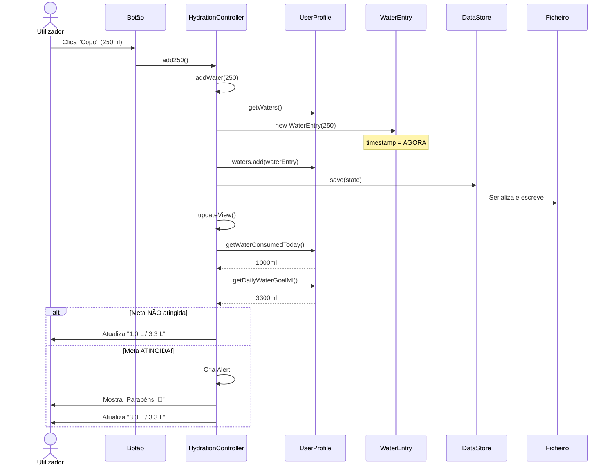

# 3️⃣ Hidratação - Análise Detalhada

> Explicação completa de todas as funções relacionadas com o registo e monitorização de consumo de água

---

## 📍 Localização do Código

**Ficheiro Java:** `AminhaDieta/src/main/java/app/ui/controller/HydrationController.java`  
**FXML:** `AminhaDieta/src/main/resources/fxml/HydrationView.fxml`  
**Linhas de código:** 102 linhas

---

## 🎯 O Que Esta Funcionalidade Permite Fazer

1. ✅ **Adicionar 250ml** (copo de água) com 1 clique
2. ✅ **Adicionar 500ml** (garrafa) com 1 clique
3. ✅ **Adicionar quantidade personalizada** (qualquer valor em ml)
4. ✅ **Remover último registo** (caso tenhas errado)
5. ✅ **Ver progresso em tempo real** (atual / meta)
6. ✅ **Barra de progresso visual**
7. ✅ **Alerta de parabéns** quando atinges a meta! 🎉

---

## 📋 TODAS as Funções Discriminadas

### Função 1: `init()` - Inicializar Tab Hidratação

**Código:** Linhas 30-34

```java
public void init(SceneManager sceneManager, AppState state, DataStore store) {
    this.state = state;      // ← Guarda referência ao estado global
    this.store = store;      // ← Guarda referência ao gestor de persistência
    updateView();            // ← Atualiza imediatamente os valores
}
```

**O QUE FAZ:**
1. Recebe e guarda referências aos objetos principais
2. Chama `updateView()` para mostrar valores atuais

**QUANDO É CHAMADA:** Quando carregas o tab "Hidratação" pela primeira vez

---

### Função 2: `updateView()` - Atualizar Display de Água

**Código:** Linhas 36-46

```java
private void updateView() {
    // 1️⃣ OBTER UTILIZADOR ATIVO
    UserProfile user = state.getActiveProfile();
    if (user == null) return;
    
    // 2️⃣ CALCULAR VALORES EM LITROS
    double consumedL = user.getWaterConsumedToday() / 1000.0;  // ml → L
    double goalL = user.getDailyWaterGoalMl() / 1000.0;         // ml → L
    
    // 3️⃣ ATUALIZAR LABEL
    mainLabel.setText(String.format("%.1f L / %.1f L", consumedL, goalL));
    
    // 4️⃣ ATUALIZAR BARRA DE PROGRESSO
    waterBar.setProgress(goalL > 0 ? consumedL / goalL : 0);
}
```

**O QUE FAZ PASSO A PASSO:**

1. **Obter utilizador ativo:** `state.getActiveProfile()`
2. **Calcular consumido hoje:**
   - Chama `user.getWaterConsumedToday()` → retorna ml
   - Divide por 1000 para converter em litros
3. **Calcular meta:**
   - Chama `user.getDailyWaterGoalMl()` → retorna ml
   - Divide por 1000 para converter em litros
4. **Atualizar texto:** "2,5 L / 3,3 L"
5. **Atualizar barra:** Progresso = consumido ÷ meta (0.0 a 1.0)

**EXEMPLO COM OS TEUS DADOS:**
```
Meta: 3300 ml = 3,3 L
Consumido: 0 ml = 0,0 L
Progresso: 0 / 3,3 = 0% (barra vazia)
```

**FUNÇÕES CHAMADAS NO UserProfile:**

```java
// Linhas 222-228 do UserProfile.java
public double getWaterConsumedToday() {
    LocalDate today = LocalDate.now();
    return waters.stream()  // Lista de WaterEntry
            .filter(w -> w.getTimestamp().toLocalDate().equals(today))  // Só hoje
            .mapToDouble(WaterEntry::getAmountMl)  // Pega ml de cada registo
            .sum();  // Soma tudo
}

// Linhas 150-152 do UserProfile.java
public double getDailyWaterGoalMl() {
    return 35 * pesoKg;  // 35 ml por kg de peso corporal
}
```

**CÁLCULO DA META:**
- Fórmula: **35ml por kg de peso**
- Exemplo: Peso 94kg → 35 × 94 = **3290 ml ≈ 3,3 L**

---

### Função 3: `add250()` - Adicionar Copo (250ml)

**Código:** Linhas 48-51

```java
@FXML
private void add250() {
    addWater(250);  // ← Chama função genérica com 250ml
}
```

**O QUE FAZ:** Botão "Copo" → adiciona 250ml

**QUANDO É CHAMADA:** Quando clicas no botão "Copo" ou equivalente (250ml)

---

### Função 4: `add500()` - Adicionar Garrafa (500ml)

**Código:** Linhas 53-56

```java
@FXML
private void add500() {
    addWater(500);  // ← Chama função genérica com 500ml
}
```

**O QUE FAZ:** Botão "Garrafa" → adiciona 500ml

**QUANDO É CHAMADA:** Quando clicas no botão "Garrafa" ou equivalente (500ml)

---

### Função 5: `addCustom()` - Adicionar Quantidade Personalizada

**Código:** Linhas 58-70

```java
@FXML
private void addCustom() {
    try {
        // 1️⃣ LER QUANTIDADE DO CAMPO DE TEXTO
        double amount = Double.parseDouble(
            customField.getText().trim().replace(",", ".")
        );
        
        // 2️⃣ VALIDAR (tem de ser > 0)
        if (amount <= 0) throw new NumberFormatException();
        
        // 3️⃣ ADICIONAR
        addWater(amount);
        
        // 4️⃣ LIMPAR CAMPO
        customField.clear();
        statusLabel.setText("");
        
    } catch (NumberFormatException e) {
        // 5️⃣ EM CASO DE ERRO
        statusLabel.setText("Valor inválido.");
    }
}
```

**O QUE FAZ PASSO A PASSO:**

1. **Recolhe texto** do campo `customField`
2. **Converte para número:**
   - Remove espaços (`.trim()`)
   - Substitui vírgula por ponto (`.replace(",", ".")`)
   - Converte para double (`.parseDouble()`)
3. **Valida:** Se ≤ 0, lança erro
4. **Adiciona** chamando `addWater(amount)`
5. **Limpa campo** para próximo uso
6. **Se der erro:** Mostra "Valor inválido."

**EXEMPLO:**
```
Utilizador escreve: "750"
→ Converte para: 750.0
→ Chama: addWater(750.0)
→ Resultado: +750ml registados
```

---

### Função 6: `removeLast()` - Remover Último Registo

**Código:** Linhas 72-82

```java
@FXML
private void removeLast() {
    // 1️⃣ OBTER UTILIZADOR
    UserProfile user = state.getActiveProfile();
    
    // 2️⃣ VERIFICAR SE HÁ REGISTOS
    if (user != null && !user.getWaters().isEmpty()) {
        // 3️⃣ REMOVER ÚLTIMO
        int size = user.getWaters().size();
        user.getWaters().remove(size - 1);  // Remove do fim da lista
        
        // 4️⃣ GUARDAR
        store.save(state);
        
        // 5️⃣ ATUALIZAR VISTA
        updateView();
        
        // 6️⃣ MOSTRAR CONFIRMAÇÃO
        statusLabel.setText("Último registo removido.");
    }
}
```

**O QUE FAZ PASSO A PASSO:**

1. **Obtem perfil** do utilizador ativo
2. **Verifica se há registos:**
   - `user.getWaters()` → Lista de WaterEntry
   - `.isEmpty()` → true se lista vazia
3. **Remove último elemento:**
   - `.size()` → Total de elementos (ex: 5)
   - `.remove(size - 1)` → Remove índice 4 (último, pois índice começa em 0)
4. **Guarda alterações** no ficheiro: `store.save(state)`
5. **Atualiza display** chamando `updateView()`
6. **Mostra mensagem** de confirmação

**EXEMPLO:**
```
Lista antes: [250ml, 500ml, 250ml]  (3 elementos, índices 0, 1, 2)
↓
Remove índice 2 (último)
↓
Lista depois: [250ml, 500ml]  (2 elementos)
```

---

### Função 7: `addWater()` - FUNÇÃO PRINCIPAL (adiciona água)

**Código:** Linhas 84-100

Esta é a **FUNÇÃO MESTRE** que TODAS as outras chamam!

```java
private void addWater(double ml) {
    // 1️⃣ OBTER UTILIZADOR
    UserProfile user = state.getActiveProfile();
    if (user != null) {
        
        // 2️⃣ CRIAR NOVO REGISTO
        user.getWaters().add(new WaterEntry(ml));
        
        // 3️⃣ GUARDAR EM DISCO
        store.save(state);
        
        // 4️⃣ ATUALIZAR VISTA
        updateView();
        
        // 5️⃣ VERIFICAR SE ATINGIU META
        if (user.getWaterConsumedToday() >= user.getDailyWaterGoalMl()) {
            // 🎉 PARABÉNS!
            Alert alert = new Alert(Alert.AlertType.INFORMATION);
            alert.setTitle("Parabéns!");
            alert.setHeaderText("Objetivo de Hidratação Atingido!");
            alert.setContentText("Excelente trabalho! Mantém-te hidratado!");
            alert.showAndWait();
        }
    }
}
```

**O QUE FAZ PASSO A PASSO:**

1. **Obtem utilizador ativo**
2. **Cria novo objeto WaterEntry:**
   ```java
   new WaterEntry(ml)  // Ex: new WaterEntry(250.0)
   ```
   
   **Classe WaterEntry (no model):**
   ```java
   public class WaterEntry implements Serializable {
       private double amountMl;         // 250.0
       private LocalDateTime timestamp; // 2026-01-07 21:15:30
       
       public WaterEntry(double amountMl) {
           this.amountMl = amountMl;
           this.timestamp = LocalDateTime.now();  // Hora ATUAL
       }
   }
   ```

3. **Adiciona à lista:**
   ```java
   user.getWaters().add(waterEntry)
   ```
   
   **Estrutura da lista:**
   ```
   waters = [
     WaterEntry(250ml, 2026-01-07 09:00),
     WaterEntry(500ml, 2026-01-07 12:30),
     WaterEntry(250ml, 2026-01-07 21:15)  ← NOVO!
   ]
   ```

4. **PERSISTE NO DISCO:**
   ```java
   store.save(state)  // Escreve TUDO em appstate.dat
   ```

5. **Atualiza display** (label e barra)

6. **VERIFICA META:**
   - Se consumido hoje ≥ meta:
   - **Mostra alerta de parabéns! 🎉**

**FLUXO COMPLETO:**



---

## 📊 Resumo: Origem de TODOS os Dados

| Elemento | Como é Obtido | Onde Vem | Onde é Guardado |
|----------|---------------|----------|-----------------|
| **Água Consumida Hoje** | `user.getWaterConsumedToday()` | Soma de `WaterEntry.amountMl` de hoje | `user.waters` (lista) → `appstate.dat` |
| **Meta de Água** | `user.getDailyWaterGoalMl()` | Fórmula: 35ml × peso (kg) | Calculado em tempo real |
| **Progresso (%)** | `consumido / meta` | Divisão dos dois valores acima | Calculado em tempo real |
| **Último Registo** | `user.getWaters().get(size-1)` | Último WaterEntry da lista | `user.waters` → `appstate.dat` |

---

## 🔢 Exemplos Práticos Completos

### Cenário 1: Adicionar 3 Copos de Água

**Estado inicial:**
```
Consumido: 0ml
Meta: 3300ml
Lista: []
```

**Ações:**
1. Clica "Copo" (250ml) → Consumido: 250ml (7,6%)
2. Clica "Copo" (250ml) → Consumido: 500ml (15,2%)
3. Clica "Copo" (250ml) → Consumido: 750ml (22,7%)

**Resultado final:**
```
Display: "0,8 L / 3,3 L"
Barra: 22,7% preenchida
Lista: [WaterEntry(250), WaterEntry(250), WaterEntry(250)]
```

---

### Cenário 2: Atingir Meta

**Estado inicial:**
```
Consumido: 3000ml (já bebeste 3L hoje)
Meta: 3300ml
```

**Ação:** Clica "Copo" (250ml)

**O que acontece:**
1. Adiciona 250ml → Total: 3250ml
2. `updateView()` atualiza: "3,3 L / 3,3 L"
3. **VERIFICA:** 3250 ≥ 3300? NÃO! (ainda falta 50ml)
4. Nenhum alerta

**Ação 2:** Adiciona quantidade personalizada: 100ml

**O que acontece:**
1. Total agora: 3350ml
2. **VERIFICA:** 3350 ≥ 3300? SIM! ✅
3. **MOSTRA ALERTA:**
   ```
   ╔══════════════════════════════╗
   ║     Parabéns! 🎉            ║
   ║                              ║
   ║ Objetivo de Hidratação       ║
   ║ Atingido!                    ║
   ║                              ║
   ║ Excelente trabalho!          ║
   ║ Mantém-te hidratado!         ║
   ║                              ║
   ║          [OK]                ║
   ╚══════════════════════════════╝
   ```

---

### Cenário 3: Remover Por Engano

**Situação:** Adicionaste 500ml mas era só 250ml

**Estado:**
```
Lista: [250ml, 500ml]  ← Último está errado!
```

**Solução:**
1. Clica "Remover Último"
   - Remove o 500ml
   - Lista: [250ml]
2. Clica "Copo" (250ml)
   - Adiciona correto
   - Lista: [250ml, 250ml]

---

## 🎯 Detalhes Técnicos Importantes

### 1. Por Que Guardar `LocalDateTime` em Cada Registo?

```java
public class WaterEntry {
    private LocalDateTime timestamp;  // 2026-01-07 21:15:30
}
```

**RAZÃO:**
- Permite filtrar por dia: `getWaterConsumedToday()` só conta registos de HOJE
- Permite histórico: Ver quanto bebeste em dias anteriores
- Permite gráficos: Evolução ao longo do tempo

---

### 2. Por Que Converter ml → L no Display?

**Código:**
```java
double consumedL = user.getWaterConsumedToday() / 1000.0;
```

**RAZÃO:**
- **Internamente:** Trabalha em ml (mais preciso, sem decimais pequenos)
- **Para o utilizador:** Litros são mais fáceis de entender
- **Exemplo:** "2,5 L" é mais claro que "2500 ml"

---

### 3. Formato de Número com `.replace(",", ".")`

**Por quê?**
```java
Double.parseDouble(text.replace(",", "."))
```

**Em Portugal:** Usamos vírgula para decimais (3,5)  
**Java espera:** Ponto para decimais (3.5)  
**Solução:** Substituir vírgula por ponto antes de converter

**Sem isto:**
```
Utilizador escreve: "3,5"
parseDouble("3,5") → ERRO! NumberFormatException
```

**Com isto:**
```
Utilizador escreve: "3,5"
replace(",", ".") → "3.5"
parseDouble("3.5") → 3.5 ✅
```

---

## ✅ Checklist de Compreensão - Hidratação

Marca quando compreenderes:

- [ ] Como é calculada a meta de água (35ml × peso)
- [ ] Onde os registos são guardados (`user.waters` → ficheiro)
- [ ] Diferença entre ml (interno) e L (display)
- [ ] Como funciona o alerta de parabéns (condição ≥ meta)
- [ ] O que é um WaterEntry e o que contém
- [ ] Como remover o último registo funciona
- [ ] Por que `.replace(",", ".")` é necessário
- [ ] Fluxo completo: botão → addWater() → save() → updateView()

---

**Próximo:** [04_Exercicios.md](04_Exercicios.md)  
**Anterior:** [02_Refeicoes.md](02_Refeicoes.md)  
**Índice:** [README.md](README.md)
