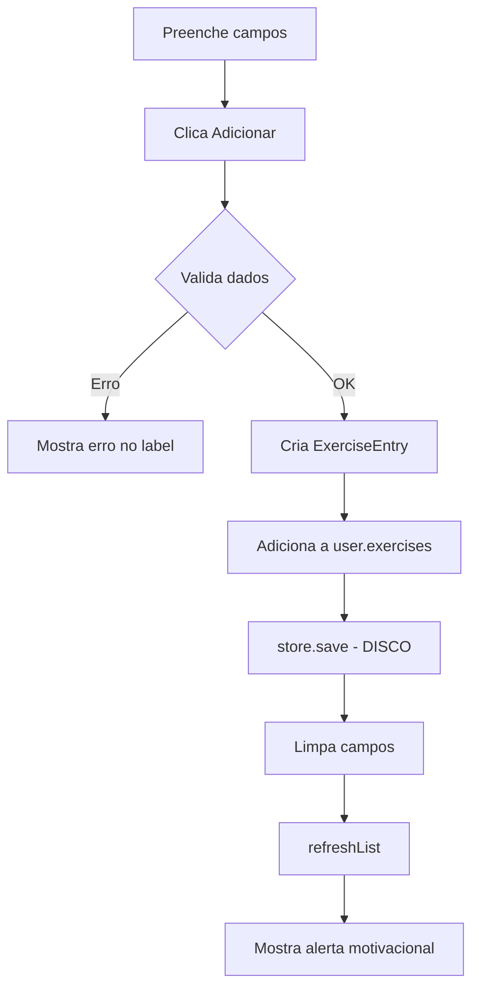

# 4️⃣ Exercícios - Análise Detalhada

> Explicação completa de todas as funções relacionadas com o registo de atividades físicas

---

## 📍 Localização do Código

**Ficheiro Java:** `AminhaDieta/src/main/java/app/ui/controller/ExerciseController.java`  
**FXML:** `AminhaDieta/src/main/resources/fxml/ExerciseView.fxml`  
**Linhas de código:** 105 linhas

---

## 🎯 O Que Esta Funcionalidade Permite Fazer

1. ✅ **Selecionar tipo de exercício** (Caminhada, Corrida, Ciclismo, Natação, Musculação, Yoga)
2. ✅ **Ou escrever tipo personalizado** (qualquer atividade)
3. ✅ **Definir duração** (minutos)
4. ✅ **Definir calorias queimadas**
5. ✅ **Ver lista de exercícios de hoje**  
6. ✅ **Receber alerta motivacional** 🎉 "Bom Trabalho!"

---

## 📋 TODAS as Funções Discriminadas

### Função 1: `init()` - Inicializar Tab Exercícios

**Código:** Linhas 35-42

```java
public void init(SceneManager sceneManager, AppState state, DataStore store) {
    this.state = state;
    this.store = store;
    
    // Preencher ComboBox com tipos pré-definidos
    typeCombo.getItems().addAll(
        "Caminhada", "Corrida", "Ciclismo", 
        "Natação", "Musculação", "Yoga"
    );
    
    refreshList();  // Mostrar exercícios de hoje
}
```

**O QUE FAZ:**
1. Guarda referências ao state e store
2. **Preenche ComboBox** com 6 tipos predefinidos
3. Chama `refreshList()` para mostrar exercícios do dia

**IMPORTANTE:** O ComboBox é **editável** → podes escrever qualquer tipo personalizado!

---

### Função 2: `onAddExercise()` - Adicionar Exercício

**Código:** Linhas 44-87

```java
@FXML
private void onAddExercise() {
    try {
        // 1️⃣ RECOLHER TIPO (selecionado OU escrito)
        String type = typeCombo.getValue();
        if (type == null || type.trim().isEmpty()) {
            type = typeCombo.getEditor().getText();  // Texto escrito
        }
        if (type == null || type.trim().isEmpty()) {
            throw new IllegalArgumentException("Selecione ou digite o tipo de atividade.");
        }
        
        // 2️⃣ RECOLHER DURAÇÃO E CALORIAS
        int duration = Integer.parseInt(durationField.getText().trim());
        int calories = Integer.parseInt(caloriesField.getText().trim());
        
        // 3️⃣ VALIDAR
        if (duration <= 0)
            throw new IllegalArgumentException("Duração inválida.");
        if (calories <= 0)
            throw new IllegalArgumentException("Calorias inválidas.");
        
        // 4️⃣ CRIAR OBJETO ExerciseEntry
        ExerciseEntry entry = new ExerciseEntry(
            LocalDateTime.now(),  // Timestamp AGORA
            type,                 // "Corrida"
            duration,             // 30 (minutos)
            calories              // 300 (kcal)
        );
        
        // 5️⃣ ADICIONAR À LISTA DO UTILIZADOR
        state.getActiveProfile().getExercises().add(entry);
        
        // 6️⃣ GUARDAR EM DISCO
        store.save(state);
        
        // 7️⃣ LIMPAR CAMPOS
        statusLabel.setText("");
        typeCombo.setValue(null);
        durationField.clear();
        caloriesField.clear();
        
        // 8️⃣ ATUALIZAR LISTA
        refreshList();
        
        // 9️⃣ MOSTRAR ALERTA MOTIVACIONAL 🎉
        Alert alert = new Alert(Alert.AlertType.INFORMATION);
        alert.setTitle("Bom Trabalho!");
        alert.setHeaderText("Exercício Registado!");
        alert.setContentText("Continua assim! O teu corpo agradece.");
        alert.showAndWait();
        
    } catch (NumberFormatException e) {
        statusLabel.setText("Duração e Calorias devem ser números inteiros.");
    } catch (IllegalArgumentException e) {
        statusLabel.setText(e.getMessage());
    } catch (Exception e) {
        statusLabel.setText("Erro ao adicionar atividade.");
    }
}
```

**CLASSE ExerciseEntry:**

```java
public class ExerciseEntry implements Serializable {
    private LocalDateTime timestamp;  // 2026-01-07 21:30:00
    private String type;              // "Corrida"
    private int durationMinutes;      // 30
    private int caloriesBurned;       // 300
    
    public ExerciseEntry(LocalDateTime timestamp, String type, 
                         int duration, int calories) {
        this.timestamp = timestamp;
        this.type = type;
        this.durationMinutes = duration;
        this.caloriesBurned = calories;
    }
}
```

**EXEMPLO COMPLETO:**

```
Utilizador:
  - Seleciona: "Corrida"
  - Duração: 30
  - Calorias: 300
  - Clica "Adicionar"

Cria objeto:
  ExerciseEntry(
    timestamp: 2026-01-07 21:30:00,
    type: "Corrida",
    duration: 30,
    calories: 300
  )

Adiciona a: state.getActiveProfile().exercises
Guarda: store.save(state)
Mostra: Alert "Bom Trabalho! 🎉"
```

**FLUXO:**



---

### Função 3: `refreshList()` - Atualizar Lista de Exercícios

**Código:** Linhas 89-103

```java
private void refreshList() {
    if (state.getActiveProfile() == null) return;
    
    LocalDate today = LocalDate.now();
    DateTimeFormatter formatter = DateTimeFormatter.ofPattern("HH:mm");
    
    // FILTRAR E FORMATAR exercícios de HOJE
    List<String> items = state.getActiveProfile().getExercises().stream()
            .filter(e -> e.getTimestamp().toLocalDate().equals(today))
            .map(e -> String.format("[%s] %s - %d min - %d kcal",
                    e.getTimestamp().format(formatter),  // Hora
                    e.getType(),                          // Tipo
                    e.getDurationMinutes(),               // Duração
                    e.getCaloriesBurned()))               // Calorias
            .collect(Collectors.toList());
    
    exerciseList.setItems(FXCollections.observableArrayList(items));
}
```

**O QUE FAZ:**

1. **Obtem lista completa:** `user.getExercises()` (TODOS os exercícios históricos)
2. **Filtra só de hoje:**
   ```java
   .filter(e -> e.getTimestamp().toLocalDate().equals(today))
   ```
3. **Formata cada um:**
   ```
   Formato: "[HH:mm] Tipo - duração min - calorias kcal"
   Exemplo: "[21:30] Corrida - 30 min - 300 kcal"
   ```
4. **Atualiza ListView**

**EXEMPLO DE LISTA:**

```
[09:00] Caminhada - 45 min - 200 kcal
[18:30] Corrida - 30 min - 350 kcal
[20:00] Musculação - 60 min - 400 kcal
```

---

## 📊 Origem dos Dados

| Dado | Como é Obtido | Onde Vem |
|------|---------------|----------|
| **Tipo** | `typeCombo.getValue()` ou `.getEditor().getText()` | Utilizador seleciona ou escreve |
| **Duração** | `durationField.getText()` | Utilizador escreve |
| **Calorias** | `caloriesField.getText()` | Utilizador escreve |
| **Timestamp** | `LocalDateTime.now()` | Sistema (hora atual) |
| **Lista exercícios** | `user.getExercises()` | UserProfile → appstate.dat |

---

## 🎯 Uso no Dashboard

O gráfico de barras no Dashboard (Atividade Física 7 dias) usa estes dados!

**No HomeController:**

```java
// Agrupa exercícios por data e soma calorias
Map<LocalDate, Integer> exerciseMap = user.getExercises().stream()
        .collect(Collectors.groupingBy(
                e -> e.getTimestamp().toLocalDate(),
                Collectors.summingInt(ExerciseEntry::getCaloriesBurned)));

// Cria barras para últimos 7 dias
for (int i = 6; i >= 0; i--) {
    LocalDate date = today.minusDays(i);
    int calories = exerciseMap.getOrDefault(date, 0);
    exerciseSeries.getData().add(new XYChart.Data<>(
        date.format(DateTimeFormatter.ofPattern("dd/MM")), 
        calories
    ));
}
```

**EXEMPLO:**

```
Exercícios registados:
  - 05/01: Corrida 300kcal + Yoga 100kcal = 400kcal
  - 07/01: Caminhada 200kcal

Gráfico mostra:
  05/01: Barra de 400 kcal
  06/01: Barra de 0 kcal
  07/01: Barra de 200 kcal
```

---

## ✅ Checklist de Compreensão

- [ ] Como criar ExerciseEntry com timestamp automático
- [ ] Diferença entre selecionar tipo vs. escrever personalizado
- [ ] Onde os exercícios são guardados (user.exercises → ficheiro)
- [ ] Como a lista é filtrada (só hoje)
- [ ] Como o Dashboard usa estes dados (gráfico de barras)
- [ ] Fluxo completo: preencher → adicionar → guardar → alerta

---

**Próximo:** [05_Historico.md](05_Historico.md)  
**Anterior:** [03_Hidratacao.md](03_Hidratacao.md)  
**Índice:** [README.md](README.md)
