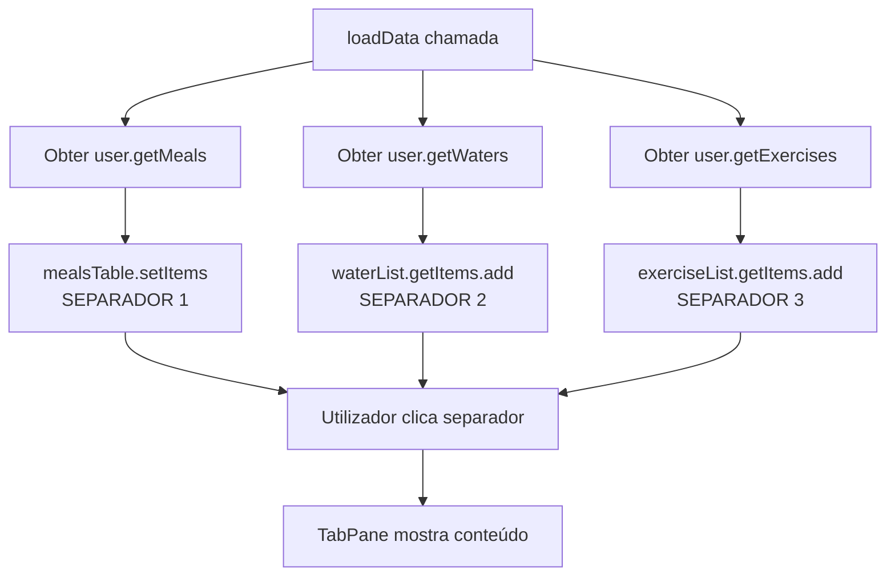
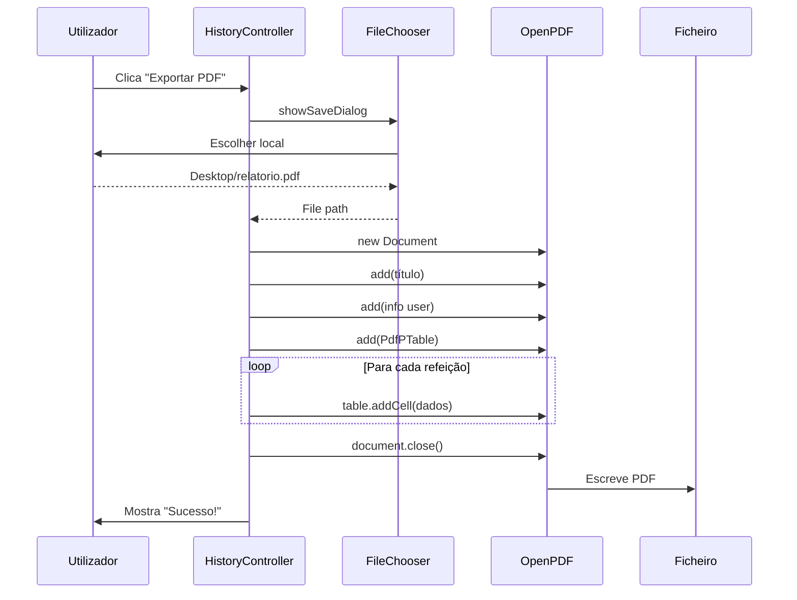

# 5️⃣ Histórico - Análise Detalhada

> Explicação completa do histórico: tabela, filtros, separadores (tabs) e exportação PDF

---

## 📍 Localização do Código

**Ficheiro Java:** `AminhaDieta/src/main/java/app/ui/controller/HistoryController.java`  
**FXML:** `AminhaDieta/src/main/resources/fxml/HistoryView.fxml`  
**Linhas de código:** 325 linhas

---

## 🎯 O Que Esta Funcionalidade Permite

1. ✅ **Ver tabela** com TODAS as refeições históricas
2. ✅ **Filtrar por descrição** (campo de pesquisa)
3. ✅ **Filtrar por data** (início e fim)
4. ✅ **SEPARADORES (Tabs):** Refeições | Água | Exercícios
5. ✅ **Exportar para PDF** (relatório completo)
6. ✅ **Gráficos de evolução** (peso ao longo do tempo)

---

## 🗂️ SEPARADORES - Como Funcionam?

### Estrutura no FXML

**HistoryView.fxml** tem um **TabPane:**

```xml
<TabPane fx:id="historyTabPane">
    <!-- SEPARADOR 1: Refeições -->
    <Tab text="Refeições" closable="false">
        <TableView fx:id="mealsTable">
            <columns>
                <TableColumn text="Data" fx:id="dateColumn"/>
                <TableColumn text="Descrição" fx:id="descColumn"/>
                <TableColumn text="Calorias" fx:id="calColumn"/>
                <TableColumn text="Proteína" fx:id="protColumn"/>
                <!-- ... -->
            </columns>
        </TableView>
    </Tab>
    
    <!-- SEPARADOR 2: Água -->
    <Tab text="Água" closable="false">
        <ListView fx:id="waterList"/>
    </Tab>
    
    <!-- SEPARADOR 3: Exercícios -->
    <Tab text="Exercícios" closable="false">
        <ListView fx:id="exerciseList"/>
    </Tab>
</TabPane>
```

**O QUE É UM TabPane?**
- É um **contentor** com múltiplos separadores
- Cada `<Tab>` é um separador
- Só um separador visível de cada vez
- `closable="false"` → Não pode fechar o separador

**NO CONTROLLER:**

```java
@FXML private TabPane historyTabPane;
```

**JavaFX gere automaticamente:**
- Clique no separador → muda conteúdo
- Não precisas escrever código para isto!

---

## 📋 TODAS as Funções Discriminadas

### Função 1: `init()` - Inicializar Histórico

**Código:** Linhas 75-81

```java
public void init(SceneManager sceneManager, AppState state, DataStore store) {
    this.sceneManager = sceneManager;
    this.state = state;
    this.store = store;
    
    setupTable();    // Configurar colunas da tabela
    loadData();      // Carregar dados nas tabs
    setupSearch();   // Configurar pesquisa
}
```

---

### Função 2: `setupTable()` - Configurar Colunas da Tabela

**Código:** Linhas 83-93

```java
private void setupTable() {
    // Ligar cada coluna ao campo do MealEntry
    dateColumn.setCellValueFactory(cellData -> 
        new SimpleStringProperty(
            cellData.getValue().getTimestamp()
                .format(DateTimeFormatter.ofPattern("dd/MM/yyyy HH:mm"))
        )
    );
    
    descColumn.setCellValueFactory(cellData -> 
        new SimpleStringProperty(cellData.getValue().getDescription())
    );
    
    calColumn.setCellValueFactory(cellData -> 
        new SimpleIntegerProperty(cellData.getValue().getCalories()).asObject()
    );
    
    protColumn.setCellValueFactory(cellData -> 
        new SimpleDoubleProperty(cellData.getValue().getProtein()).asObject()
    );
    
    carbColumn.setCellValueFactory(cellData -> 
        new SimpleDoubleProperty(cellData.getValue().getCarbs()).asObject()
    );
    
    fatColumn.setCellValueFactory(cellData -> 
        new SimpleDoubleProperty(cellData.getValue().getFat()).asObject()
    );
}
```

**O QUE FAZ:**

`setCellValueFactory` diz à coluna **ONDE IR BUSCAR O VALOR**.

**EXEMPLO:**
```
MealEntry: {
    description: "Arroz com Frango",
    calories: 450,
    protein: 35.0,
    ...
}

descColumn.setCellValueFactory(cellData -> cellData.getValue().getDescription())
↓
Coluna mostra: "Arroz com Frango"

calColumn.setCellValueFactory(cellData -> cellData.getValue().getCalories())
↓
Coluna mostra: 450
```

---

### Função 3: `loadData()` - Carregar Dados Nos 3 Separadores

**Código:** Linhas 95-177

```java
private void loadData() {
    UserProfile user = state.getActiveProfile();
    if (user == null) return;
    
    // ═══════════════════════════════════════
    // SEPARADOR 1: REFEIÇÕES (Tabela)
    // ═══════════════════════════════════════
    
    // Criar lista observável (atualiza UI automaticamente)
    ObservableList<MealEntry> allMeals = 
        FXCollections.observableArrayList(user.getMeals());
    
    // Criar lista FILTRADA (para pesquisa)
    filteredData = new FilteredList<>(allMeals, p -> true);
    
    // Colocar na tabela
    mealsTable.setItems(filteredData);
    
    // ═══════════════════════════════════════
    // SEPARADOR 2: ÁGUA (Lista simples)
    // ═══════════════════════════════════════
    
    waterList.getItems().clear();
    DateTimeFormatter fmt = DateTimeFormatter.ofPattern("dd/MM/yyyy HH:mm");
    
    for (WaterEntry w : user.getWaters()) {
        String line = String.format("[%s] %.0f ml",
                w.getTimestamp().format(fmt),
                w.getAmountMl());
        waterList.getItems().add(line);
    }
    
    // ═══════════════════════════════════════
    // SEPARADOR 3: EXERCÍCIOS (Lista simples)
    // ═══════════════════════════════════════
    
    exerciseList.getItems().clear();
    
    for (ExerciseEntry e : user.getExercises()) {
        String line = String.format("[%s] %s - %d min - %d kcal",
                e.getTimestamp().format(fmt),
                e.getType(),
                e.getDurationMinutes(),
                e.getCaloriesBurned());
        exerciseList.getItems().add(line);
    }
    
    // ═══════════════════════════════════════
    // GRÁFICO DE PESO (Se houver dados)
    // ═══════════════════════════════════════
    
    if (weightChart != null && !user.getWeights().isEmpty()) {
        XYChart.Series<String, Number> series = new XYChart.Series<>();
        series.setName("Evolução de Peso");
        
        for (WeightEntry we : user.getWeights()) {
            series.getData().add(new XYChart.Data<>(
                we.getDate().format(DateTimeFormatter.ofPattern("dd/MM")),
                we.getWeightKg()
            ));
        }
        
        weightChart.getData().clear();
        weightChart.getData().add(series);
    }
}
```

**COMO OS SEPARADORES SÃO PREENCHIDOS:**



**IMPORTANTE:**
- TODOS os dados são carregados de UMA VEZ
- TabPane apenas **MOSTRA/ESCONDE** os separadores
- Não há função para "mudar de tab" - JavaFX gere isso!

---

### Função 4: `setupSearch()` - Configurar Pesquisa

**Código:** Linhas 179-183

```java
private void setupSearch() {
    searchField.textProperty().addListener((observable, oldValue, newValue) -> {
        updateFilter();
    });
}
```

**O QUE FAZ:**
- Quando texto no `searchField` muda → chama `updateFilter()`
- **Listener** = ouve mudanças

---

### Função 5: `updateFilter()` - Aplicar Filtros

**Código:** Linhas 185-209

```java
private void updateFilter() {
    String searchText = searchField.getText().toLowerCase();
    LocalDate startDate = startDatePicker.getValue();
    LocalDate endDate = endDatePicker.getValue();
    
    filteredData.setPredicate(mealEntry -> {
        // 1️⃣ FILTRO DE TEXTO (descrição)
        boolean matchesText = true;
        if (searchText != null && !searchText.isEmpty()) {
            matchesText = mealEntry.getDescription()
                                   .toLowerCase()
                                   .contains(searchText);
        }
        
        // 2️⃣ FILTRO DE DATA INÍCIO
        boolean matchesStartDate = true;
        if (startDate != null) {
            matchesStartDate = !mealEntry.getTimestamp()
                                         .toLocalDate()
                                         .isBefore(startDate);
        }
        
        // 3️⃣ FILTRO DE DATA FIM
        boolean matchesEndDate = true;
        if (endDate != null) {
            matchesEndDate = !mealEntry.getTimestamp()
                                       .toLocalDate()
                                       .isAfter(endDate);
        }
        
        // TEM DE PASSAR TODOS OS FILTROS
        return matchesText && matchesStartDate && matchesEndDate;
    });
}
```

**COMO FUNCIONA O FILTRO:**

```
DADOS ORIGINAIS (allMeals):
  1. Arroz (07/01/2026)
  2. Frango (06/01/2026)
  3. Salada (05/01/2026)
  4. Massa (04/01/2026)

UTILIZADOR ESCREVE: "arr"
↓ updateFilter() chamado
↓ Predicate testa cada entrada:
  
  1. "Arroz" contains "arr"? SIM ✓
  2. "Frango" contains "arr"? NÃO ✗
  3. "Salada" contains "arr"? NÃO ✗
  4. "Massa" contains "arr"? NÃO ✗

TABELA MOSTRA:
  1. Arroz (07/01/2026)  ← Só este!
```

**COM FILTRO DE DATA:**

```
UTILIZADOR:
  - Pesquisa: "" (vazio)
  - Data início: 05/01/2026
  - Data fim: 06/01/2026

Predicate:
  1. Arroz (07/01): DEPOIS de 06/01? NÃO → EXCLUÍDO ✗
  2. Frango (06/01): Entre 05 e 06? SIM → INCLUÍDO ✓
  3. Salada (05/01): Entre 05 e 06? SIM → INCLUÍDO ✓
  4. Massa (04/01): ANTES de 05/01? SIM → EXCLUÍDO ✗

TABELA MOSTRA:
  2. Frango (06/01/2026)
  3. Salada (05/01/2026)
```

---

### Função 6: `handleDownloadPdf()` - Exportar PDF

**Código:** Linhas 211-323

```java
@FXML
private void handleDownloadPdf() {
    try {
        UserProfile user = state.getActiveProfile();
        if (user == null) return;
        
        // 1️⃣ ESCOLHER ONDE GUARDAR
        FileChooser fileChooser = new FileChooser();
        fileChooser.setTitle("Guardar Relatório PDF");
        fileChooser.setInitialFileName("relatorio_" + 
            LocalDate.now().format(DateTimeFormatter.ofPattern("ddMMyyyy")) + ".pdf");
        fileChooser.getExtensionFilters().add(
            new FileChooser.ExtensionFilter("PDF files", "*.pdf"));
        
        File file = fileChooser.showSaveDialog(mealsTable.getScene().getWindow());
        if (file == null) return;
        
        // 2️⃣ CRIAR DOCUMENTO PDF
        Document document = new Document(PageSize.A4);
        PdfWriter.getInstance(document, new FileOutputStream(file));
        document.open();
        
        // 3️⃣ TÍTULO
        Font titleFont = new Font(Font.HELVETICA, 18, Font.BOLD);
        Paragraph title = new Paragraph("Relatório de Dieta - " + user.getNome(), titleFont);
        title.setAlignment(Element.ALIGN_CENTER);
        document.add(title);
        document.add(new Paragraph(" "));  // Espaço
        
        // 4️⃣ INFORMAÇÕES DO UTILIZADOR
        document.add(new Paragraph("Idade: " + user.getIdade() + " anos"));
        document.add(new Paragraph("Peso: " + user.getPesoKg() + " kg"));
        document.add(new Paragraph("Altura: " + user.getAlturaCm() + " cm"));
        document.add(new Paragraph("IMC: " + String.format("%.1f", user.getBMI())));
        document.add(new Paragraph(" "));
        
        // 5️⃣ TABELA DE REFEIÇÕES
        Font headerFont = new Font(Font.HELVETICA, 12, Font.BOLD);
        document.add(new Paragraph("Refeições:", headerFont));
        
        PdfPTable table = new PdfPTable(6);  // 6 colunas
        table.setWidthPercentage(100);
        
        // Cabeçalhos
        table.addCell("Data");
        table.addCell("Descrição");
        table.addCell("Calorias");
        table.addCell("Proteína");
        table.addCell("Hidratos");
        table.addCell("Gordura");
        
        // Dados (últimas 50 refeições)
        DateTimeFormatter fmt = DateTimeFormatter.ofPattern("dd/MM/yyyy");
        List<MealEntry> recentMeals = user.getMeals().stream()
                .sorted((a, b) -> b.getTimestamp().compareTo(a.getTimestamp()))
                .limit(50)
                .collect(Collectors.toList());
        
        for (MealEntry m : recentMeals) {
            table.addCell(m.getTimestamp().format(fmt));
            table.addCell(m.getDescription());
            table.addCell(String.valueOf(m.getCalories()));
            table.addCell(String.format("%.1f", m.getProtein()));
            table.addCell(String.format("%.1f", m.getCarbs()));
            table.addCell(String.format("%.1f", m.getFat()));
        }
        
        document.add(table);
        
        // 6️⃣ TOTAIS
        document.add(new Paragraph(" "));
        int totalCals = recentMeals.stream().mapToInt(MealEntry::getCalories).sum();
        document.add(new Paragraph("Total de Calorias: " + totalCals + " kcal"));
        
        // 7️⃣ FECHAR DOCUMENTO
        document.close();
        
        // 8️⃣ MOSTRAR CONFIRMAÇÃO
        Alert alert = new Alert(Alert.AlertType.INFORMATION);
        alert.setTitle("Sucesso");
        alert.setHeaderText("PDF Criado!");
        alert.setContentText("Relatório guardado em: " + file.getAbsolutePath());
        alert.showAndWait();
        
    } catch (Exception e) {
        e.printStackTrace();
        Alert alert = new Alert(Alert.AlertType.ERROR);
        alert.setTitle("Erro");
        alert.setHeaderText("Erro ao criar PDF");
        alert.setContentText(e.getMessage());
        alert.showAndWait();
    }
}
```

**BIBLIOTECA USADA:** OpenPDF (1.3.30)

**FLUXO COMPLETO:**



---

## 📊 Resumo: Funcionalidades do Histórico

| Funcionalidade | Tecnologia | Como Funciona |
|----------------|------------|---------------|
| **Separadores** | TabPane (JavaFX) | FXML define tabs, JavaFX gere cliques |
| **Tabela** | TableView | `setCellValueFactory` liga colunas a dados |
| **Filtro Texto** | FilteredList + Predicate | Testa `.contains()` em cada entrada |
| **Filtro Data** | DatePicker + Predicate | Testa `isBefore()` / `isAfter()` |
| **Export PDF** | OpenPDF library | Cria Document, adiciona Paragraph e PdfPTable |

---

## 🎯 Como os Separadores SÃO Geridos Automaticamente

**NO FXML:**
```xml
<TabPane>
    <Tab text="Refeições">...</Tab>
    <Tab text="Água">...</Tab>
    <Tab text="Exercícios">...</Tab>
</TabPane>
```

**JavaFX FAZ:**
1. Renderiza 3 separadores no topo
2. Quando clicas "Água" → esconde conteúdo de "Refeições", mostra "Água"
3. Quando clicas "Exercícios" → esconde "Água", mostra "Exercícios"

**NÃO PRECISAS escrever código para isto!**

**No Controller apenas:**
- Preenches CADA separador com dados (loadData)
- JavaFX gere a visualização

---

## ✅ Checklist de Compreensão - Histórico

- [ ] Entendo o que é um TabPane e como funciona
- [ ] Sei que separadores são geridos automaticamente por JavaFX
- [ ] Compreendo `setCellValueFactory` (ligar coluna a campo)
- [ ] Sei como FilteredList funciona com Predicate
- [ ] Entendo filtro de texto (`.contains()`)
- [ ] Entendo filtro de data (`isBefore()`, `isAfter()`)
- [ ] Sei como OpenPDF cria documentos (Document, Paragraph, PdfPTable)
- [ ] Compreendo que loadData() preenche TODOS os separadores de uma vez

---

**Próximo:** [06_Definicoes.md](06_Definicoes.md)  
**Anterior:** [04_Exercicios.md](04_Exercicios.md)  
**Índice:** [README.md](README.md)
