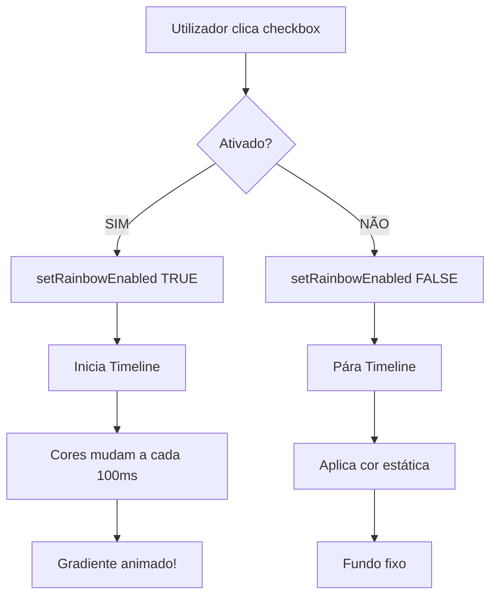
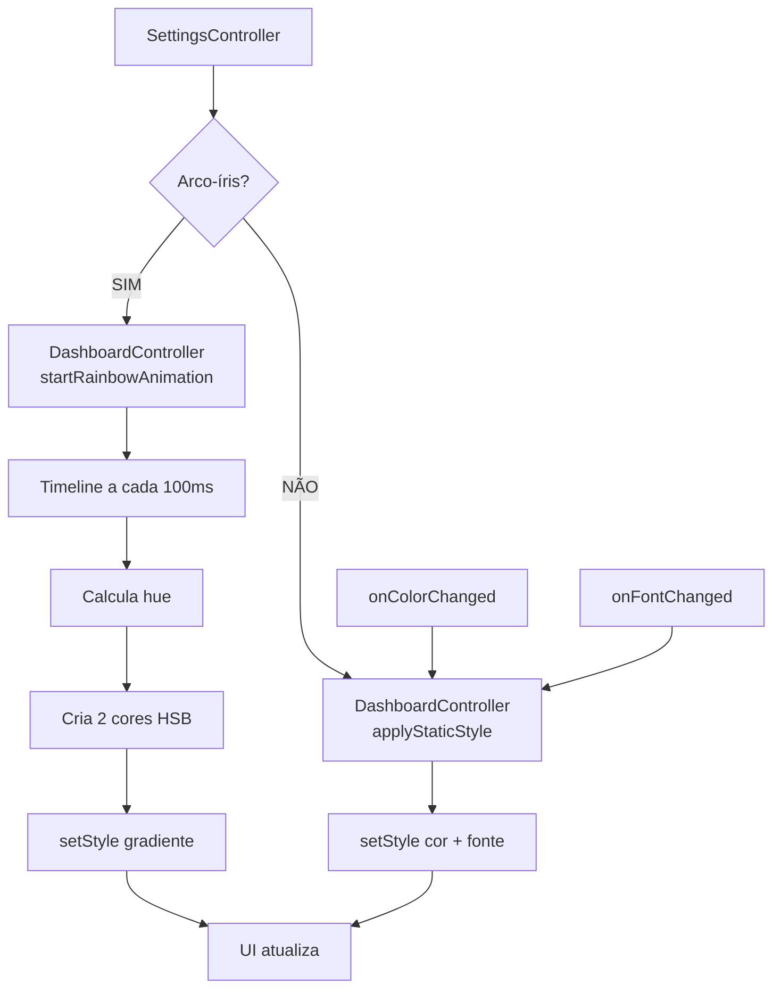

# 6️⃣ Definições - Análise Detalhada

> Explicação completa das definições visuais: arco-íris, cores estáticas e fontes

---

## 📍 Localização do Código

**Ficheiro Java:** `AminhaDieta/src/main/java/app/ui/controller/SettingsController.java` (67 linhas)  
**FXML:** `AminhaDieta/src/main/resources/fxml/SettingsView.fxml`  
**DashboardController:** `DashboardController.java` (contém lógica de estilos)

---

## 🎯 O Que Esta Funcionalidade Permite

1. ✅ **Ativar/Desativar Modo Arco-Íris** (gradiente animado)
2. ✅ **Escolher Cor Estática** (quando arco-íris desligado)
3. ✅ **Mudar Fonte** da aplicação (Verdana, Arial, Segoe UI, etc.)
4. ✅ **Aplicar mudanças em tempo real** (sem reiniciar!)

---

## 🌈 Como Funciona o Modo Arco-Íris?

### DashboardController - A Animação

**Código:** DashboardController.java, linhas 118-136

```java
private void startRainbowAnimation() {
    if (rainbowTimeline != null) {
        rainbowTimeline.play();
        return;
    }
    
    // Criar Timeline (animação)
    rainbowTimeline = new Timeline(
        new KeyFrame(Duration.millis(100), e -> {
            // CALCULAR COR baseada no tempo
            double hue = (System.currentTimeMillis() % 10000) / 10000.0 * 360;
            
            // Criar 2 cores em gradiente
            String color1 = String.format("hsb(%.0f, 20%%, 95%%)", hue);
            String color2 = String.format("hsb(%.0f, 20%%, 90%%)", (hue + 40) % 360);
            
            // APLICAR AO FUNDO
            contentArea.getScene().getRoot().setStyle(
                String.format(
                    "-fx-background-color: linear-gradient(to bottom right, %s, %s); -fx-font-family: '%s';",
                    color1, color2, currentFont
                )
            );
        })
    );
    
    rainbowTimeline.setCycleCount(Animation.INDEFINITE);  // Loop infinito
    rainbowTimeline.play();
}
```

**COMO FUNCIONA:**

1. **Timeline** = animação que executa algo repetidamente
2. **KeyFrame(100ms)** = a cada 100 milissegundos:
   - Calcula `hue` (ton de cor) baseado no tempo
   - `hue` varia de 0 a 360 (roda completa de cores)
   - Cria 2 cores com 40° de diferença
   - Aplica gradiente ao fundo

**RESULTADO:**
```
Tempo 0ms:    hue=0   → Vermelho
Tempo 2500ms: hue=90  → Verde
Tempo 5000ms: hue=180 → Azul Ciano
Tempo 7500ms: hue=270 → Roxo
Tempo 10000ms: hue=0  → Vermelho (recomeça)
```

**CORES HSB:**
- **H** (Hue): Tonalidade (0-360°)
- **S** (Saturation): Saturação (20% = cores pastel)
- **B** (Brightness): Brilho (95% = muito claro)

---

## 📋 TODAS as Funções Discriminadas

### Função 1: `init()` - Inicializar Definições

**Código:** Linhas 26-37

```java
public void init(DashboardController dashboardController) {
    this.dashboardController = dashboardController;
    
    // Estado inicial baseado no Dashboard
    rainbowCheck.setSelected(dashboardController.isRainbowEnabled());
    colorBox.setDisable(rainbowCheck.isSelected());  // Desativa se arco-íris ativo
    
    // Cor padrão
    themeColorPicker.setValue(Color.web("#E0F7FA"));  // Azul claro
    
    // Preencher ComboBox de fontes
    fontCombo.getItems().addAll(
        "Verdana", "Arial", "Segoe UI", "Tahoma", "Comic Sans MS"
    );
    fontCombo.setValue("Verdana");  // Padrão
}
```

**O QUE FAZ:**
1. Guarda referência ao DashboardController
2. Sincroniza checkbox com estado atual (arco-íris ligado/desligado)
3. Desativa seletor de cor se arco-íris estiver ativo
4. Define cor padrão: #E0F7FA (azul claro)
5. Preenche lista de fontes

---

### Função 2: `onRainbowToggled()` - Ligar/Desligar Arco-Íris

**Código:** Linhas 39-45

```java
@FXML
private void onRainbowToggled() {
    boolean enabled = rainbowCheck.isSelected();
    
    // APLICAR NO DASHBOARD
    dashboardController.setRainbowEnabled(enabled);
    
    // Desativar/ativar seletor de cor
    colorBox.setDisable(enabled);
    
    // Mostrar status
    statusLabel.setText(enabled ? "Modo Arco-íris ativado!" : "Modo Estático ativado.");
}
```

**DashboardController.setRainbowEnabled():**

```java
public void setRainbowEnabled(boolean enabled) {
    this.isRainbowEnabled = enabled;
    if (enabled) {
        if (rainbowTimeline != null)
            rainbowTimeline.play();  // ← INICIA ANIMAÇÃO
        else
            startRainbowAnimation();
    } else {
        if (rainbowTimeline != null)
            rainbowTimeline.stop();  // ← PÁRA ANIMAÇÃO
        applyStaticStyle();          // ← APLICA COR ESTÁTICA
    }
}
```

**FLUXO:**



---

### Função 3: `onColorChanged()` - Mudar Cor Estática

**Código:** Linhas 47-57

```java
@FXML
private void onColorChanged() {
    if (!rainbowCheck.isSelected()) {  // Só se arco-íris DESLIGADO
        Color c = themeColorPicker.getValue();
        
        // Converter Color para Hex
        String hex = String.format("#%02X%02X%02X",
                (int) (c.getRed() * 255),
                (int) (c.getGreen() * 255),
                (int) (c.getBlue() * 255));
        
        dashboardController.setStaticColor(hex);
    }
}
```

**CONVERSÃO Color → Hex:**

```
Color JavaFX:
  Red:   0.8784313725490196    (0.0 a 1.0)
  Green: 0.9686274509803922
  Blue:  0.9803921568627451

Converter para 0-255:
  Red:   0.8784 × 255 = 224
  Green: 0.9686 × 255 = 247
  Blue:  0.9804 × 255 = 250

Formato Hex:
  #E0F7FA
```

**DashboardController.setStaticColor():**

```java
public void setStaticColor(String hexColor) {
    this.staticColor = hexColor;
    if (!isRainbowEnabled)
        applyStaticStyle();
}

private void applyStaticStyle() {
    contentArea.getScene().getRoot().setStyle(
        String.format(
            "-fx-background-color: %s; -fx-font-family: '%s';",
            staticColor,  // Ex: "#E0F7FA"
            currentFont   // Ex: "Verdana"
        )
    );
}
```

**RESULTADO:** Fundo fica cor sólida escolhida

---

### Função 4: `onFontChanged()` - Mudar Fonte

**Código:** Linhas 59-65

```java
@FXML
private void onFontChanged() {
    String font = fontCombo.getValue();
    if (font != null) {
        dashboardController.setFont(font);
    }
}
```

**DashboardController.setFont():**

```java
public void setFont(String fontName) {
    this.currentFont = fontName;
    if (!isRainbowEnabled)
        applyStaticStyle();  // Aplica nova fonte
}
```

**APLICA EM TODA A APLICAÇÃO:**

```css
-fx-font-family: 'Verdana';  /* Antes */
-fx-font-family: 'Arial';    /* Depois */
```

**Muda fonte de:**
- Labels
- Botões
- TextFields
- Toda a UI!

---

## 📊 Resumo: Como Estilos São Aplicados



---

## 🎨 Exemplos de Estilos CSS Aplicados

### Modo Arco-Íris LIGADO

**A cada 100ms, algo assim é aplicado:**

```css
-fx-background-color: linear-gradient(to bottom right, hsb(120, 20%, 95%), hsb(160, 20%, 90%));
-fx-font-family: 'Verdana';
```

**Animação:**
```
t=0s:    hsb(0, ...) → hsb(40, ...)     [Vermelho → Laranja]
t=2.5s:  hsb(90, ...) → hsb(130, ...)   [Verde → Verde-azulado]
t=5s:    hsb(180, ...) → hsb(220, ...)  [Ciano → Azul]
t=7.5s:  hsb(270, ...) → hsb(310, ...)  [Roxo → Magenta]
t=10s:   hsb(0, ...) → hsb(40, ...)     [Recomeça]
```

---

### Modo Arco-Íris DESLIGADO

**Estilo fixo:**

```css
-fx-background-color: #E0F7FA;  /* Azul claro */
-fx-font-family: 'Arial';
```

**Muda apenas quando:**
- Utilizador escolhe nova cor
- Utilizador escolhe nova fonte

---

## ✅ Checklist de Compreensão - Definições

- [ ] Entendo como Timeline cria animação (KeyFrame a cada 100ms)
- [ ] Sei como HSB funciona (Hue 0-360, Saturation, Brightness)
- [ ] Compreendo cálculo de `hue` baseado em tempo (`%10000`)
- [ ] Sei converter Color JavaFX (0-1) para Hex (#RRGGBB)
- [ ] Entendo diferença entre modo arco-íris (animado) e estático (fixo)
- [ ] Sei como setStyle aplica CSS inline em JavaFX
- [ ] Compreendo que fonte muda TODA a UI (propagação CSS)
- [ ] Entendo por que seletor de cor é desativado quando arco-íris está ativo

---

**Próximo:** [07_Perfis.md](07_Perfis.md)  
**Anterior:** [05_Historico.md](05_Historico.md)  
**Índice:** [README.md](README.md)
