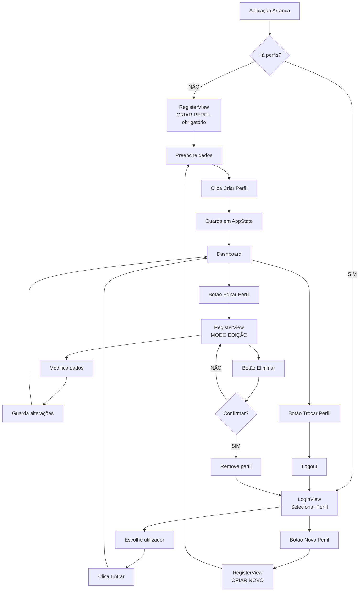
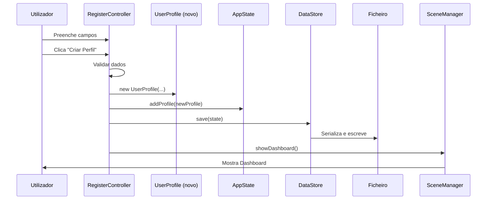
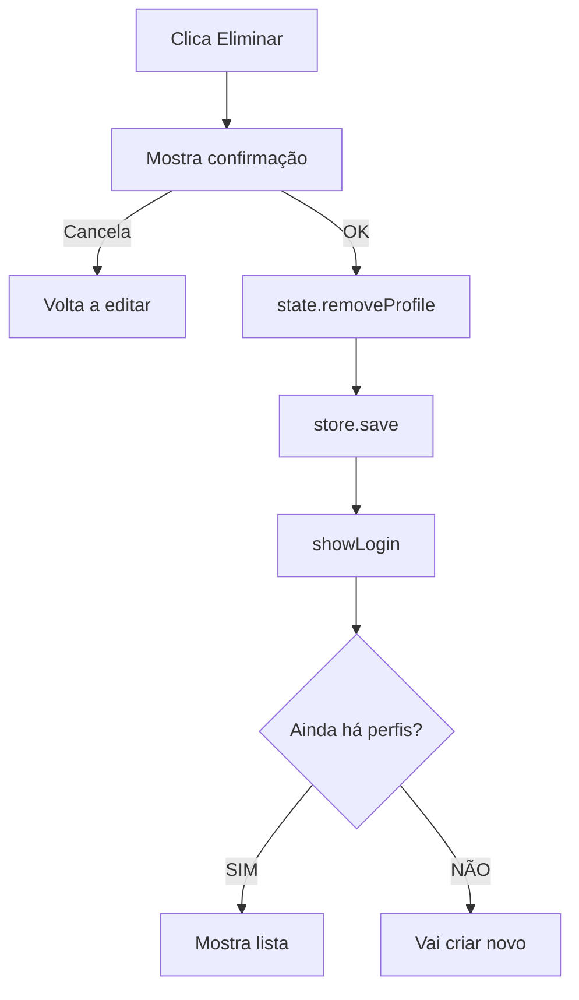

# 7️⃣ Gestão de Perfis - Criar, Editar, Eliminar, Login, Trocar

> Explicação completa de todo o ciclo de vida dos perfis de utilizador

---

## 📍 Localização do Código

**Criar/Editar:** `AminhaDieta/src/main/java/app/ui/controller/RegisterController.java` (192 linhas)  
**Login:** `AminhaDieta/src/main/java/app/ui/controller/LoginController.java`  
**FXML Registo:** `AminhaDieta/src/main/resources/fxml/RegisterView.fxml`  
**FXML Login:** `AminhaDieta/src/main/resources/fxml/LoginView.fxml`

---

## 🔄 Fluxo Completo de Perfis



---

## 1️⃣ CRIAR PERFIL (Primeira Vez)

### Quando Acontece?

**No arranque - Main.java:**

```java
SceneManager sceneManager = new SceneManager(stage, state, store);
sceneManager.showInitialScene();
```

**SceneManager.showInitialScene():**

```java
public void showInitialScene() {
    if (state.getProfiles().isEmpty())
        showRegister(false, null);  // ← CRIAR OBRIGATÓRIO!
    else
        showLogin();
}
```

**SE `state.getProfiles().isEmpty()` é TRUE:**
- Lista de perfis está vazia
- É a primeira vez
- **Vai para RegisterView CRIAR PERFIL**
- `canCancel = false` → **NÃO pode cancelar** (botão escondido)
- `profileToEdit = null` → Modo CRIAÇÃO

---

### RegisterController - Modo CRIAÇÃO

**Função `init()` - Linhas 61-115:**

```java
public void init(SceneManager sceneManager, AppState state, DataStore store, 
                boolean canCancel, UserProfile profileToEdit) {
    this.sceneManager = sceneManager;
    this.state = state;
    this.store = store;
    this.profileToEdit = profileToEdit;
    
    // Configurar ToggleGroup para sexo
    genderGroup = new ToggleGroup();
    masculinoRadio.setToggleGroup(genderGroup);
    femininoRadio.setToggleGroup(genderGroup);
    masculinoRadio.setUserData(UserProfile.Gender.MALE);
    femininoRadio.setUserData(UserProfile.Gender.FEMALE);
    masculinoRadio.setSelected(true);  // Padrão: Masculino
    
    // Preencher ComboBoxes
    atividadeCombo.getItems().setAll(UserProfile.PhysicalActivityLevel.values());
    atividadeCombo.getSelectionModel().select(PhysicalActivityLevel.SEDENTARY);
    
    frequenciaCombo.getItems().setAll(UserProfile.WeighInFrequency.values());
    frequenciaCombo.getSelectionModel().select(WeighInFrequency.WEEKLY);
    
    // MODO CRIAÇÃO (profileToEdit == null)
    if (profileToEdit == null) {
        tituloLabel.setText("Criar Perfil");
        guardarBtn.setText("Criar Perfil");
        
        eliminarBtn.setVisible(false);  // Esconde botão eliminar
        eliminarBtn.setManaged(false);
    }
    
    // Mostrar/esconder botão Cancelar
    cancelarBtn.setVisible(canCancel);    // FALSE na primeira vez!
    cancelarBtn.setManaged(canCancel);
}
```

**PRIMEIRA VEZ:**
- Título: "Criar Perfil"
- Botão: "Criar Perfil"
- Botão Eliminar: **ESCONDIDO**
- Botão Cancelar: **ESCONDIDO** (não pode fugir!)

---

### Criar Perfil - Função `onGuardar()`

**Código:** Linhas 118-168

```java
@FXML
private void onGuardar() {
    try {
        // 1️⃣ RECOLHER DADOS
        String nome = nomeField.getText().trim();
        int idade = Integer.parseInt(idadeField.getText().trim());
        double peso = Double.parseDouble(pesoField.getText().trim().replace(",", "."));
        double altura = Double.parseDouble(alturaField.getText().trim().replace(",", "."));
        double metaPeso = Double.parseDouble(metaPesoField.getText().trim().replace(",", "."));
        
        Gender gender = (Gender) genderGroup.getSelectedToggle().getUserData();
        PhysicalActivityLevel activityLevel = atividadeCombo.getValue();
        WeighInFrequency frequency = frequenciaCombo.getValue();
        
        // 2️⃣ VALIDAR
        if (nome.isEmpty())
            throw new IllegalArgumentException("Nome obrigatório.");
        if (idade <= 0)
            throw new IllegalArgumentException("Idade inválida.");
        if (peso <= 0)
            throw new IllegalArgumentException("Peso inválido.");
        if (altura <= 0)
            throw new IllegalArgumentException("Altura inválida.");
        if (metaPeso <= 0)
            throw new IllegalArgumentException("Meta de peso inválida.");
        
        // 3️⃣ CRIAR NOVO PERFIL
        if (profileToEdit == null) {
            UserProfile newProfile = new UserProfile(
                nome, idade, peso, altura, gender, 
                activityLevel, frequency, metaPeso
            );
            state.addProfile(newProfile);  // ← ADICIONA À LISTA!
        }
        
        // 4️⃣ GUARDAR EM DISCO
        store.save(state);
        
        // 5️⃣ NAVEGAR PARA DASHBOARD
        sceneManager.showDashboard();
        
    } catch (Exception e) {
        erroLabel.setText(e.getMessage() == null ? "Dados inválidos." : e.getMessage());
    }
}
```

**O QUE ACONTECE:**



**AppState.addProfile():**
```java
public void addProfile(UserProfile profile) {
    profiles.add(profile);
    setActiveProfile(profile);  // ← Define como ativo automaticamente!
}
```

---

## 2️⃣ LOGIN (Escolher Perfil Existente)

### LoginController

```java
public class LoginController {
    @FXML private ListView<String> profilesListView;
    
    private SceneManager sceneManager;
    private AppState state;
    private DataStore store;
    
    public void init(SceneManager sm, AppState state, DataStore store) {
        this.sceneManager = sm;
        this.state = state;
        this.store = store;
        
        // Preencher lista com nomes dos perfis
        profilesListView.getItems().clear();
        for (UserProfile profile : state.getProfiles()) {
            profilesListView.getItems().add(profile.getNome());
        }
    }
    
    @FXML
    private void handleLogin() {
        String selectedName = profilesListView.getSelectionModel().getSelectedItem();
        
        if (selectedName == null) {
            showError("Selecione um perfil!");
            return;
        }
        
        // Encontrar perfil pelo nome
        UserProfile profile = state.getProfiles().stream()
                .filter(p -> p.getNome().equals(selectedName))
                .findFirst()
                .orElse(null);
        
        if (profile != null) {
            // Definir como ativo
            state.setActiveProfile(profile);
            
            // Navegar para Dashboard
            sceneManager.showDashboard();
        }
    }
    
    @FXML
    private void handleNewProfile() {
        // Botão "Novo Perfil"
        sceneManager.showRegister(true, null);  // canCancel=true, criar novo
    }
}
```

**FLUXO LOGIN:**

```
1. Mostra lista de nomes: ["Carlos", "João", "Maria"]
2. Utilizador seleciona "Carlos"
3. Clica "Entrar"
4. Procura UserProfile com nome "Carlos"
5. Define como activeProfile
6. Navega para Dashboard
```

---

## 3️⃣ EDITAR PERFIL (Do Dashboard)

### Botão no Dashboard

```java
// HomeController
@FXML
private void onEditarPerfil() {
    sceneManager.showRegister(true, state.getActiveProfile());
}
```

**Parâmetros:**
- `canCancel = true` → Pode cancelar (volta ao Dashboard)
- `profileToEdit = state.getActiveProfile()` → Perfil atual

---

### RegisterController - Modo EDIÇÃO

**No `init()` - Linhas 82-103:**

```java
// Se profileToEdit != null → MODO EDIÇÃO
if (profileToEdit != null) {
    tituloLabel.setText("Editar Perfil");
    guardarBtn.setText("Guardar Alterações");
    
    // PRÉ-PREENCHER campos
    nomeField.setText(profileToEdit.getNome());
    idadeField.setText(String.valueOf(profileToEdit.getIdade()));
    pesoField.setText(String.valueOf(profileToEdit.getPesoKg()));
    alturaField.setText(String.valueOf(profileToEdit.getAlturaCm()));
    metaPesoField.setText(String.valueOf(profileToEdit.getTargetWeightKg()));
    frequenciaCombo.getSelectionModel().select(profileToEdit.getWeighInFrequency());
    
    if (profileToEdit.getGender() == Gender.MALE)
        masculinoRadio.setSelected(true);
    else
        femininoRadio.setSelected(true);
    
    if (profileToEdit.getPhysicalActivityLevel() != null)
        atividadeCombo.getSelectionModel().select(profileToEdit.getPhysicalActivityLevel());
    
    // MOSTRAR botão Eliminar
    eliminarBtn.setVisible(true);
    eliminarBtn.setManaged(true);
}
```

**MODO EDIÇÃO:**
- Título: "Editar Perfil"
- Botão: "Guardar Alterações"
- **Campos pré-preenchidos** com dados atuais
- Botão Eliminar: **VISÍVEL**
- Botão Cancelar: **VISÍVEL**

---

### Guardar Alterações

**No `onGuardar()` - Linhas 141-156:**

```java
// Se está a editar (profileToEdit != null)
if (profileToEdit != null) {
    profileToEdit.setNome(nome);
    profileToEdit.setIdade(idade);
    
    // Se peso mudou, adiciona entrada no histórico
    if (profileToEdit.getPesoKg() != peso) {
        profileToEdit.setPesoKg(peso);
        profileToEdit.addWeightEntry(peso);
    }
    
    profileToEdit.setAlturaCm(altura);
    profileToEdit.setGender(gender);
    profileToEdit.setPhysicalActivityLevel(activityLevel);
    profileToEdit.setTargetWeightKg(metaPeso);
    profileToEdit.setWeighInFrequency(frequency);
}

// Guardar
store.save(state);

// Voltar ao Dashboard
sceneManager.showDashboard();
```

**IMPORTANTE:** Se peso mudou → adiciona `WeightEntry` ao histórico!

---

## 4️⃣ ELIMINAR PERFIL

### Botão Eliminar

**Código:** Linhas 175-190

```java
@FXML
private void onEliminar() {
    if (profileToEdit == null) return;
    
    // Confirmação
    Alert alert = new Alert(Alert.AlertType.CONFIRMATION);
    alert.setTitle("Eliminar Perfil");
    alert.setHeaderText("Tem a certeza que deseja eliminar este perfil?");
    alert.setContentText("Esta ação não pode ser desfeita.");
    
    if (alert.showAndWait().orElse(ButtonType.CANCEL) == ButtonType.OK) {
        // REMOVE da lista
        state.removeProfile(profileToEdit.getId());
        
        // Guarda
        store.save(state);
        
        // Volta ao Login
        sceneManager.showLogin();
    }
}
```

**AppState.removeProfile():**
```java
public void removeProfile(UUID id) {
    profiles.removeIf(p -> p.getId().equals(id));
    setActiveProfile(null);  // Remove ativo
}
```

**FLUXO:**



---

## 5️⃣ TROCAR PERFIL (Logout)

### Botão no Dashboard

**DashboardController:**

```java
@FXML
private void onTrocarPerfil() {
    state.setActiveProfile(null);  // ← Remove ativo
    store.save(state);
    sceneManager.showLogin();
}
```

**O QUE FAZ:**
1. Define activeProfile como `null`
2. Guarda estado
3. Volta para LoginView

**RESULTADO:** Utilizador pode escolher outro perfil ou criar novo

---

## 6️⃣ CRIAR NOVO PERFIL (Via Login)

**No LoginView, botão "Novo Perfil":**

```java
@FXML
private void handleNewProfile() {
    sceneManager.showRegister(true, null);
    // canCancel = true → pode cancelar e voltar ao login
    // profileToEdit = null → modo CRIAÇÃO
}
```

**DIFERENÇA vs. Primeira Vez:**
- **Primeira vez:** `canCancel = false` → Obrigado a criar
- **Via Login:** `canCancel = true` → Pode voltar atrás

---

## 📊 Resumo: Todos os Modos de RegisterView

| Origem | canCancel | profileToEdit | Título | Botão | Eliminar? | Cancelar? |
|--------|-----------|---------------|--------|-------|-----------|-----------|
| **Primeira vez** | `false` | `null` | "Criar Perfil" | "Criar Perfil" | ❌ Não | ❌ Não |
| **Login → Novo** | `true` | `null` | "Criar Perfil" | "Criar Perfil" | ❌ Não | ✅ Sim |
| **Dashboard → Editar** | `true` | `perfil atual` | "Editar Perfil" | "Guardar Alterações" | ✅ Sim | ✅ Sim |

---

## ✅ Checklist de Compreensão - Perfis

- [ ] Sei quando RegisterView aparece em modo CRIAÇÃO obrigatório
- [ ] Entendo diferença entre criar (1ª vez) vs. criar (via login)
- [ ] Compreendo como Login seleciona perfil da lista
- [ ] Sei como perfil é pré-preenchido em modo EDIÇÃO
- [ ] Entendo por que peso mudado adiciona WeightEntry
- [ ] Sei o que acontece ao eliminar perfil (volta login)
- [ ] Compreendo trocar perfil (setActiveProfile(null))
- [ ] Entendo gestão de botões (visibilidade canCancel/modo)

---

**Próximo:** [08_Navegacao.md](08_Navegacao.md)  
**Anterior:** [06_Definicoes.md](06_Definicoes.md)  
**Índice:** [README.md](README.md)
