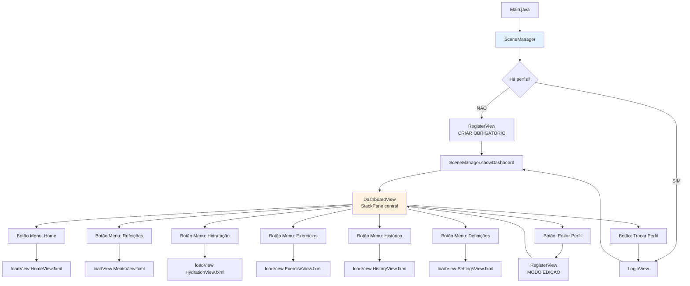
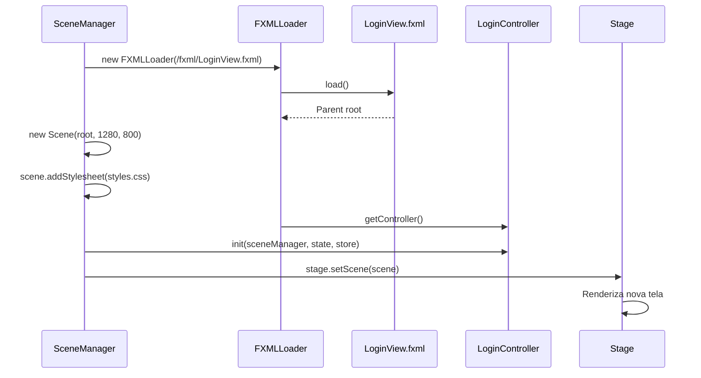
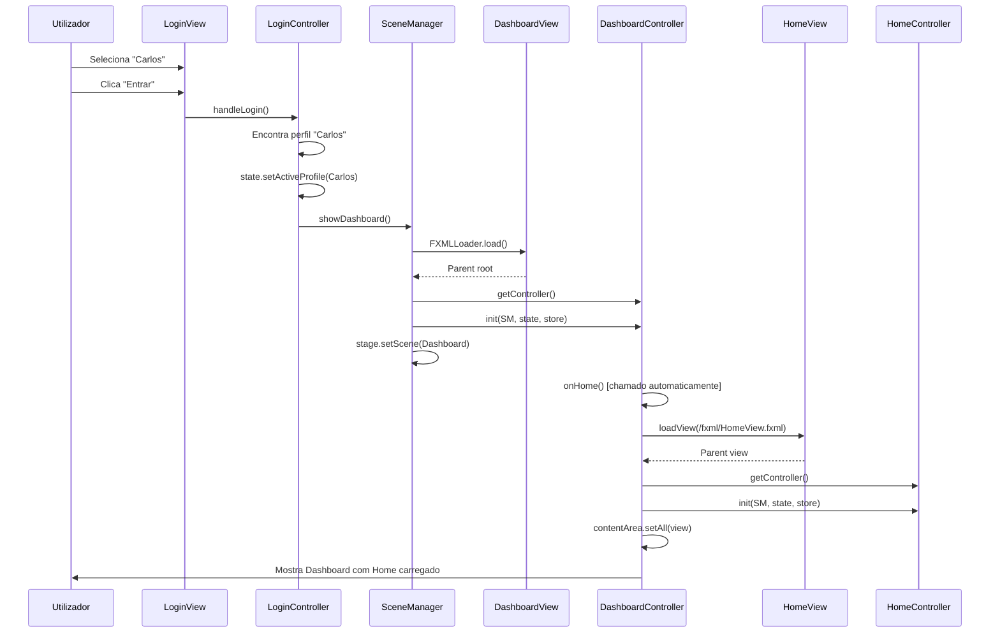

# 8️⃣ Navegação Global - Como Tudo se Liga

> Explicação completa do sistema de navegação: SceneManager e DashboardController

---

## 📍 Localização do Código

**Ficheiro Principal:** `AminhaDieta/src/main/java/app/ui/SceneManager.java` (80 linhas)  
**Dashboard (Hub):** `AminhaDieta/src/main/java/app/ui/controller/DashboardController.java` (211 linhas)

---

## 🎯 Dois Níveis de Navegação

### Nível 1: Navegação de Ecrã Completo (SceneManager)

**Muda toda a janela:**
- Login ↔ Dashboard
- Dashboard ↔ Register (Criar/Editar Perfil)
- Qualquer ↔ Login (Logout)

**Responsável:** `SceneManager`

---

### Nível 2: Navegação Interna do Dashboard (DashboardController)

**Muda conteúdo central (usa StackPane):**
- Home
- Refeições
- Hidratação
- Exercícios
- Histórico
- Definições

**Responsável:** `DashboardController.loadView()`

---

## 🗺️ Mapa Completo de Navegação



---

## 📋 SceneManager - Funções Discriminadas

### Função 1: `showInitialScene()` - Decidir Primeira Tela

**Código:** Linhas 32-36

```java
public void showInitialScene() {
    if (state.getProfiles().isEmpty())
        showRegister(false, null);  // Criar perfil obrigatório
    else
        showLogin();                 // Lista de perfis
}
```

**LÓGICA:**
```
state.getProfiles().isEmpty()?
├─ TRUE  → Nenhum perfil existe → CRIAR
└─ FALSE → Há perfis → LOGIN
```

---

### Função 2: `showLogin()` - Mostrar Ecrã de Login

**Código:** Linhas 38-50

```java
public void showLogin() {
    try {
        // 1. CARREGAR FXML
        FXMLLoader loader = new FXMLLoader(
            getClass().getResource("/fxml/LoginView.fxml")
        );
        Scene scene = new Scene(loader.load(), 1280, 800);
        
        // 2. ADICIONAR CSS
        scene.getStylesheets().add(
            getClass().getResource("/css/styles.css").toExternalForm()
        );
        
        // 3. OBTER CONTROLLER
        LoginController controller = loader.getController();
        
        // 4. INICIALIZAR CONTROLLER
        controller.init(this, state, store);
        
        // 5. MUDAR CENA
        stage.setScene(scene);
        
    } catch (IOException e) {
        e.printStackTrace();
    }
}
```

**PADRÃO (usado em TODOS os métodos show):**



---

### Função 3: `showRegister()` - Criar/Editar Perfil

**Código:** Linhas 52-66

```java
public void showRegister(boolean canCancel, UserProfile profileToEdit) {
    try {
        FXMLLoader loader = new FXMLLoader(
            getClass().getResource("/fxml/RegisterView.fxml")
        );
        Scene scene = new Scene(loader.load(), 1280, 800);
        scene.getStylesheets().add(
            getClass().getResource("/css/styles.css").toExternalForm()
        );
        
        RegisterController controller = loader.getController();
        controller.init(this, state, store, canCancel, profileToEdit);
        
        stage.setScene(scene);
        
    } catch (IOException e) {
        e.printStackTrace();
    }
}
```

**PARÂMETROS:**
- `canCancel`:
  - `false` → Primeira vez (obrigatório criar)
  - `true` → Pode cancelar (via Dashboard ou Login)
- `profileToEdit`:
  - `null` → Modo CRIAÇÃO
  - `UserProfile` → Modo EDIÇÃO

---

### Função 4: `showDashboard()` - Mostrar Dashboard

**Código:** Linhas 68-80

```java
public void showDashboard() {
    if (state.getActiveProfile() == null) {
        // Sem perfil ativo → volta ao login
        showLogin();
        return;
    }
    
    try {
        FXMLLoader loader = new FXMLLoader(
            getClass().getResource("/fxml/DashboardView.fxml")
        );
        Scene scene = new Scene(loader.load(), 1280, 800);
        scene.getStylesheets().add(
            getClass().getResource("/css/styles.css").toExternalForm()
        );
        
        DashboardController controller = loader.getController();
        controller.init(this, state, store);
        
        stage.setScene(scene);
        
    } catch (IOException e) {
        e.printStackTrace();
    }
}
```

**VALIDAÇÃO IMPORTANTE:**
```java
if (state.getActiveProfile() == null) {
    showLogin();  // ← Segurança: sem perfil ativo → login
    return;
}
```

---

## 📋 DashboardController - Navegação Interna

### Estrutura do DashboardView.fxml

```xml
<BorderPane>
    <!-- TOPO: Menu de navegação -->
    <top>
        <HBox>
            <Button text="Dashboard" onAction="#onHome"/>
            <Button text="Refeições" onAction="#onMeals"/>
            <Button text="Hidratação" onAction="#onHydration"/>
            <Button text="Exercício" onAction="#onExercise"/>
            <Button text="Histórico" onAction="#onHistory"/>
            <Button text="Definições" onAction="#onSettings"/>
            <Button text="Trocar Perfil" onAction="#onTrocarPerfil"/>
        </HBox>
    </top>
    
    <!-- CENTRO: StackPane (onde views são carregadas) -->
    <center>
        <StackPane fx:id="contentArea"/>
    </center>
</BorderPane>
```

**StackPane:**
- Contentor que empilha elementos
- Só 1 visível de cada vez
- Trocar conteúdo = substituir filhos

---

### Função: `loadView()` - Carregar View no StackPane

**Código:** Linhas 186-209

```java
private void loadView(String fxmlPath) {
    try {
        // 1. CARREGAR FXML
        FXMLLoader loader = new FXMLLoader(getClass().getResource(fxmlPath));
        Parent view = loader.load();
        
        // 2. OBTER CONTROLLER
        Object controller = loader.getController();
        
        // 3. INICIALIZAR CONTROLLER (switch por tipo)
        if (controller instanceof HomeController) {
            ((HomeController) controller).init(sceneManager, state, store);
        } else if (controller instanceof MealsController) {
            ((MealsController) controller).init(sceneManager, state, store);
        } else if (controller instanceof HydrationController) {
            ((HydrationController) controller).init(sceneManager, state, store);
        } else if (controller instanceof HistoryController) {
            ((HistoryController) controller).init(sceneManager, state, store);
        } else if (controller instanceof ExerciseController) {
            ((ExerciseController) controller).init(sceneManager, state, store);
        }
        
        // 4. SUBSTITUIR CONTEÚDO DO STACKPANE
        contentArea.getChildren().setAll(view);
        
    } catch (Exception e) {
        e.printStackTrace();
    }
}
```

**SWITCH POR TIPO:**
- Java não sabe tipo do controller até runtime
- `instanceof` verifica tipo
- Cast `(HomeController)` para chamar `init()`

---

### Funções de Menu

**Código:** Linhas 154-177

```java
@FXML
private void onHome() {
    loadView("/fxml/HomeView.fxml");
}

@FXML
private void onMeals() {
    loadView("/fxml/MealsView.fxml");
}

@FXML
private void onHydration() {
    loadView("/fxml/HydrationView.fxml");
}

@FXML
private void onExercise() {
    loadView("/fxml/ExerciseView.fxml");
}

@FXML
private void onHistory() {
    loadView("/fxml/HistoryView.fxml");
}
```

**Todas seguem o mesmo padrão:** Botão → `loadView(path)`

---

### Função: `onSettings()` - Definições (Especial)

**Código:** Linhas 138-152

```java
@FXML
private void onSettings() {
    try {
        FXMLLoader loader = new FXMLLoader(
            getClass().getResource("/fxml/SettingsView.fxml")
        );
        Parent view = loader.load();
        
        SettingsController controller = loader.getController();
        controller.init(this);  // ← Passa DashboardController (não SceneManager!)
        
        contentArea.getChildren().setAll(view);
        
    } catch (Exception e) {
        e.printStackTrace();
    }
}
```

**POR QUE DIFERENTE?**
- Settings precisa mudar estilos do Dashboard
- Passa `this` (DashboardController) em vez de SceneManager
- Permite chamar `dashboardController.setRainbowEnabled()` etc.

---

### Função: `onTrocarPerfil()` - Logout

**Código:** Linhas 179-184

```java
@FXML
private void onTrocarPerfil() {
    state.setActiveProfile(null);  // ← Remove ativo
    store.save(state);
    sceneManager.showLogin();      // ← Volta ao login
}
```

---

## 📊 Resumo: Fluxo de Dados na Navegação

### SceneManager → Controller

```
SceneManager
├─ AppState state       ← Dados globais
├─ DataStore store      ← Persistência
└─ Stage stage          ← Janela

showDashboard() {
    DashboardController.init(this, state, store)
    ↓
    DashboardController recebe:
      - SceneManager (para navegar)
      - AppState (dados)
      - DataStore (guardar)
}
```

---

### DashboardController → Sub-Controllers

```
DashboardController
├─ SceneManager sceneManager
├─ AppState state
└─ DataStore store

loadView("/fxml/HomeView.fxml") {
    HomeController.init(sceneManager, state, store)
    ↓
    HomeController recebe:
      - SceneManager (se precisar navegar)
      - AppState (ler dados)
      - DataStore (guardar)
}
```

---

## 🔄 Exemplo Completo: Do Login ao Dashboard ao Home



---

## ✅ Checklist de Compreensão - Navegação

- [ ] Entendo 2 níveis de navegação (SceneManager vs. DashboardController)
- [ ] Sei padrão de navegação SceneManager (load FXML → get controller → init → setScene)
- [ ] Compreendo StackPane como contentor para trocar views
- [ ] Sei diferença entre `scene.setAll()` (troca tudo) vs. `contentArea.setChildren().setAll()` (troca só centro)
- [ ] Entendo como dados fluem (Main → SM → DC → sub-controllers)
- [ ] Sei por que SettingsController recebe DashboardController
- [ ] Compreendo validação `if (activeProfile == null) showLogin()`
- [ ] Entendo switch por `instanceof` para inicializar controllers

---

**Anterior:** [07_Perfis.md](07_Perfis.md)  
**Próximo:** [09_Persistencia.md](09_Persistencia.md)  
**Índice:** [README.md](README.md)
