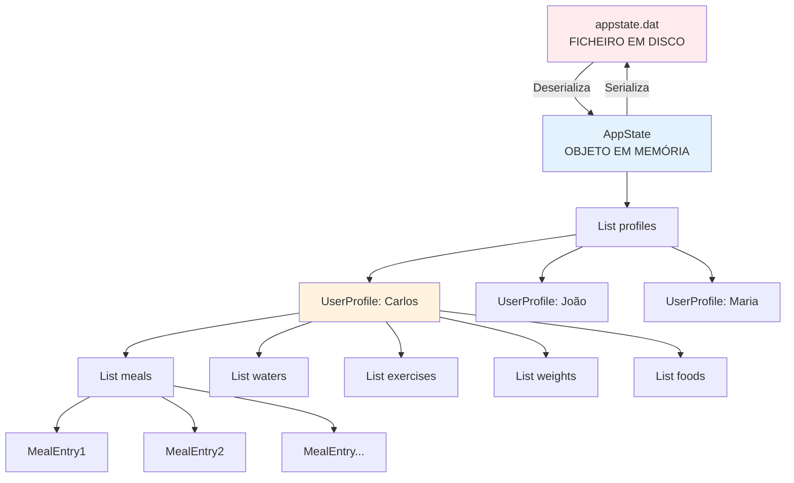
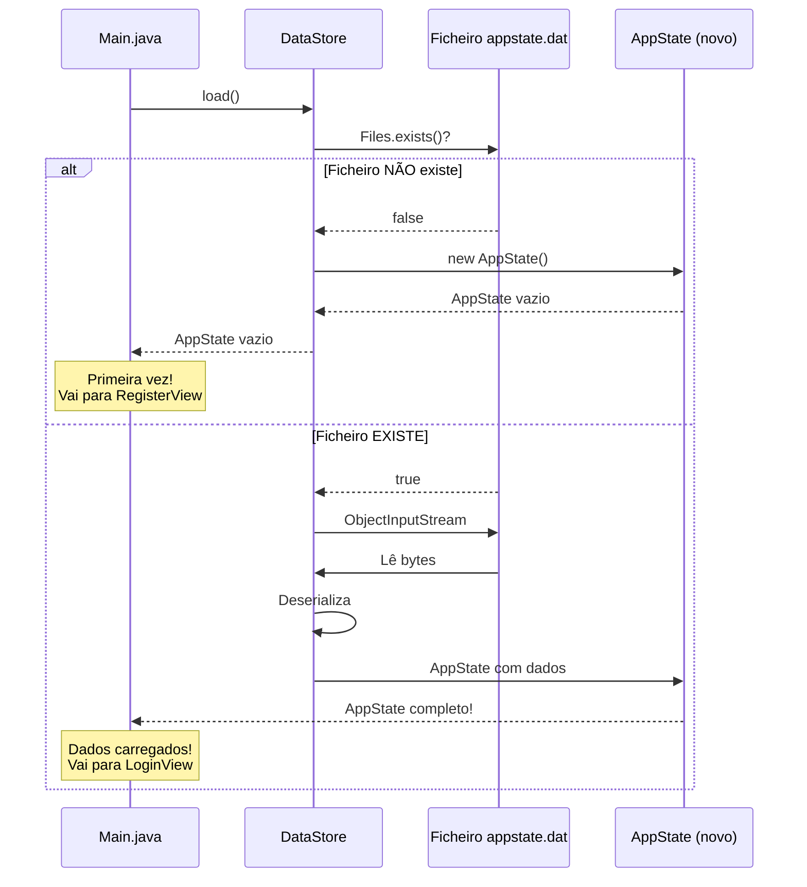
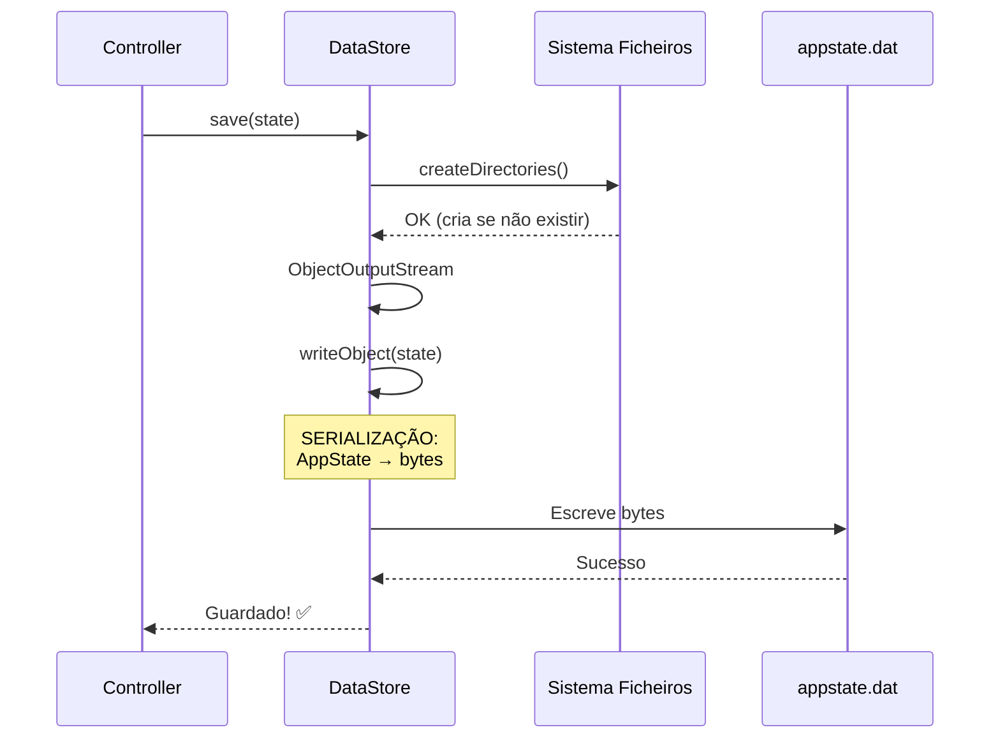
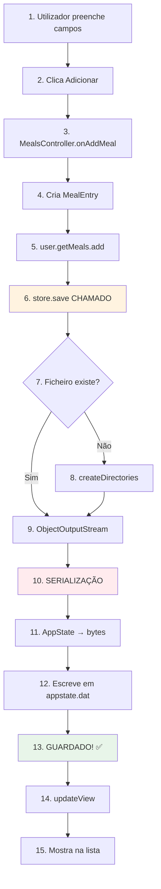

# 🔥 9️⃣ Persistência de Dados - O MAIS IMPORTANTE!

> **COMPREENSÃO ESSENCIAL:** Como os dados são guardados, carregados e sobrevivem ao fecho da aplicação

---

## 🎯 Por Que É O Mais Importante?

**SEM PERSISTÊNCIA:**
- Fechar app → PERDE TUDO! ❌
- Cada vez que abres → Começas do zero
- Registos, perfis, refeições → DESAPARECEM

**COM PERSISTÊNCIA:**
- Fechar app → GUARDA TUDO! ✅
- Abrir app → CARREGA dados guardados
- TODO o histórico está sempre disponível

**É O CORAÇÃO DA APLICAÇÃO!**

---

## 📍 Localização do Código

**Ficheiro Principal:** `AminhaDieta/src/main/java/app/persistence/DataStore.java` (40 linhas)  
**Estado Global:** `AminhaDieta/src/main/java/app/model/AppState.java` (76 linhas)  
**Ficheiro de Dados:** `C:\Users\[Nome]\AppData\Roaming\AMinhaDieta\data\appstate.dat`

---

## 📂 Estrutura Completa de Dados



---

## 🏗️ Classe AppState - O Container MASTER

**Código:** `app/model/AppState.java`

```java
public class AppState implements Serializable {
    private static final long serialVersionUID = 1L;
    
    // LISTA DE TODOS OS UTILIZADORES
    private List<UserProfile> profiles = new ArrayList<>();
    
    // UTILIZADOR ATIVO NESTE MOMENTO
    private UserProfile activeProfile;
    
    // MÉTODOS
    public void addProfile(UserProfile profile) {
        profiles.add(profile);
    }
    
    public UserProfile getActiveProfile() {
        return activeProfile;
    }
    
    public void setActiveProfile(UserProfile profile) {
        this.activeProfile = profile;
    }
    
    public List<UserProfile> getProfiles() {
        return profiles;
    }
    
    public void removeProfile(UUID id) {
        profiles.removeIf(p -> p.getId().equals(id));
    }
}
```

**O QUE GUARDA:**

```
AppState
├── profiles: List<UserProfile>
│   ├── [0] UserProfile "Carlos"
│   │   ├── nome: "Carlos"
│   │   ├── idade: 25
│   │   ├── pesoKg: 82.0
│   │   ├── alturaCm: 175.0
│   │   ├── meals: [...]  ← TODAS as refeições históricas
│   │   ├── waters: [...] ← TODOS os registos de água
│   │   ├── exercises: [...]
│   │   ├── weights: [...]
│   │   └── foods: [...]
│   │
│   ├── [1] UserProfile "João"
│   └── [2] UserProfile "Maria"
│
└── activeProfile: referência ao perfil ativo (Carlos)
```

---

## 💾 Classe DataStore - O Gestor de Ficheiros

**Código Completo:** `app/persistence/DataStore.java`

```java
package app.persistence;

import app.model.AppState;
import java.io.ObjectInputStream;
import java.io.ObjectOutputStream;
import java.nio.file.Files;
import java.nio.file.Path;

public class DataStore {
    private final Path filePath;
    
    public DataStore(Path filePath) {
        this.filePath = filePath;
        // filePath = C:\Users\Carlos\AppData\Roaming\AMinhaDieta\data\appstate.dat
    }
    
    // FUNÇÃO 1: CARREGAR DADOS
    public AppState load() {
        try {
            // Verifica se ficheiro existe
            if (!Files.exists(filePath)) 
                return new AppState();  // ← NOVO, vazio
            
            // Abre ficheiro e lê objeto
            try (ObjectInputStream in = new ObjectInputStream(
                    Files.newInputStream(filePath))) {
                return (AppState) in.readObject();  // ← DESERIALIZA
            }
        } catch (Exception e) {
            // Se corrompido ou incompatível, cria novo
            return new AppState();
        }
    }
    
    // FUNÇÃO 2: GUARDAR DADOS
    public void save(AppState state) {
        try {
            // Cria diretórios se não existirem
            Files.createDirectories(filePath.getParent());
            
            // Abre ficheiro e escreve objeto
            try (ObjectOutputStream out = new ObjectOutputStream(
                    Files.newOutputStream(filePath))) {
                out.writeObject(state);  // ← SERIALIZA
            }
        } catch (Exception e) {
            throw new RuntimeException("Erro a guardar dados: " + e.getMessage(), e);
        }
    }
}
```

---

## 🔄 Ciclo de Vida Completo dos Dados

### 1️⃣ ARRANQUE DA APLICAÇÃO

**Main.java - Linhas 18-28:**

```java
@Override
public void start(Stage stage) {
    // 1. DEFINIR CAMINHO
    String appData = System.getenv("APPDATA");
    if (appData == null) {
        appData = System.getProperty("user.home");
    }
    Path dataPath = Path.of(appData, "AMinhaDieta", "data", "appstate.dat");
    
    // 2. CRIAR DATASTORE
    DataStore store = new DataStore(dataPath);
    
    // 3. CARREGAR DADOS DO DISCO
    AppState state = store.load();  // ← AQUI!
    
    // 4. CRIAR SCENE MANAGER
    SceneManager sceneManager = new SceneManager(stage, state, store);
    sceneManager.showInitialScene();
    
    stage.show();
}
```

**O QUE ACONTECE EM `store.load()`:**



---

### 2️⃣ DURANTE A UTILIZAÇÃO

**SEMPRE que algo muda, é guardado:**

```java
// MealsController - Adicionar refeição
user.getMeals().add(new MealEntry(...));
store.save(state);  // ← GUARDA IMEDIATAMENTE!

// HydrationController - Adicionar água
user.getWaters().add(new WaterEntry(...));
store.save(state);  // ← GUARDA!

// ExerciseController - Adicionar exercício
user.getExercises().add(new ExerciseEntry(...));
store.save(state);  // ← GUARDA!

// RegisterController - Criar/editar perfil
state.addProfile(newProfile);
store.save(state);  // ← GUARDA!
```

**O QUE ACONTECE EM `store.save(state)`:**



---

### 3️⃣ FECHO DA APLICAÇÃO

**Quando fechas a aplicação:**
- ❌ NÃO há "save final" especial
- ✅ Dados JÁ foram guardados durante utilização
- ✅ Ficheiro `appstate.dat` está **sempre atualizado**

**Próxima vez que abres:**
- `store.load()` → Carrega tudo!
- Como se nunca tivesses fechado 🎉

---

## 🔐 O Que É Serialização?

### Conceito

**Serialização:** Transformar objetos em bytes para guardar em ficheiro  
**Deserialização:** Ler bytes do  ficheiro e reconstruir objetos

```
MEMÓRIA (objetos)         DISCO (ficheiro)
┌──────────────┐          ┌──────────────┐
│  AppState    │          │              │
│  ├─ Carlos   │ ═════════│  01101010    │
│  │  ├─meals  │  SAVE    │  11001001    │
│  │  └─waters │ ────────▶│  00110101    │
│  └─ João     │          │  10101100    │
└──────────────┘          │  ...         │
                          └──────────────┘

┌──────────────┐          ┌──────────────┐
│  AppState    │          │              │
│  ├─ Carlos   │  LOAD    │  01101010    │
│  │  ├─meals  │ ◀────────│  11001001    │
│  │  └─waters │          │  00110101    │
│  └─ João     │          │  10101100    │
└──────────────┘          └──────────────┘
```

### Como Funciona?

**Todas as classes implementam `Serializable`:**

```java
public class AppState implements Serializable {
    private static final long serialVersionUID = 1L;
}

public class UserProfile implements Serializable {
    private static final long serialVersionUID = 1L;
}

public class MealEntry implements Serializable {
    private static final long serialVersionUID = 1L;
}

// ... todas as outras também!
```

**`serialVersionUID`:**
- Número de versão da classe
- Se mudares a classe (adicionar campo novo), deves mudar este número
- Evita carregar dados incompatíveis

---

## 📁 Onde Fica o Ficheiro?

### Windows

**Caminho:** `C:\Users\[TeuNome]\AppData\Roaming\AMinhaDieta\data\appstate.dat`

**Como chegar:**
1. Windows + R
2. Escreve: `%APPDATA%`
3. Navega para: `AMinhaDieta\data\`
4. Vês: `appstate.dat`

### Estrutura de Pastas

```
C:\Users\Carlos\
└── AppData\
    └── Roaming\
        └── AMinhaDieta\        ← Criado pela app
            └── data\            ← Criado pela app
                └── appstate.dat ← FICHEIRO DE DADOS
```

---

## 🔍 O Que Acontece Se...

### ... Apagares o ficheiro `appstate.dat`?

```java
public AppState load() {
    if (!Files.exists(filePath)) 
        return new AppState();  // ← Cria novo vazio
}
```

**RESULTADO:**
- Aplicação abre normalmente
- MAS: Lista de perfis vazia
- É como primeira vez!
- Tens de criar perfil novamente

---

### ... Corromper o ficheiro?

```java
try {
    return (AppState) in.readObject();
} catch (Exception e) {
    return new AppState();  // ← Cria novo se erro
}
```

**RESULTADO:**
- Aplicação NÃO crasha! ✅
- Cria novo AppState vazio
- Dados antigos PERDIDOS (ficheiro corrompido)

---

### ... Tentar abrir o ficheiro `.dat` num editor?

**RESULTADO:**

```
☺♦²º♥►♠▼♣◄►¶§▬↨◘∟ ⌂Çüéâ ä... (símbolos estranhos)
```

**É binário!** Não é legível por humanos.

---

## 💡 Fluxo Completo - Exemplo Prático

### Cenário: Adicionar Refeição



**DETALHES TÉCNICOS:**

```java
// PASSO 6-12 (dentro de store.save):

1. Files.createDirectories(filePath.getParent());
   → Cria: C:\Users\Carlos\AppData\Roaming\AMinhaDieta\data\

2. ObjectOutputStream out = new ObjectOutputStream(
       Files.newOutputStream(filePath));
   → Abre appstate.dat para escrita

3. out.writeObject(state);
   → SERIALIZAÇÃO ACONTECE AQUI!
   → Java converte AppState inteiro em bytes
   → Recursivamente serializa:
     - profiles (Lista)
     - cada UserProfile
     - cada MealEntry, WaterEntry, etc.
     - TUDO!

4. out.close() (try-with-resources)
   → Fecha ficheiro
   → Dados estão SEGUROS no disco! ✅
```

---

## 🎯 Por Que É Tão Importante?

### 1. **Permite Histórico Ilimitado**

```java
// TODAS as refeições são guardadas!
private List<MealEntry> meals = new ArrayList<>();

// Podes ter:
meals = [
    MealEntry("Arroz", 200kcal, 2026-01-01 12:00),
    MealEntry("Frango", 300kcal, 2026-01-01 19:00),
    MealEntry("Salada", 100kcal, 2026-01-02 13:00),
    ... 1000 refeições ...
    MealEntry("Sopa", 150kcal, 2026-12-31 20:00)
]

// TUDO guardado!
// TUDO carregado ao abrir!
```

---

### 2. **Múltiplos Utilizadores**

```java
AppState {
    profiles: [
        UserProfile "Carlos" + todos os seus dados,
        UserProfile "João" + todos os seus dados,
        UserProfile "Maria" + todos os seus dados
    ]
}

// TUDO num só ficheiro!
// Cada um tem histórico separado!
```

---

### 3. **Portabilidade**

```
Copiar appstate.dat para outro computador
↓
Instalar aplicação
↓
Colar appstate.dat na pasta correta
↓
TUDO funciona! Todos os dados aparecem! ✅
```

---

## 📋 Estrutura COMPLETA de AppState

```
appstate.dat (ficheiro binário)
└── AppState
    ├── serialVersionUID: 1L
    ├── profiles: ArrayList<UserProfile>
    │   └── [0] UserProfile
    │       ├── id: UUID (550e8400-e29b-41d4-a716...)
    │       ├── nome: "Carlos"
    │       ├── idade: 25
    │       ├── pesoKg: 82.0
    │       ├── alturaCm: 175.0
    │       ├── gender: Gender.MALE
    │       ├── physicalActivityLevel: MODERATELY_ACTIVE
    │       ├── targetWeightKg: 75.0
    │       ├── weighInFrequency: WEEKLY
    │       │
    │       ├── meals: ArrayList<MealEntry>
    │       │   ├── [0] MealEntry
    │       │   │   ├── description: "Arroz com Frango"
    │       │   │   ├── calories: 450
    │       │   │   ├── protein: 35.0
    │       │   │   ├── carbs: 50.0
    │       │   │   ├── fat: 10.0
    │       │   │   └── timestamp: 2026-01-07T13:30
    │       │   └── [...]
    │       │
    │       ├── waters: ArrayList<WaterEntry>
    │       │   ├── [0] WaterEntry
    │       │   │   ├── amountMl: 250.0
    │       │   │   └── timestamp: 2026-01-07T09:00
    │       │   └── [...]
    │       │
    │       ├── exercises: ArrayList<ExerciseEntry>
    │       │   └── [...]
    │       │
    │       ├── weights: ArrayList<WeightEntry>
    │       │   └── [...]
    │       │
    │       └── foods: ArrayList<Food>
    │           └── [...]
    │
    └── activeProfile: → (referência ao UserProfile "Carlos")
```

**TAMANHO ESTIMADO:**
- Perfil básico: ~1 KB
- Refeição: ~200 bytes
- 1000 refeições: ~200 KB
- **Total com 3 utilizadores e histórico:** ~1-5 MB

**É MUITO PEQUENO!** Cabem facilmente milhares de registos.

---

## ✅ Checklist de Compreensão - Persistência

- [ ] Sei onde fica o ficheiro appstate.dat
- [ ] Entendo o que é serialização
- [ ] Sei quando store.save() é chamado (sempre que há mudanças)
- [ ] Sei quando store.load() é chamado (só no arranque)
- [ ] Compreendo a estrutura de AppState
- [ ] Sei por que todas as classes têm `Serializable`
- [ ] Entendo o papel de serialVersionUID
- [ ] Sei o que acontece se apagar o ficheiro
- [ ] Compreendo por que é o mais importante (sem isto, nada funciona!)

---

## 🎓 Para Defesa de Trabalho

**PERGUNTA:** "Como os dados são guardados?"

**RESPOSTA COMPLETA:**

"Os dados são guardados usando **serialização Java**. Temos um ficheiro `appstate.dat` em `AppData/Roaming/AMinhaDieta/data/` que contém TODO o estado da aplicação.

A classe `DataStore` tem dois métodos principais:
1. **`load()`** - Chamado no arranque, lê o ficheiro e **deserializa** bytes em objetos Java
2. **`save()`** - Chamado sempre que há mudanças, **serializa** objetos em bytes e escreve no ficheiro

A estrutura é hierárquica: `AppState` contém uma lista de `UserProfile`, cada perfil contém listas de `MealEntry`, `WaterEntry`, `ExerciseEntry`, etc. 

Todas as classes implementam `Serializable` para permitir esta conversão. O `serialVersionUID` garante compatibilidade de versões.

Quando adiciono uma refeição, por exemplo, o objeto `MealEntry` é adicionado à lista do perfil e **imediatamente** `store.save(state)` é chamado, garantindo que nunca perdemos dados, mesmo se a aplicação crashar."

---

**Anterior:** [08_Navegacao.md](08_Navegacao.md)  
**Índice:** [README.md](README.md)
