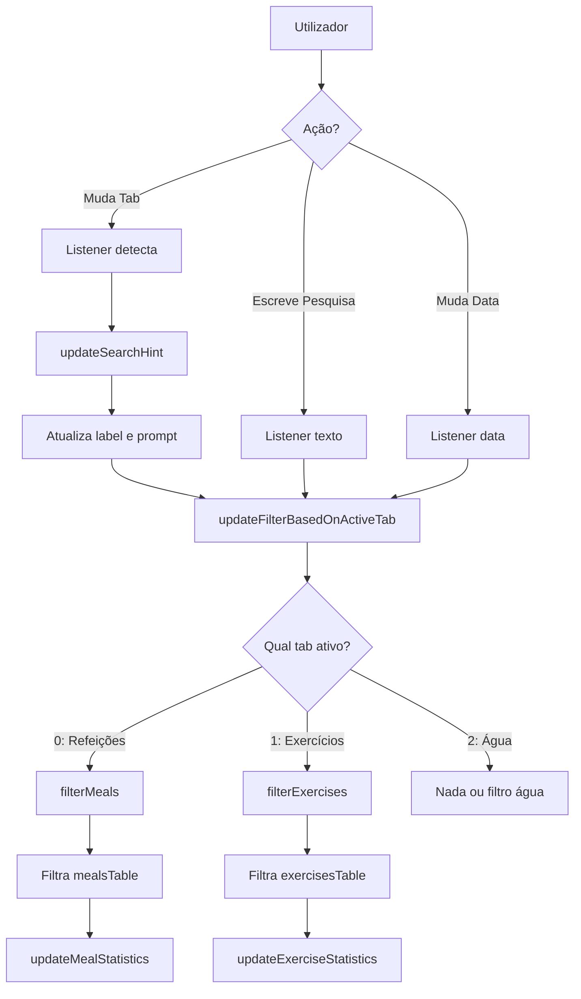

# 6️⃣ Filtro Dinâmico por Separador Ativo

> Tutorial para fazer a caixa de pesquisa filtrar automaticamente conforme o separador ativo

---

## 🎯 Objetivo

Fazer com que:
- **Separador Refeições ativo** → pesquisa filtra **refeições**
- **Separador Exercícios ativo** → pesquisa filtra **exercícios**
- **Separador Água ativo** → pesquisa **desativada** (ou filtra água)

---

## 🎨 Como Funciona

**ANTES:** Caixa de pesquisa só filtra refeições (sempre)

**DEPOIS:** Caixa de pesquisa detecta qual tab está ativo e filtra correspondente

---

## 🔧 PARTE 1: Preparar Estrutura

### PASSO 1.1: Mover Caixa de Pesquisa para Fora dos Separadores

**Ficheiro:** `HistoryView.fxml`

**Estrutura ANTES:**
```xml
<TabPane fx:id="historyTabPane">
    <Tab text="Refeições">
        <VBox>
            <!-- Pesquisa AQUI (só para refeições) -->
            <TextField fx:id="searchField"/>
            <!-- ... -->
        </VBox>
    </Tab>
</TabPane>
```

**Estrutura DEPOIS:**
```xml
<VBox spacing="10" padding="10">
    <!-- ✅ PESQUISA GLOBAL NO TOPO -->
    <HBox spacing="10" alignment="CENTER_LEFT">
        <Label text="Pesquisar:"/>
        <TextField fx:id="searchField" promptText="Escreva para filtrar..." 
                   prefWidth="300"/>
        <Label fx:id="searchHintLabel" text="(Filtrando: Refeições)" 
               style="-fx-text-fill: gray;"/>
    </HBox>
    
    <!-- Separadores -->
    <TabPane fx:id="historyTabPane">
        <Tab text="Refeições">
            <!-- Tabela SEM pesquisa -->
        </Tab>
        <Tab text="Exercícios">
            <!-- Tabela -->
        </Tab>
    </TabPane>
</VBox>
```

---

### PASSO 1.2: Declarar no Controller

**Ficheiro:** `HistoryController.java`

```java
@FXML private TabPane historyTabPane;
@FXML private TextField searchField;
@FXML private Label searchHintLabel;
```

---

## 🔧 PARTE 2: Detectar Separador Ativo

### PASSO 2.1: Adicionar Listener de Mudança de Tab

**Na função `init()` ou `setupSearch()`, ADICIONA:**

```java
private void setupSearch() {
    // Listener de texto (já existe)
    searchField.textProperty().addListener((observable, oldValue, newValue) -> {
        updateFilterBasedOnActiveTab();
    });
    
    // Listeners de data (já existem)
    startDatePicker.valueProperty().addListener((obs, old, val) -> {
        updateFilterBasedOnActiveTab();
    });
    endDatePicker.valueProperty().addListener((obs, old, val) -> {
        updateFilterBasedOnActiveTab();
    });
    
    // ✅ NOVO: Listener de mudança de TAB
    historyTabPane.getSelectionModel().selectedItemProperty()
            .addListener((observable, oldTab, newTab) -> {
                updateSearchHint();  // Atualiza dica
                searchField.clear(); // Limpa pesquisa ao mudar
                updateFilterBasedOnActiveTab();
            });
    
    // Inicializar hint
    updateSearchHint();
}
```

---

### PASSO 2.2: Criar Função para Atualizar Hint

```java
private void updateSearchHint() {
    int selectedIndex = historyTabPane.getSelectionModel().getSelectedIndex();
    
    switch (selectedIndex) {
        case 0: // Refeições
            searchHintLabel.setText("(Filtrando: Refeições)");
            searchField.setPromptText("Pesquisar por descrição...");
            searchField.setDisable(false);
            break;
            
        case 1: // Exercícios
            searchHintLabel.setText("(Filtrando: Exercícios)");
            searchField.setPromptText("Pesquisar por tipo...");
            searchField.setDisable(false);
            break;
            
        case 2: // Água (ou outro)
            searchHintLabel.setText("(Pesquisa não disponível)");
            searchField.setPromptText("--");
            searchField.setDisable(true);  // Desativa
            break;
            
        default:
            searchHintLabel.setText("");
            searchField.setDisable(false);
    }
}
```

---

## 🔧 PARTE 3: Aplicar Filtros Dinâmicos

### PASSO 3.1: Criar Funções de Filtro Separadas

**SUBSTITUIR a função `updateFilter()` existente:**

```java
private void updateFilterBasedOnActiveTab() {
    int selectedIndex = historyTabPane.getSelectionModel().getSelectedIndex();
    
    switch (selectedIndex) {
        case 0: // Refeições
            filterMeals();
            break;
            
        case 1: // Exercícios
            filterExercises();
            break;
            
        case 2: // Água
            // Não filtra (ou implementa filtro se quiseres)
            break;
    }
}
```

---

### PASSO 3.2: Filtro de Refeições

**Mantém lógica existente, renomeia para `filterMeals()`:**

```java
private void filterMeals() {
    if (filteredData == null) return;  // Ainda não inicializado
    
    filteredData.setPredicate(meal -> {
        boolean matchesSearch = true;
        boolean matchesDate = true;
        
        // ═══ FILTRO DE TEXTO ═══
        String searchText = searchField.getText();
        if (searchText != null && !searchText.isEmpty()) {
            matchesSearch = meal.getDescription()
                                .toLowerCase()
                                .contains(searchText.toLowerCase());
        }
        
        // ═══ FILTRO DE DATA ═══
        LocalDate mealDate = meal.getTimestamp().toLocalDate();
        
        if (startDatePicker.getValue() != null) {
            if (mealDate.isBefore(startDatePicker.getValue()))
                matchesDate = false;
        }
        
        if (endDatePicker.getValue() != null) {
            if (mealDate.isAfter(endDatePicker.getValue()))
                matchesDate = false;
        }
        
        return matchesSearch && matchesDate;
    });
    
    // Atualizar estatísticas
    updateMealStatistics();
}
```

---

### PASSO 3.3: Filtro de Exercícios (NOVO!)

**ADICIONA esta nova função:**

```java
private void filterExercises() {
    UserProfile user = state.getActiveProfile();
    if (user == null) return;
    
    String searchText = searchField.getText();
    LocalDate startDate = startDatePicker.getValue();
    LocalDate endDate = endDatePicker.getValue();
    
    // Filtrar exercícios
    List<ExerciseEntry> filtered = user.getExercises().stream()
            .filter(exercise -> {
                boolean matchesSearch = true;
                boolean matchesDate = true;
                
                // ═══ FILTRO DE TEXTO (tipo de exercício) ═══
                if (searchText != null && !searchText.isEmpty()) {
                    matchesSearch = exercise.getType()
                                           .toLowerCase()
                                           .contains(searchText.toLowerCase());
                }
                
                // ═══ FILTRO DE DATA ═══
                LocalDate exDate = exercise.getTimestamp().toLocalDate();
                
                if (startDate != null) {
                    if (exDate.isBefore(startDate))
                        matchesDate = false;
                }
                
                if (endDate != null) {
                    if (exDate.isAfter(endDate))
                        matchesDate = false;
                }
                
                return matchesSearch && matchesDate;
            })
            .collect(Collectors.toList());
    
    // Atualizar tabela
    exercisesTable.setItems(
        FXCollections.observableArrayList(filtered)
    );
    
    // Atualizar estatísticas
    updateExerciseStatistics();
}
```

---

## 🔧 PARTE 4: Inicialização Correta

### PASSO 4.1: Atualizar loadData()

**No final da função `loadData()`, SUBSTITUI chamadas individuais:**

```java
private void loadData() {
    // ... código existente de carregar dados ...
    
    // ═══════════════════════════════════════════════
    // ✅ SUBSTITUI ISTO:
    // updateMealStatistics();
    // updateExerciseStatistics();
    
    // ✅ POR ISTO:
    updateFilterBasedOnActiveTab();  // Filtra baseado no tab atual
    // ═══════════════════════════════════════════════
}
```

---

## 📊 Fluxo Completo



---

## 🧪 Testar

1. **Compilar:**
   ```bash
   mvn clean compile
   ```

2. **Executar:**
   ```bash
   mvn javafx:run
   ```

3. **Testar Refeições:**
   - Abre "Histórico"
   - Separador Refeições está ativo
   - Hint: "(Filtrando: Refeições)"
   - Escreve "arroz" → só mostra refeições com "arroz"

4. **Testar Exercícios:**
   - Clica separador "Exercícios"
   - Hint muda: "(Filtrando: Exercícios)"
   - Prompt muda: "Pesquisar por tipo..."
   - Campo limpa automaticamente
   - Escreve "corrida" → só mostra exercícios "Corrida"

5. **Testar Água:**
   - Clica separador "Água"
   - Hint: "(Pesquisa não disponível)"
   - Campo fica **desativado** (cinzento)

---

## 🎨 Melhorias Opcionais

### 1. Estilo Visual para Separador Ativo

**Adiciona CSS ao `searchHintLabel`:**

```java
private void updateSearchHint() {
    int selectedIndex = historyTabPane.getSelectionModel().getSelectedIndex();
    
    switch (selectedIndex) {
        case 0:
            searchHintLabel.setText("(Filtrando: Refeições)");
            searchHintLabel.setStyle("-fx-text-fill: #4CAF50; -fx-font-weight: bold;");
            // ...
            break;
            
        case 1:
            searchHintLabel.setText("(Filtrando: Exercícios)");
            searchHintLabel.setStyle("-fx-text-fill: #2196F3; -fx-font-weight: bold;");
            // ...
            break;
    }
}
```

---

### 2. Contador de Resultados

**Adiciona Label:**

```xml
<Label fx:id="resultCountLabel" text="0 resultados"/>
```

**Atualiza ao filtrar:**

```java
private void filterMeals() {
    // ... filtro ...
    
    // ✅ ADICIONA:
    resultCountLabel.setText(
        filteredData.size() + " resultado" + (filteredData.size() != 1 ? "s" : "")
    );
}
```

---

### 3. Atalho de Teclado (Ctrl+F para Focar Pesquisa)

**No `init()` ou `setupSearch()`:**

```java
searchField.getScene().setOnKeyPressed(event -> {
    if (event.isControlDown() && event.getCode() == javafx.scene.input.KeyCode.F) {
        searchField.requestFocus();
        event.consume();
    }
});
```

---

## ✅ Checklist

- [ ] Movi caixa de pesquisa para fora dos separadores (global)
- [ ] Adicionei `searchHintLabel`
- [ ] Criei listener de mudança de tab
- [ ] Criei `updateSearchHint()`
- [ ] Criei `updateFilterBasedOnActiveTab()`
- [ ] Renomeei filtro existente para `filterMeals()`
- [ ] Criei `filterExercises()` (novo!)
- [ ] Testei mudança de tabs e hint atualiza
- [ ] Testei pesquisa em Refeições funciona
- [ ] Testei pesquisa em Exercícios funciona
- [ ] Testei pesquisa desativa em Água
- [ ] Fiz commit: `git commit -m "Adicionar filtro dinâmico por separador"`

---

## 🎉 CONCLUSÃO - Todos os Guias Completos!

Parabéns! Agora tens **6 guias completos** de implementação:

1. ✅ Adicionar botão refeição rápida
2. ✅ Adicionar botão água
3. ✅ Adicionar tipo exercício
4. ✅ Editar/eliminar exercícios
5. ✅ Estatísticas do histórico
6. ✅ Filtro dinâmico por separador

**Todas as funcionalidades solicitadas estão documentadas!** 🚀

---

**Anterior:** [05_estatisticas_historico.md](05_estatisticas_historico.md)  
**Índice:** [README.md](README.md)
